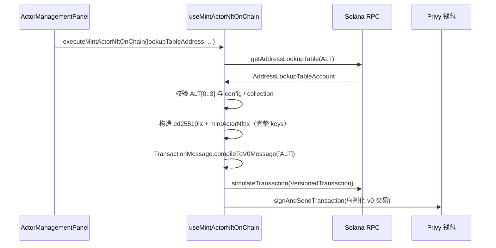

# Story 合约 Address Lookup Table（ALT）说明

本文档说明 Solana **Address Lookup Table（ALT）** 在本项目中的背景、作用、链上地址、Admin 配置与前端集成方式。详细 devnet 地址清单见 [`src/solana/ALT_INFO.md`](../src/solana/ALT_INFO.md)。

---

## 1. 什么是 ALT？

**Address Lookup Table（地址查找表）** 是 Solana 链上的一种特殊账户，内部维护一份 **pubkey 列表**（最多 256 个）。

在 **Versioned Transaction（v0 交易）** 中，若某指令引用的账户 pubkey 已写入某张 ALT，则交易消息里可用 **1 字节索引** 引用该地址，而不是为每个账户再占 **32 字节**。从而在 **总交易体积仍受 1232 字节上限约束** 的前提下，塞进更多账户与更大的指令 data。

> ALT 是「交易编码的压缩字典」，**不是**「程序从表里自动读账户、指令里可以少传账户」。

---

## 2. 为什么需要 ALT？

### 2.1 问题背景

演员链上铸造指令 `mint_actor_nft` 具备以下特征，易导致 **Legacy Transaction** 序列化后超过 **1232 字节**：

- 账户数量多（creator、config、mint、ATA、nft_info、metadata、collection、支付代币、treasury、sysvar、多个 program 等）；
- 指令 `data` 内含完整 `canonical_payload` 与 64 字节 `sig`。

表现为 Privy / 钱包报错：**Transaction too large**。

### 2.2 ALT 能解决什么？

将 **每次 mint 都相同、且可预先确定** 的账户预先写入 ALT，在发 v0 交易时由运行时通过「静态账户 + ALT 索引」解析 pubkey，大约每个账户节省 **31 字节**（32 → 1）。

本项目策略：**10 个静态账户 → 约节省 310 字节**。

### 2.3 ALT 不能替代什么？

| 仍须完整写在指令 `keys` 中 | 说明 |
|--------------------------|------|
| 全部合约要求的账户 | Anchor / Story 程序按固定账户顺序与 `isSigner` / `isWritable` 访问 |
| 每次 mint 变化的账户 | 如 user、actor_mint、token_account、nft_info、actor metadata、pay_token ATA 等（不在 ALT 内） |
| 不在 ALT 内的业务账户 | 如 `storyDelegator`（Ed25519）、`storyTreasury` 相关 ATA |

**结论：有了 ALT，`mintActorNftIx` 仍要拼装完整 `keys`；ALT 只压缩交易 wire format，不减少指令账户个数。**

---

## 3. 谁创建 ALT？

| 角色 | 职责 |
|------|------|
| **合约 / 运维（SOL 管理员钱包）** | 一次性 `createLookupTable` + `extendLookupTable`，写入 10 个静态账户 |
| **Admin chainlinks** | 下发各链 ALT 账户地址（及与之对齐的 collection mint 等） |
| **用户前端（Privy 钱包）** | 仅 **读取已有 ALT**、编译 **VersionedTransaction** 并签名发送 mint |

**用户浏览器不负责创建 ALT**，也无需为 ALT 支付租金。

当前 devnet 已由合约侧创建好两张表（见下文「链上地址」）。换链或更换集合后需重新建表并更新配置。

---

## 4. 静态账户分配策略（10 个）

两张 ALT（Drama / Actor）结构相同，**索引 0–9** 含义一致；**索引 1–3** 为各自集合的 mint / metadata / master edition。

| 索引 | 账户 | 特征 |
|------|------|------|
| 0 | `config_pda` | 每次调用相同（`shared.configPda`） |
| 1 | `collection_mint` | 该 ALT 对应集合类型（Drama / Actor 各不同） |
| 2 | `collection_metadata` | 同上 |
| 3 | `collection_master_edition` | 同上 |
| 4 | `INSTRUCTIONS_SYSVAR` | 固定系统地址 |
| 5 | `system_program` | 固定程序 ID |
| 6 | `token_program` | 固定程序 ID |
| 7 | `associated_token_program` | 固定程序 ID |
| 8 | `token_metadata_program` | 固定程序 ID |
| 9 | `rent` sysvar | 固定 sysvar |

索引 4–9 在 Drama / Actor 两张表中 **地址相同**；索引 0 为共享 `config_pda`；索引 1–3 随集合类型变化。

---

## 5. 链上地址（devnet 参考）

来源：[`src/solana/ALT_INFO.md`](../src/solana/ALT_INFO.md)。

| 类型 | ALT 账户地址 | 说明 |
|------|----------------|------|
| **Actor**（`mint_actor_nft`） | `AXeyFwc5yoNZ31yvf71FxSLJjG1BANHNBfos6DRFqVyG` | 演员铸造使用 **此表** |
| **Drama**（`mint_series_nft`） | `8gHbYWTTzNtPPnvbyXjMhL4r9Kvkcw1A6diKM9nFFvJj` | 短剧铸造使用，与演员无关 |

**Story Program ID（devnet）**：`D3zJ8SZFLSU5iJnYzcc4hKovnUyPjSeZeoUYhMQbu8oN`

### Actor ALT 内 10 个账户（devnet）

```
[0] eAYFqgCm9gxJ9PES2sVEtzDAAgscgyvbBPSw5H9ay9C   # config_pda
[1] FrBZHG9tnCvuQ8qhfAmzK6XTzvknXRB2jSVSfG1SUHyL   # actor collection_mint
[2] 6EPnGjsJeaT4ccWNWLcZdo7xQ78VhcayggSgq43vaWra   # collection_metadata
[3] DQu46CK57TQZ9CwxKHcp4cCAUA9LVoTNkimXf6NXJ1n7   # collection_master_edition
[4] Sysvar1nstructions1111111111111111111111111
[5] 11111111111111111111111111111111
[6] TokenkegQfeZyiNwAJbNbGKPFXCWuBvf9Ss623VQ5DA
[7] ATokenGPvbdGVxr1b2hvZbsiqW5xWH25efTNsLJA8knL
[8] metaqbxxUerdq28cj1RbAWkYQm3ybzjb6a8bt518x1s
[9] SysvarRent111111111111111111111111111111111
```

前端可从链上 `getAddressLookupTable` 读取表中地址；`collection_metadata` / `collection_master_edition` 可与 ALT `[2]`、`[3]` 对齐后填入指令（无需在 chainlinks 逐项配置这 10 个地址）。

### Drama ALT 内 10 个账户（devnet）

```
[0] eAYFqgCm9gxJ9PES2sVEtzDAAgscgyvbBPSw5H9ay9C   # config_pda
[1] HHhfqox6suTN7ruvdqMJkugdemLn8kAZ6uNGRBvz588J   # drama collection_mint
[2] 5cjq9utJBcrsKqV2uctP9uuFvNyE9Q3yXvf76QwQHSyq   # collection_metadata
[3] 6mEp51S6NuGStA3r3z6kA9b6fqjgQTyAbswVBwn3b9uA   # collection_master_edition
[4] Sysvar1nstructions1111111111111111111111111
[5] 11111111111111111111111111111111
[6] TokenkegQfeZyiNwAJbNbGKPFXCWuBvf9Ss623VQ5DA
[7] ATokenGPvbdGVxr1b2hvZbsiqW5xWH25efTNsLJA8knL
[8] metaqbxxUerdq28cj1RbAWkYQm3ybzjb6a8bt518x1s
[9] SysvarRent111111111111111111111111111111111
```

---

## 6. Admin chainlinks 配置

### 6.1 演员铸造必须配置的字段

`mint_actor_nft` 依赖 `resolveMintActorOnChainContext`（[`useMintActorNftOnChain.ts`](../src/hooks/solana/useMintActorNftOnChain.ts)），以下字段缺一不可：

| chainlinks 字段 | 含义 | devnet 示例 / 注意 |
|-----------------|------|-------------------|
| `rpc.http` | JSON-RPC | 与目标链一致 |
| `story` | Story 程序 ID | `D3zJ8SZFLSU5iJnYzcc4hKovnUyPjSeZeoUYhMQbu8oN` |
| **`storyActorMintLookupTable`** | **Actor ALT 账户地址** | **`AXeyFwc5yoNZ31yvf71FxSLJjG1BANHNBfos6DRFqVyG`** |
| `storyActorCollectionMintPDA` | 演员集合 Mint | 须与 Actor ALT `[1]` 一致：`FrBZHG9tnCvuQ8qhfAmzK6XTzvknXRB2jSVSfG1SUHyL` |
| `storyDelegator` | Ed25519 验签公钥 | 不在 ALT 内 |
| `storyTreasury` | 收款钱包 | 不在 ALT 内 |

### 6.2 短剧铸造必须配置的字段

`mint_series_nft` 依赖 `resolveMintDramaOnChainContext`（[`useMintDramaNftOnChain.ts`](../src/hooks/solana/useMintDramaNftOnChain.ts)）：

| chainlinks 字段 | 含义 | devnet 示例 / 注意 |
|-----------------|------|-------------------|
| `rpc.http` | JSON-RPC | 与目标链一致 |
| `story` | Story 程序 ID | `D3zJ8SZFLSU5iJnYzcc4hKovnUyPjSeZeoUYhMQbu8oN` |
| **`storyDramaMintLookupTable`** | **Drama ALT 账户地址** | **`8gHbYWTTzNtPPnvbyXjMhL4r9Kvkcw1A6diKM9nFFvJj`** |
| `storyDramaCollectionMintPDA` | 短剧集合 Mint | 须与 Drama ALT `[1]` 一致：`HHhfqox6suTN7ruvdqMJkugdemLn8kAZ6uNGRBvz588J` |
| `storyDelegator` | Ed25519 验签公钥 | 不在 ALT 内 |

### 6.3 chainlinks 示例（devnet）

```json
{
  "contracts": {
    "storyActorMintLookupTable": "AXeyFwc5yoNZ31yvf71FxSLJjG1BANHNBfos6DRFqVyG",
    "storyDramaMintLookupTable": "8gHbYWTTzNtPPnvbyXjMhL4r9Kvkcw1A6diKM9nFFvJj",
    "storyActorCollectionMintPDA": "FrBZHG9tnCvuQ8qhfAmzK6XTzvknXRB2jSVSfG1SUHyL",
    "storyDramaCollectionMintPDA": "HHhfqox6suTN7ruvdqMJkugdemLn8kAZ6uNGRBvz588J"
  }
}
```

- **不要**把 Actor / Drama 的 ALT 地址混用。
- **不要**把 ALT 内 10 个账户逐个写入 chainlinks；表内地址由 RPC 拉取。

### 6.4 配置要求（无本地回落）

当前实现已取消本地 devnet ALT 常量回落。若 chainlinks 未配置对应 ALT 字段，前端会将其视为缺失配置并阻断铸造流程。请在 Admin 中显式配置 `storyActorMintLookupTable` / `storyDramaMintLookupTable`。

---

## 7. 前端集成说明

### 7.1 总体流程



### 7.2 技术要点

1. **拉取 ALT**  
   `fetchStoryActorMintLookupTable`（[`storyActorMintLookupTable.ts`](../src/hooks/solana/actorMint/storyActorMintLookupTable.ts)）

2. **校验**  
   `assertStoryActorMintLookupTableMatchesContext`：ALT `[0]` config、`[1]` collection mint、`[2][3]` metadata / edition 与当前 mint 上下文一致。

3. **编译 v0 交易**  
   `buildMintActorNftVersionedTransaction`：  
   `new TransactionMessage({ payerKey, recentBlockhash, instructions }).compileToV0Message([lookupTableAccount])`  
   → `new VersionedTransaction(messageV0)`  
   **消息类型必须为 VersionedMessage（v0），禁止再使用 Legacy `Transaction`。**

4. **模拟与发送**  
   `connection.simulateTransaction(versionedTx, { sigVerify: false })`  
   Privy `signAndSendTransaction` 传入 `versionedTx.serialize()` 的字节。

5. **体积自检**  
   日志 `[mintActorNftOnChain] versionedTransaction.size`：`serializedBytes` 应 ≤ **1232**。

### 7.3 相关源码

| 文件 | 职责 |
|------|------|
| [`src/hooks/solana/storyMintLookupTable.ts`](../src/hooks/solana/storyMintLookupTable.ts) | 通用：拉表、校验、读 collection 账户 |
| [`src/hooks/solana/buildStoryMintVersionedTransaction.ts`](../src/hooks/solana/buildStoryMintVersionedTransaction.ts) | 通用：v0 + ALT 编译 |
| [`src/hooks/solana/useMintActorNftOnChain.ts`](../src/hooks/solana/useMintActorNftOnChain.ts) | 演员 `mint_actor_nft` |
| [`src/hooks/solana/useMintDramaNftOnChain.ts`](../src/hooks/solana/useMintDramaNftOnChain.ts) | 短剧 `mint_series_nft` |
| [`src/hooks/solana/actorMint/storyActorMintLookupTable.ts`](../src/hooks/solana/actorMint/storyActorMintLookupTable.ts) | 演员 ALT 封装 |
| [`src/hooks/solana/dramaMint/storyDramaMintLookupTable.ts`](../src/hooks/solana/dramaMint/storyDramaMintLookupTable.ts) | 短剧 ALT 封装 |
| [`src/hooks/solana/chainRpcConfig.ts`](../src/hooks/solana/chainRpcConfig.ts) | `getStoryActorMintLookupTable` / `getStoryDramaMintLookupTable` |
| [`src/features/narrator/components/ActorManagementPanel.tsx`](../src/features/narrator/components/ActorManagementPanel.tsx) | 演员铸造入口 |
| [`src/features/narrator/components/DramaManagementPanel.tsx`](../src/features/narrator/components/DramaManagementPanel.tsx) | 短剧铸造入口 |

### 7.4 错误提示区分

| 场景 | 用户可见提示 |
|------|----------------|
| 未连接 Privy Solana 钱包 | 「请先连接 Solana 钱包」 |
| 缺少 `storyActorMintLookupTable` | 「演员铸造地址查找表未配置…」 |
| 缺少 `storyDramaMintLookupTable` | 「短剧铸造地址查找表未配置…」 |
| 其它 chainlinks 缺失 | 「演员/短剧铸造链上配置不完整…」 |

控制台可查看 `missingFields`（如 `lookupTableAddress`）便于运维排查。

---

## 8. 常见问题（FAQ）

### Q1：有了 ALT，`mintActorNftIx.keys` 可以删掉与 ALT 重复的账户吗？

**不可以。** 指令仍需列出程序所需的全部账户；ALT 仅在序列化时压缩已在表中的 pubkey。

### Q2：铸造该用哪张 ALT？

| 指令 | ALT 字段 | devnet 地址 |
|------|----------|-------------|
| `mint_actor_nft` | `storyActorMintLookupTable` | `AXeyFwc5yoNZ31yvf71FxSLJjG1BANHNBfos6DRFqVyG` |
| `mint_series_nft` | `storyDramaMintLookupTable` | `8gHbYWTTzNtPPnvbyXjMhL4r9Kvkcw1A6diKM9nFFvJj` |

### Q3：chainlinks 最少要多配什么？

- 演员：**`storyActorMintLookupTable`** + `storyActorCollectionMintPDA` 与 Actor ALT `[1]` 一致 + `storyDelegator` / `storyTreasury` / RPC 等。  
- 短剧：**`storyDramaMintLookupTable`** + `storyDramaCollectionMintPDA` 与 Drama ALT `[1]` 一致 + `storyDelegator` / RPC 等。

### Q4：何时需要重新建 ALT？

- 更换链（devnet → mainnet）；  
- 更换演员 / 短剧 Collection Mint；  
- `config_pda` 或程序部署变更导致静态地址变化。  

重建后更新 Admin `storyActorMintLookupTable`（及短剧侧对应字段，若已接入）。

---

## 9. 检查清单

**运维 / Admin**

- [ ] 目标链 Actor ALT 已创建且 extend 10 个账户  
- [ ] `contracts.storyActorMintLookupTable` = Actor ALT 地址  
- [ ] `storyActorCollectionMintPDA` = Actor ALT 索引 `[1]`  
- [ ] `storyDelegator`、`storyTreasury`、RPC 已配置  

**前端联调**

- [ ] 铸造时控制台 `messageVersion: 0`  
- [ ] `versionedTransaction.size` 中 `serializedBytes` ≤ 1232  
- [ ] 模拟与链上确认成功  

---

## 10. 延伸阅读

- Solana 文档：[Versioned Transactions](https://solana.com/docs/core/transactions#versioned-transactions)  
- 项目铸造流程：[`docs/铸造NFT合约实现.md`](./铸造NFT合约实现.md)  
- Story 合约 API：[`src/solana/STORY_CONTRACT_API.md`](../src/solana/STORY_CONTRACT_API.md)
