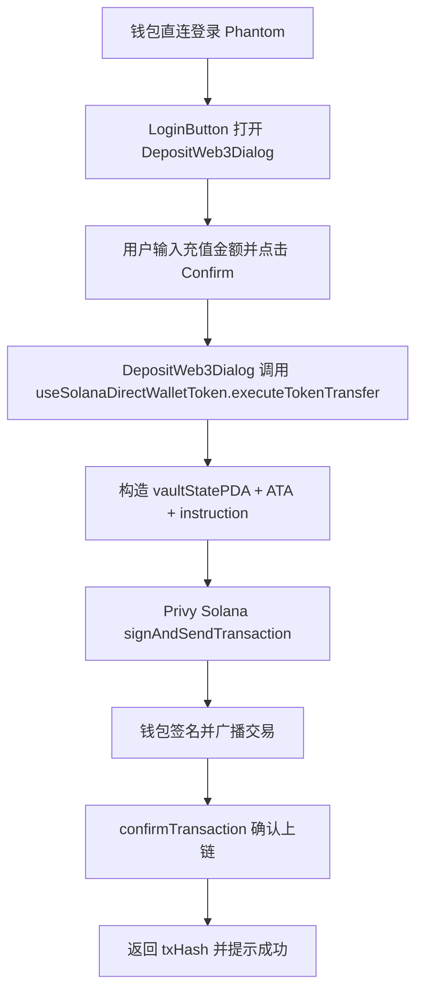
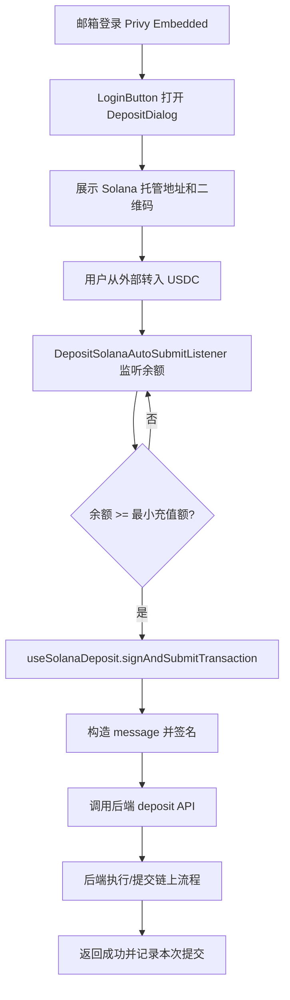

# SVM 充值实现说明

本文基于当前项目代码，梳理 SVM（Solana）充值的两条链路：

1. 钱包直连登录
2. 邮箱账户登录

每种方式都包含：实现原理、执行流程、涉及文件与作用、流程图。

---

## 一、钱包直连登录

### 1) 实现过程与原理

- 用户通过 Privy 的钱包登录入口连接外部 Solana 钱包（如 Phantom）。
- 在钱包菜单点击充值时，打开 `DepositWeb3Dialog`（仅钱包直连 + `connectedChainType === 'solana'` 时展示）。
- 用户输入金额后，前端调用 `useSolanaDirectWalletToken.executeTokenTransfer` 构造并发送链上交易。
- 这条路径是“前端直接上链”：用户钱包签名 + 用户支付 SOL Gas。

核心原理：

- 通过 `useAppPrivyAccount` 统一识别当前登录类型和链类型。
- `useSolanaDirectWalletToken` 在前端构造 Solana `TransactionInstruction`：
  - `vaultStatePDA`
  - `userTokenAccount`（ATA）
  - `inVaultTokenAccount`（ATA）
- 使用 Privy Solana SDK 的 `signAndSendTransaction` 触发钱包签名并广播。
- 通过 `confirmTransaction` 确认交易上链结果。

### 2) 涉及文件与作用

- `src/providers/PrivyProviderWrapper.tsx`
  - 配置 Privy 登录方式、Solana external connectors（`toSolanaWalletConnectors`）与 embedded solana 钱包策略。
- `src/hooks/useAppPrivyAccount.ts`
  - 统一输出 `loginType`、`solanaAddress`、`connectedChainType`，供充值分流使用。
- `src/components/LoginButton.tsx`
  - 钱包直连用户点击充值时打开 `depositWeb3Dialog`。
- `src/components/DepositWeb3Dialog.tsx`
  - 钱包直连充值弹窗：金额输入、参数校验、调用转账 hook。
- `src/hooks/useSolanaDirectWalletToken.ts`
  - 直连充值核心：构造并发送 Solana 交易，等待确认并返回 tx hash。
- `src/hooks/useGlobalConfig.ts`
  - 从配置接口解析链配置，生成 `depositConfig`（rpc、vault、token、inVault/spender 等）。
- `src/stores/config.ts`
  - 存储 `depositConfig`、`chainlinks`、`currentChain` 等链路配置状态。

### 3) 流程图

---

## 二、邮箱账户登录

### 1) 实现过程与原理

- 用户通过邮箱登录后，Privy 会提供 embedded Solana 地址。
- 用户点击充值时打开 `DepositDialog`，看到托管地址 + 二维码（此弹窗不直接发链上交易）。
- 用户从外部钱包/交易所转入 USDC 到该 Solana 地址。
- 全局监听器 `DepositSolanaAutoSubmitListener` 在充值弹窗打开期间监听该地址余额。
- 达到最小充值阈值后，调用 `useSolanaDeposit.signAndSubmitTransaction`：
  - 前端组装交易 message 并签名
  - 请求后端 deposit API 提交

这条路径是“监听触发 + 前端签名 + 后端提交”的协作模式。

核心原理：

- UI 层负责展示充值地址，不直接执行转账。
- 全局逻辑组件负责监听余额变化并做阈值判断。
- `useSolanaBalanceListener` 负责轮询 token account 余额。
- `useSolanaDeposit` 负责签名与后端 API 提交。

### 2) 涉及文件与作用

- `src/components/DepositDialog.tsx`
  - 邮箱登录充值弹窗：展示 Solana 托管地址、二维码、充值网络与注意事项。
- `src/global/index.tsx`
  - 全局挂载 `DepositSolanaAutoSubmitListener`，保证监听逻辑在应用生命周期内可用。
- `src/components/DepositSolanaAutoSubmitListener.tsx`
  - 自动提交中枢：读取配置、监听余额、阈值判断、防重复提交、调用提交 hook。
- `src/hooks/useSolanaBalanceListener.ts`
  - Solana 余额监听：轮询 SPL Token 余额，并在初次加载/变更时触发回调。
- `src/hooks/useSolanaDeposit.ts`
  - 自动提交核心：构造交易 message，使用 Privy wallet 签名，调用后端 API 提交。
- `src/hooks/useDepositConfig.ts`
  - 把全局 `depositConfig` 映射为充值 UI 需要的数据结构。
- `src/hooks/useGlobalConfig.ts`
  - 从后端 `chainlinks + init` 解析当前链配置和充值 API。
- `src/hooks/useAppPrivyAccount.ts`
  - 提供邮箱/钱包登录态识别，以及 Solana 地址来源统一。

### 3) 流程图

---

## 两种方式对比（简要）

- 钱包直连登录：前端直接上链，用户钱包签名，用户承担 Gas，链路短。
- 邮箱账户登录：地址充值 + 监听触发，前端签名后端提交，链路更长但体验更接近 Web2。

