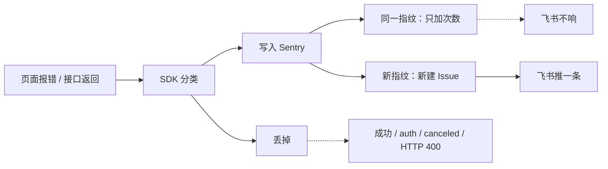

# 一期可观测性 — 主站集成指南

> **仓库：** `web-onestory-www`（StoryFun / One Story 主站）  
> **包名：** `@amazing-socrates/telemetry-kit` **^0.1.9**  
> **包仓文档：** `web-telemetry-kit/docs/一期可观测性-NPM包设计与实现.md`  
> **完整原稿（三步合一，保留不动）：** `docs/一期可观测性NPM包-编码执行计划.md`  
>
> 本文只服务**主站同学**：装包、外壳接线、业务码钩子、Source Map / CI、Sentry 收集与归堆、飞书进/不进、测网验收、**Sentry 账号/项目切换**（§9）。  
> **不要**在本文维护包内部实现、目录结构、vitest 细节——那些在包仓文档。

---

## 0. 本文写什么 / 不写什么

| 写 | 不写 |
|----|------|
| 主站要改哪些文件、改成什么样 | 包内 `scrub` / `filter` / adapter 怎么实现 |
| `init` / `instrumentApi` 宿主怎么配 | tsup / peer / 发版策略 |
| Source Map 与 `release` 对齐（发生在宿主构建） | N1～N22 包单测明细 |
| Sentry 收什么、怎么归堆、哪些进飞书 | 飞书机器人 / Cloudflare Worker **实现代码**（中继服务另维） |
| 主站验收 Case I* / S*、回滚开关 | 包架构排期 D1～D2 细节 |
| **换 Sentry Org/Project：env / Integration / 警报 / MCP**（§9） | — |

**依赖关系：** 主站集成依赖包已可安装；Source Map 的 `release` 必须与 `init({ release })` 字符串一致。

---

## 1. 一期主站目标（一句话）

**删 spike + 装包 + 只改公共入口接线**；业务 `features/**` 零侵入；错误四类 `category` + 慢接口性能通道 + Source Map 可还原。

### 1.1 必须做到

| 能力 | 主站动作 | 验收口径 |
|------|----------|----------|
| 统一初始化 | 外壳尽早 `init`（读 env） | 无 DSN 静默降级；有 DSN 能上报 |
| 错误四层 | CatchBoundary → `component`；API → `instrumentApi`；js/promise 由包自带 | Issues 可见 `category` |
| 业务码 / 鉴权 | `init` 注入钩子，**码表留在主站** | 业务失败可报；登录过期不刷屏 |
| 用户 / feedbackId | UserSync → `setUser` / `clearUser` | 控台可复制 feedbackId |
| 禁止直连 Sentry | 删 `@sentry/*` 直依赖；`src/features` 无 `@sentry/` | `pnpm why` 只有包传递的一份 |
| Source Map | Vite hidden + 上传 + 删 map；release 对齐 | Issue 可见源码行 |

### 1.2 本轮不做（主站也不要做）

链上 / Worker、业务 feature 大面积埋点、完整 TTI、细降噪规则库。

飞书**不在主站代码里配 Webhook**。告警在 Sentry 项目侧，当前规则是 **「新建问题」** 才推群。主站同学要知道哪些场景会建 Issue、哪些会进群，见 **§3.3**。

### 1.3 重要前提：现有代码是 spike，不是基线

主站里的旧 spike / 临时目录已清掉；宿主组装在 `src/lib/bootstrapObservability.ts`，用户同步用 `useObservabilityUserSync`。临时验收页与 DEV 浮层已在上生产前移除。

| 不要这样理解 | 应该这样理解 |
|--------------|--------------|
| 「现网行为，不许回退」 | 「spike 结论进包，代码整体替换」 |
| 「小心改造 appRequest 上报」 | 「上报整段删除，换成一行 `instrumentApi`」 |

集成本质是：**删 spike + 装包 + 接线**。

---

## 2. 主站要改的文件（只这些）

> 顺序硬约束：挂 `instrumentApi` 与删手写上报**必须同一次提交**，否则一次失败会双报（F13）。

| 文件 | 动作 |
|------|------|
| `package.json` | 装 `@amazing-socrates/telemetry-kit`；**删除** `@sentry/react` 直依赖；重装 lockfile |
| `src/lib/bootstrapObservability.ts` | 集中读 env + `init`（业务码钩子从 `appRequest` 引用） |
| `src/hooks/useObservabilityUserSync.ts` | 根布局调用：登录 `setUser` / 退出 `clearUser`（生产也要，不是测试页） |
| `src/router.tsx` | 尽早 `bootstrapObservability()` |
| `src/api/appRequest.ts` | 模块内 `instrumentApi(axiosClient)`（慢阈值走包环境默认）；`export` 鉴权/成功码供 init；业务请求仍走 `appRequest` / `appAxiosInstance` |
| `src/routes/__root.tsx` | `useObservabilityUserSync()` |
| `src/layouts/DefaultCatchBoundary.tsx` | `reportError(..., { category: 'component' })`，import 来自包 |
| `vite.config.ts` + CI | `sourcemap: 'hidden'` + Sentry 上传插件（仅 build） |
| 环境变量 | 在部署/CI 或 `.env.local` 增加 `VITE_SENTRY_DSN` / `VITE_APP_VERSION` / `SENTRY_*` 并写清说明即可；**不必**维护 `.env.local.example` |

### 2.1 不改

- `src/features/**` 业务页面  
- 飞书 Webhook  
- `appAxiosInstance` 的业务 toast、`silentBusinessCodes`、鉴权跳转等  

### 2.2 收尾自检

```bash
# 不应再有旧 spike 目录
rg "src/observability|features/observability-test" src || true

# src 下不应再直接依赖 Sentry
rg "@sentry/" src

# package.json 无直依赖
rg "@sentry/" package.json
```

---

## 3. 宿主怎么配 `init`（对外 API 摘要）

业务日常要记：`init`、`reportError`、`setUser` / `clearUser`、`instrumentApi`；排查加 `getFeedbackId`。

完整类型与七分类语义见**包仓文档**；主站必须配好的钩子如下。

### 3.1 推荐接线形状

```ts
import {
  init,
  reportError,
  setUser,
  clearUser,
} from '@amazing-socrates/telemetry-kit';
import {
  AUTH_ERROR_CODES,
  BUSINESS_SUCCESS_CODE,
} from '@/api/appRequest';

init({
  dsn: import.meta.env.VITE_SENTRY_DSN,
  environment: import.meta.env.MODE,
  release: import.meta.env.VITE_APP_VERSION, // 必须与 Source Map 上传 release 完全一致
  platform: 'StoryFun',
  defaultTags: { product: 'OneStory' },
  getBusinessCode: (data) =>
    data && typeof data === 'object' && 'code' in data
      ? (data as { code: number | string }).code
      : undefined,
  isBusinessSuccess: (code) =>
    code === BUSINESS_SUCCESS_CODE || code === 200,
  isAuthFailure: ({ httpStatus, businessCode }) =>
    httpStatus === 401 ||
    httpStatus === 403 ||
    (businessCode != null && AUTH_ERROR_CODES.has(Number(businessCode))),
});

// 采样 / Replay / 慢阈值：不传则走 0.1.9 环境默认（production tracesSampleRate=0.05）
// 不要传 extraHttpReportStatuses：默认 400 不上报，404/429 上报，5xx 一律报

// API 层采集挂在 appRequest 模块内（对同一 axios 实例），业务只调 appRequest / appAxiosInstance
```

### 3.2 API 七分类：主站要知道的策略（不必改包）

分类顺序（0.1.9）：`canceled` → `timeout` → `network` → `parse` → `auth` → `http` → `business`。

| `api.failure` | 默认策略 | 主站注意 |
|---------------|----------|----------|
| `canceled` | 不上报 | 快速切页不应刷 Issue |
| `timeout` | 上报 error | 超时要能看见 |
| `network` | warning | 弱网；控台标题常是 `AxiosError: Network Error`，筛 Error only 会看不见 |
| `http` | 上报 error | 先分成 http 后才看状态码门，见下表 |
| `business` | 上报 error | **必须是 HTTP 2xx + 业务码失败**；依赖 `getBusinessCode` / `isBusinessSuccess` |
| `auth` | 不上报 | **必须**配 `isAuthFailure`（HTTP 401/403，以及 `100401` / `100001`） |
| `parse` | 上报 error | 解析失败 |

HTTP 状态码门（**仅当已经是 `api.failure=http` 的 4xx**）：

| 状态 | 是否上报 |
|------|----------|
| 404 / 429 | 上报 |
| 400 及其它 4xx | 默认不上报 |
| 5xx | 一律上报，不走 4xx 白名单 |
| 401 / 403 | 通常已分成 `auth`，不上报 |

慢接口走**性能通道**（`perf_type=slow_api`，级别 warning），**不写**错误 `category`。主站 `instrumentApi(axiosClient)` 不覆盖阈值，走包环境默认（development 10s / test 8s / production 5s）。

可用 `apiFailurePolicy` 整类覆盖；细到单个业务码是二期。

### 3.3 Sentry 收集、归堆、飞书

两层不要混：

1. **Sentry**：符合规则的 event 都会进收件箱，同一类问题叠在同一格。  
2. **飞书**：门铃。当前告警是 **「新建问题」** 才推；同一格再上报只加次数，不重复推。



#### 收集：报不报、报成什么

| 场景 | 进 Sentry | 级别 | 控台常见标题 |
|------|-----------|------|----------------|
| 成功请求（2xx + 业务码 100000/200） | 否 | — | — |
| 401 / 403 / 鉴权业务码 | 否 | — | — |
| 用户取消、abort | 否 | — | — |
| HTTP 400 等未进白名单的 4xx | 否 | — | — |
| HTTP 2xx + 业务码失败 | 是 | error | `Error: API business` |
| HTTP 404 / 429 / 5xx | 是 | error | `AxiosError: Request failed with status code …` |
| 超时 | 是 | error | `AxiosError: timeout …` |
| 断网、无 response | 是 | **warning** | `AxiosError: Network Error` |
| 响应不是合法 JSON | 是 | error | 解析类 |
| 成功但超过慢阈值 | 是 | **warning** | `Slow API GET /…` |
| JS throw / 未处理 Promise / CatchBoundary | 是 | error | `Error: …` |

JS / Promise / 组件错误带 `category`（`js` / `promise` / `component`）。接口失败带 `category=api` 与 `api.failure=…`。慢接口**没有**错误 `category`，看 `perf_type=slow_api`。

#### 归堆：按接口模板，不按用户

URL 会先收成模板：去掉 query、去掉末尾 `/`，长数字 / UUID 收成 `:id`。  
指纹里**没有 userId**。同一人连点，和一万人打同一个挂掉的接口，都是一条 Issue。

| 问题类型 | 指纹 | 同一格 |
|----------|------|--------|
| 接口失败 | `api` + 分类 + 方法 + 路径模板 + 状态码 | 同一个接口、同一种失败 |
| 慢接口 | `slow_api` + 方法 + 路径模板 | 同一个接口一直慢 |

因此：

- **不同接口**（归一化后路径不同）→ 不同 Issue → 各自**第一次**会进飞书。  
- **同一接口反复 500 / 反复慢** → 同一 Issue，只加次数 → **不重复推飞书**。  
- `/foo` 与 `/foo/`、`/drama/很长id` 与另一个 dramaId，通常算同一格。

验收页「新建 Error / 新建慢接口」每次换唯一 code 或路径，是为了**故意新建 Issue** 测门铃；生产不会这么造 URL。

#### 飞书：进 / 不进

以 Sentry 项目「新建问题」为准（主站不写 Webhook）。Issue 被 Resolve 后再出现，若告警开了「再出现」，才会再推。

| 场景 | Sentry | 飞书 |
|------|--------|------|
| 新的 JS Error | 新 Issue | 进 |
| 新的业务码失败 / 超时 / 404 / 429 / 5xx | 新 Issue | 进 |
| 新的慢接口（路径模板不同） | 新 Issue | 进 |
| Resolve 后再出现（若开了回归） | 原 Issue 回归 | 可能进 |
| 断网 `network` | warning Issue | **不进**（按当前验收；控台勿只筛 Error） |
| 成功请求 / 401 / 取消 / HTTP 400 | 无 | 不进 |
| 同一接口反复 500 / 反复慢 | 次数 +1 | 不进 |

自己验：在测网 / 生产制造真实错误（或临时本地 DEV 调 `reportError`），绿规则看进群，灰规则只看 Sentry，黄规则不应出 Error Issue。生产上线后勿再依赖已删除的 `/dev/observability-test`。

### 3.4 用户同步

在 `__root` 调用 `useObservabilityUserSync()`：

- 登录：`setUser(业务用户ID)`  
- 退出：`clearUser()`（回游客，默认保留 anon）  
- 控制台应出现：`[OneWorld Observability] feedbackId=… kind=guest|user`

### 3.5 CatchBoundary

```ts
reportError(error, { category: 'component' });
```

`category` 只允许：`js` | `promise` | `api` | `component`。

---

## 4. Source Map（主站 / CI 负责）

上传发生在**宿主构建**，不是发 NPM 包那一下。逻辑在 `scripts/vite.sentry.ts`，由 `vite.config.ts` 调用。  
**一期不改 Workflow / Dockerfile**：凭证写在对应 `.env.*`，Docker 构建会 `COPY` 进镜像上下文并由 `loadEnv` 读取；`VITE_APP_VERSION` 仍由 Dockerfile 的 `GIT_COMMIT` 注入。

### 4.1 硬门禁：`release` 必须对齐

| 规则 | 说明 |
|------|------|
| 同一字符串 | `init({ release })` ≡ 上传插件的 `release` |
| 禁止静默 `dev` | 非 development 算不出版本 → **构建失败**，不要回落 `dev` |
| 取值建议 | 优先 `VITE_APP_VERSION`；Docker/CI 用 `GIT_COMMIT`；本地预验可临时 export |

### 4.2 一期环境策略

| mode / 脚本 | 默认是否上传 | 配置位置 |
|-------------|--------------|----------|
| `development` / `build:dev` | **否** | `.env.development` 仅 `VITE_SENTRY_DSN` |
| `testenv` / `build:test` | **是**（凭证齐全时） | `.env.testenv`：DSN + Token/Org/Project |
| `production` / `build:production` | **是**（凭证齐全时） | `.env.production`：同上 |

开关 `SENTRY_UPLOAD`（env 或命令行均可）：

| 值 | 含义 |
|----|------|
| 未设置 | 跟 mode 默认（上表） |
| `0` | **强制关闭**（测网后期可在 `.env.testenv` 设 `SENTRY_UPLOAD=0`） |
| `1` | **强制开启**（如本地 `SENTRY_UPLOAD=1 pnpm build:dev` 预验） |

其它约定：

- DSN / Org / Project **一期共用一套**；靠 `environment`（`MODE`）与 `release` 区分  
- 上传失败：`errorHandler` 只告警，**不阻断**发版  

### 4.3 本地预验

1. DEV 默认不传；需要时：`SENTRY_UPLOAD=1 VITE_APP_VERSION=local-xxx pnpm build:dev`  
2. `pnpm build:test` / `build:production`：读对应 `.env.*`，有凭证且有 `VITE_APP_VERSION` 时会上传（本地也需带上 version）  
3. 产物无对外下发的 `.map`（上传后删除）

### 4.4 正式 / CI（当前）

- **无需**改 `deploy.yml` / Dockerfile 传 Sentry Secret  
- `build:test` / `build:production` 走镜像内 Vite，自动按 mode 上传  
- 测网若要关闭上传：在 `.env.testenv` 增加 `SENTRY_UPLOAD=0` 即可（后续也可再接到 Workflow 开关）

---

## 5. 主站任务 Checklist

| # | 任务 | DoD |
|---|------|-----|
| 1 | 清 spike + 装包 + 去 `@sentry/*` 直依赖 | I13 |
| 2 | `lib/bootstrapObservability` + 业务码钩子 + 按环境采样 | I1、I5、I8、I18 |
| 3 | `instrumentApi` + 删手写上报（同提交） | I3、I7、I12、I15、I16、I19、I20 |
| 4 | `useObservabilityUserSync` + CatchBoundary | I4、I6 |
| 5 | 全仓 rg 收尾 | I10 |
| 6 | Source Map C0 + CI | S1～S3、S5～S8 |
| 7 | 测网勾选 I* / S*；验收页与 DEV 浮层上生产前已删除 | 见下节 |

---

## 6. 主站验收 Case

### 6.1 集成（I*）

| ID | Case | 期望 |
|----|------|------|
| I1 | 同步 throw | `category=js` |
| I2 | 未处理 Promise | `category=promise` |
| I3 | 失败接口 / 业务码失败 | `category=api`；一次请求一条（非双报） |
| I4 | CatchBoundary 渲染抛错 | `category=component` |
| I5 | F12 搜 Observability | 可见 feedbackId |
| I6 | 登录 / 退出 | User 与 feedbackId kind 切换正确 |
| I7 | 慢响应 | 慢接口性能事件；`perf_type=slow_api`；无错误 `category`；同一路径模板归一格 |
| I8 | 切页 | Trace / 面包屑有路由 |
| I9 | 真实错误 | 可关联 Replay（会话采样可为 0） |
| I10 | `rg "@sentry/" src/features` | 无匹配 |
| I11 | 快速切页 | 无 Abort 刷屏 |
| I12 | 必失败接口 1 次 | **仅 1 条** api Issue |
| I13 | `package.json` / `pnpm why` | 无直依赖；解析树一份 Sentry |
| I14 | SSR / start 首屏 | 服务端不崩、无 localStorage 报错 |
| I15 | 过期 token + 鉴权码 | **无新 Issue**；UI 仍 toast + 清登录 + 跳转 |
| I16 | 200 + 非成功业务码（非鉴权） | api Issue + `extra.businessCode`；`api.failure=business` |
| I17 | 业务手动 `reportError` | 可见自定义 tag |
| I18 | 生产/测网 | `tracesSampleRate` 为保守值，不是 `1`（走包环境默认即可） |
| I19 | 超时 | `api.failure=timeout`；页面不白屏 |
| I20 | 假断网 / ERR_NETWORK | `api.failure=network` **warning**；标题 `AxiosError: Network Error`；**不进飞书** |
| I21 | HTTP 400 vs 404/429/500 | 400 无 Issue；404/429/500 有；5xx 不走 4xx 白名单 |

**测网必验：** I1～I6、I10、I12、I13、I15、I16、I19、I20、I21。收集/归堆/飞书口径见 **§3.3**。

### 6.2 Source Map（S*）

| ID | Case | 期望 |
|----|------|------|
| S1 | 带插件 build | 日志显示 map 上传成功 |
| S2 | preview 抛错 | Issue 源码行可读 |
| S3 | 查产物 | 无对外 `.map` |
| S4 | 故意 release 不一致 | 对不上（反例记录） |
| S5 | CI | 与 S1～S3 同等 |
| S6 | 缺版本变量 | **构建失败**，不回落 `dev` |
| S7 | `pnpm dev` | 不上传 |
| S8 | 查 dist | 无 Token 明文 |
| S9 | 访问 `*.js.map` | 404 |

### 6.3 交付勾选（主站）

- [ ] I1～I21（必验子集见上）  
- [ ] 游客 / 登录标识与控台 feedbackId 可用  
- [ ] 事件无 Authorization / Cookie / 私钥明文  
- [ ] Replay 已开观测；Trace 采样保守  
- [ ] `package.json` 无 `@sentry/*`；外壳无双报  
- [ ] S1～S3；S6～S8；CI S5 通过或有排期  

---

## 7. 风险与回滚（主站侧）

| 风险 | 对策 |
|------|------|
| 双报 | 挂 instrumentApi 与删手写上报同提交；验 I12 |
| 登录过期刷屏 | `auth` 默认不报 + 配 `isAuthFailure`；验 I15 |
| 双份 Sentry | 删直依赖；验 I13 |
| release=`dev` 对不上 map | 缺变量构建失败；验 S6 |
| Issue 量上涨 | 拦截器覆盖面大于旧 mutator，属预期；先筛是否该 ignore 的类 |

### 应急开关

| 场景 | 动作 |
|------|------|
| 事件量爆 | 置空 `VITE_SENTRY_DSN` 重新发布 → 静默禁用 |
| 临时降量 | 改采样 / 关 Replay 后发布 |
| 包有问题 | lockfile 回退包版本 |
| 集成 P0 | revert 外壳集中改动的 commit（回滚面小） |

---

## 8. 文档落位

| 路径 | 用途 |
|------|------|
| **本文** `docs/一期可观测性-主站集成指南.md` | 主站接线 / Source Map / **收集·归堆·飞书** / 验收 / **§9 账号切换** |
| `web-telemetry-kit/docs/一期可观测性-NPM包设计与实现.md` | 包架构与实现 |
| `docs/一期可观测性NPM包-编码执行计划.md` | 一期完整原稿（保留，三步合一） |

包 API 细节与单测 Case 以包仓文档 + 包 README 为准。

对话检索：「打开 Sentry 切换手册」/「换 Sentry 账号流程」→ 直接看本文 **§9**。

---

## 9. Sentry 账号 / 项目切换手册

> 个人免费账号到期、换 Org/Project 时按本节执行。  
> 业务过滤（鉴权不上报、慢阈值等）在 `telemetry-kit` / 主站代码里，**不用**在 Sentry UI 重配。  
> DSN / Token **不要**写进文档正文，只写在各环境 env。

### 9.1 一句话目标

换一套新 Sentry Organization + Project 后，保证：浏览器事件进新项目、Source Map 能上传、飞书门铃仍响、Cursor Sentry MCP 能查到新 Issue。

### 9.2 链路全景（不要搞反箭头）

```text
页面 / SDK
  → VITE_SENTRY_DSN
  → 新 Sentry Project（收事件、归堆 Issue）

构建机
  → SENTRY_AUTH_TOKEN + SENTRY_ORG + SENTRY_PROJECT
  → 上传 Source Map（release = VITE_APP_VERSION）

Sentry Alert 触发
  → Internal Integration（Webhook URL）
  → Cloudflare Worker（格式转换）
  → Lark 群机器人
  → 飞书群消息

Cursor MCP
  → ~/.cursor/mcp.json 里 sentry.url
  → 助手查 Issues（与网站 env 无关）
```

**重要：** Cloudflare **不**绑定「哪个 Sentry 项目」。换账号时一般 **不动 Worker**，而是让 **新 Sentry 的告警再指向同一个 Worker URL**。

### 9.3 什么要换 / 什么可复用

| 项 | 换账号时 | 说明 |
|----|----------|------|
| 新 Org + Project | **必建** | slug 以地址栏为准；当前基线见 §9.8（例：`os-gw` / `storyfun`） |
| `VITE_SENTRY_DSN` | **必换** | Client Keys 页面复制 |
| `SENTRY_ORG` / `SENTRY_PROJECT` | **必换** | Org / Project slug |
| `SENTRY_AUTH_TOKEN` | **必换** | 新 Org 的 Organization Token |
| Internal Integration | **必重建** | 旧 Org 的集成带不过来 |
| 4 条警报规则 | **必重建** | 动作指向新 Integration |
| Cloudflare Worker | **通常复用** | URL 不变 |
| Lark 群机器人 Webhook | **通常复用** | 同一群即可 |
| Cursor MCP URL | **必改** | 指到新 org/project |
| `VITE_APP_VERSION` | **一般不换** | 仍由 CI/本地版本策略决定 |
| 主站过滤 / 慢阈值 | **不用迁** | 在代码包里 |

### 9.4 切换检查清单（按顺序）

- [ ] **A.** 新账号建 Org + Project（区域尽量仍用 US / `ingest.us.sentry.io`）
- [ ] **B.** 复制新 DSN；创建新 Organization Token；从地址栏 / 设置记下 Org / Project **slug**（见 §9.5 A/B）
- [ ] **C.** 按各环境开关习惯更新 env（development / testenv / production / `.env.local`）；同步改 §9.8；测网验证可短暂放开 DSN
- [ ] **D.** 新 Org 建 Internal Integration：`Lark Alert Relay`，Webhook = 旧 Worker URL，**Alert Action 开**，**Headers 留空**，Issues/Errors Webhook **全不勾**
- [ ] **E.** 在新 Project 建 4 条警报（名称与 §9.5 E 原样一致；慢接口用 `perf_type` + warning）
- [ ] **F.**（可选）补 Uptime Monitor（测网探活）
- [ ] **G.** 更新 `~/.cursor/mcp.json` 的 Sentry MCP URL，重载 MCP / 用新账号授权
- [ ] **H.** `pnpm build:test`（或测网发版）验 Source Map 上传
- [ ] **I.** 测网/生产触发 error 与慢接口：事件进新 Project、飞书进群且链接为新 Org
- [ ] **J.** 用 MCP 或助手按 Issue 链接查一次，确认 MCP 通
- [ ] **K.** 测网若曾短暂放开：注释回 DSN，`SENTRY_UPLOAD` 改回日常值

### 9.5 Step 详解

#### A / B. 新 Sentry 账号侧

1. 用新账号登录 Sentry → 建 **Organization** → 建 **Project**（平台选 JavaScript / React）  
2. 区域尽量仍用 **US**（DSN 主机形如 `*.ingest.us.sentry.io`）  
3. **Settings → Client Keys (DSN) / 客户端密钥** → 复制完整 DSN（`https://…@o….ingest….sentry.io/…`）  
4. **Developer Settings → Organization Tokens** → Create → 勾选能上传 release / sourcemap 的权限 → **立刻保存完整 `sntrys_…`**（只显示一次，截图易截断）  
5. 记下 **Org slug**、**Project slug**（见下表「从哪取」）  

一期不用 OTLP：Client Keys 页上的 OTLP Endpoint **可忽略**，不必写入任何 env。

##### Org / Project slug 从哪取（不是 Client Keys 上的单独字段）

| 变量 | 含义 | 怎么取（以当前基线为例） |
|------|------|--------------------------|
| `SENTRY_ORG` | Organization **slug** | 地址栏 `https://sentry.io/settings/<org>/…` 中的 `<org>`；或 **组织 → 常规设置** 里的 Slug；或 MCP 页 URL `https://mcp.sentry.dev/mcp/<org>`。例：`os-gw` |
| `SENTRY_PROJECT` | Project **slug** | 地址栏 `…/settings/projects/<project>/keys/` 中的 `<project>`；或 **项目设置 → General** 的 Project slug。例：`storyfun`（注意旧基线曾是 `story-fun`，**以 URL 为准，勿凭感觉加横杠**） |

DSN 里已有组织和项目的数字 ID，但 Vite Sentry 插件上传 Source Map **不解析 DSN**，必须另写 `SENTRY_ORG` + `SENTRY_PROJECT`。

换账号前建议备齐这四样再改仓库（DSN / Token **只写 env，不写进本文正文**）：

1. Org slug  
2. Project slug  
3. DSN  
4. Organization Auth Token（`sntrys_…`）

#### C. 仓库环境变量

| 变量 | 写在哪 | 用途 |
|------|--------|------|
| `VITE_SENTRY_DSN` | development / testenv / production / `.env.local` | 运行时上报 |
| `SENTRY_ORG` / `SENTRY_PROJECT` / `SENTRY_AUTH_TOKEN` | testenv / production / `.env.local` | Source Map 上传（Token **不进前端包**） |

一期约定：DSN / Org / Project **共用一套**；靠 `environment`（Vite `MODE`）与 `release`（`VITE_APP_VERSION`）区分环境。改完需重启 Vite / 重新 build。

##### 各文件怎么写（保持原有开关习惯，只换值）

| 文件 | DSN | Token / Org / Project | `SENTRY_UPLOAD` | 说明 |
|------|-----|------------------------|-----------------|------|
| `.env.development` | **注释**掉（可保留注释示例为新 DSN） | 通常不写 | `0` | 本地默认不上报 |
| `.env.testenv` | 日常 **注释**；验证换号时可短暂取消注释 | **写入**新值 | 日常 `0`；验证时可临时 `1` | 与生产同 Project，靠 `environment:testenv` 过滤 |
| `.env.production` | **启用**新 DSN | **写入**新值 | `1` | 生产必须能上报 + 传 map |
| `.env.local` | 按需；模板可全注释 | 按需；**勿提交**（`*.local` 已 gitignore） | 预验上传时临时 `1` | 仅本机覆盖 |

##### 测网短暂放开验证（推荐顺序）

1. `.env.testenv`：取消注释 `VITE_SENTRY_DSN`；可选将 `SENTRY_UPLOAD=1`  
2. 提交 / 发测网 → 打开测网站点 → 故意触发一条 error（或慢接口）  
3. 新 Project 筛 **`environment:testenv`**，确认有事件；构建日志确认 Source Map 上传（若开了 Upload）  
4. **验完收口**：再注释 DSN，并把 `SENTRY_UPLOAD` 改回 `0`（除非产品决定测网长期开上报）  

只验「事件进新项目」时，可先不做 D/E（飞书）；要验飞书门铃则必须先完成 D + E。

同时更新本文 **§9.8 基线表** 与 **§9.9 修订记录**。

#### D. Internal Integration（Sentry ↔ Cloudflare）

这是「告警可以 POST 到 Cloudflare」的出门条，**不是** 4 条警报本身。  
**Cloudflare Worker / 飞书机器人 Webhook 通常复用**，不要去改 Worker 绑新 Sentry；方向是 **新 Sentry → 旧 Worker URL**。

##### 操作路径

新 Org → **Settings → Custom Integrations（自定义集成）→ Internal Integration → Create（新建）**

##### 字段怎么填

| 字段 | 建议值 | 注意 |
|------|--------|------|
| Name / 姓名 | `Lark Alert Relay` | 与旧规则名、警报动作名保持一致，便于对照 |
| Webhook URL / 地址 | §9.8 基线里的 Worker 公网地址（当前：`https://sentry-to-lark.chenchangjun520.workers.dev/`） | 末尾 `/` 与现网保持一致即可 |
| Webhook Headers | **整块留空** | UI 常带示例 `Authorization: Bearer <token>`、`X-Custom-Header: value`——**必须删掉**。一期 Worker 不校验自定义 Header，留假 Token 可能干扰请求 |
| Alert Action | **打开（必须）** | 关掉则警报里选不到本 Integration |
| Schema / 概览 / Authorized JS Origins | 空着 | 一期不用 |
| Issue & Event | **Read** | 够用 |
| Project / Team / Release / Organization / Member / Alerts 等 | **No Access** | 一期即可 |
| CI「允许上传 source maps…」勾选 | **不勾** | Source Map 走 Organization Token + Vite 插件，不靠本 Integration |

##### 保存前 / 保存后必查

1. 页面下方 **Webhooks** 勾选区（Issues created、Errors 等）：**全部不要勾**  
2. 一期只靠 **Alert Action** 触发推送；勾了 Issues Created 容易和警报 **双推**  
3. Save → 确认列表里出现 `Lark Alert Relay`，且 Alert Action 为开  

#### E. 四条警报（飞书门铃主体）

##### 公共步骤（每条相同）

1. 打开目标 **Project**（当前基线：`storyfun`）  
2. 左侧 **Alerts（警报）→ Create Alert → Issues**  
3. 按下表设 WHEN / IF  
4. **Then（动作）**：选 **Send a notification via Lark Alert Relay**  
   - 若列表没有该项 → 回到 **D** 检查 Alert Action 是否打开、是否保存在**当前** Org  
5. 规则名建议与下表 **原样一致**（Cloudflare 侧可能用名称区分「新建 / 暴增」文案）  
6. Save Rule  

一期规则里**不必**再筛 `environment`（测网与生产都会推群；若只要生产推送再自行加过滤）。  
Sentry 默认邮件类 high priority 规则 **不必**当飞书门铃迁移。

##### 四条对照表

| 规则名（建议原样） | WHEN | IF（过滤） |
|--------------------|------|------------|
| `新建Issue-Error` | A new issue is created | level = **error** |
| `短时间暴增-Error` | An issue escalates | level = **error** |
| `新建Issue-慢接口` | A new issue is created | level = **warning** **且** tag `perf_type` = `slow_api` |
| `短时间暴增-慢接口` | An issue escalates | 同上 |

##### 逐条填写要点

**① `新建Issue-Error`**

- WHEN：`A new issue is created`  
- IF：`The issue's level is equal to` → **error**  
- Then：`Send a notification via Lark Alert Relay`

**② `短时间暴增-Error`**

- WHEN：`An issue escalates`（短时间暴增 / escalates）  
- IF：level = **error**  
- Then：同上

**③ `新建Issue-慢接口`**

- WHEN：`A new issue is created`  
- IF：**两条 AND**  
  1. level = **warning**（不是 error）  
  2. event tag / tags：Key = **`perf_type`**，Value = **`slow_api`**  
- Then：同上

**④ `短时间暴增-慢接口`**

- WHEN：`An issue escalates`  
- IF：与 ③ 相同（warning + `perf_type` = `slow_api`）  
- Then：同上

##### 慢接口过滤怎么点（易错）

1. Add filter / Add condition  
2. 选 **tags** / **event tag**（以当前 Sentry UI 文案为准）  
3. Key 填 **`perf_type`**（不要写成别的 tag 名）  
4. 运算符 equals / is，Value 填 **`slow_api`**  
5. 再确保另有一条 level = **warning**  

慢接口是 **warning + `perf_type`**，与 Error 规则自然分流；写错 tag 名或把 level 写成 error，会导致飞书收不到或和 Error 规则抢同一批 Issue。

##### 建完自检

- Alerts 列表正好 **4 条**，名称与上表一致  
- 每条 Then 都是 **Lark Alert Relay**  
- Integration Webhooks 勾选区仍为全不勾  

#### F. Uptime（可选）

测网探活：Monitors → **Uptime**（如 `https://onestory-web-test.actqa.com`）。要推群则 Alert 动作同样选 `Lark Alert Relay`。  
**Error Monitor** 多为项目自带；接飞书靠改 Alerts，不要去新建 Metric。

#### G. Cursor Sentry MCP

本机 `~/.cursor/mcp.json`（与网站 env **无关**）：

```json
"sentry": {
  "url": "https://mcp.sentry.dev/mcp/<ORG_SLUG>/<PROJECT_SLUG>"
}
```

例（当前基线）：`https://mcp.sentry.dev/mcp/os-gw/storyfun`  

改完后：重载 MCP / 重启 Cursor；若需登录用**新 Sentry 账号**授权。

#### H / I / J. 验收

```bash
# H：Source Map（测网验证时可临时 SENTRY_UPLOAD=1）
pnpm build:test

# I：上报 + 飞书（验收页已删除）
# 测网或生产打开站点 → 故意触发 error / 慢接口
# Network 过滤 ingest / envelope 期望 200
# 新 Project 出现事件；environment 为 testenv 或 production
# 约 1～2 分钟飞书进群；链接必须是新 Org（如 os-gw），不是旧 Org

# J：MCP
# 助手或 MCP 按 Issue 链接能查到同一条
```

建议验收顺序：先确认事件进新 Project → 再确认飞书 → 最后确认 MCP。测网短暂放开验证后记得按 **§9.5 C** 收口。

### 9.6 验收标准

| 能力 | 通过条件 |
|------|----------|
| 上报 | 新 Project 出现验收事件；`environment` 正确（`testenv` / `production`） |
| Source Map | build 上传成功；堆栈落到 `src/...` |
| 飞书 | 触发后约 1～2 分钟进群；链接为**新** Org |
| MCP | 助手能查到同一条 Issue |
| Integration | 有 `Lark Alert Relay`；Alert Action 开；Webhook Headers 空；Issues/Errors Webhook **未勾** |
| 警报 | 4 条名称与 §9.5 E 一致；动作均为 Lark Alert Relay |

### 9.7 常见踩坑

1. 只换 DSN、没重建 Integration / 警报 → 有 Issue、群没声  
2. 以为要改 Cloudflare 绑新 Sentry → 方向反了；改的是 **新 Sentry → 旧 Cloudflare Worker**  
3. Integration 里勾了 Issues Created 等 Webhook → 易双推；一期只靠 Alert Action  
4. Webhook Headers 留着 UI 示例 `Bearer <token>` → 应**整块清空**  
5. 慢接口过滤写成随便 tag = `slow_api` → 应写 **`perf_type` = `slow_api`**，且 level = **warning**  
6. Project slug 写成旧的 `story-fun` 或凭感觉加横杠 → 以地址栏 `projects/<slug>/` 为准  
7. MCP 还指旧 org → 助手查不到  
8. Token 截图截断 → 必须保存完整 `sntrys_…`  
9. 改完 env 不重启 / 不重新发版 → 仍打旧 DSN  
10. 测网验证完忘了注释 DSN / 关 `SENTRY_UPLOAD` → 测网长期双开上报或持续传 map  

### 9.8 当前基线（随切换更新）

> 2026-08-31 从 `ow-33` / `story-fun` 迁到下列基线；下次切换请改表。

| 项 | 值 |
|----|-----|
| Org | `os-gw` |
| Project | `storyfun` |
| Cloudflare Worker | `sentry-to-lark` → `https://sentry-to-lark.chenchangjun520.workers.dev/` |
| Integration 名 | `Lark Alert Relay` |
| 飞书测试群 | `sentry预警测试`（以实际为准） |
| Cursor MCP | `https://mcp.sentry.dev/mcp/os-gw/storyfun` |
| 告警策略 | 新建 Issue + escalates；Error / 慢接口共 4 条 |

### 9.9 修订记录

| 日期 | 说明 |
|------|------|
| 2026-08-31 | 换账号：`ow-33` / `story-fun` → `os-gw` / `storyfun`；更新各环境 env；§9.5 补全 slug 取法、各 env 写法、测网短暂放开、Integration（含清空 Headers）与 4 条警报完整操作 |
| 2026-08-17 | 并入本文 §9；实操来自 `ccj-o4/ow` → `ow-33/story-fun` |
