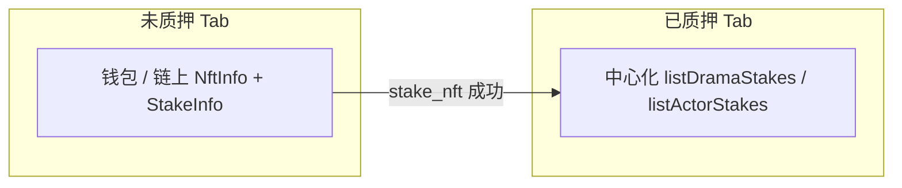
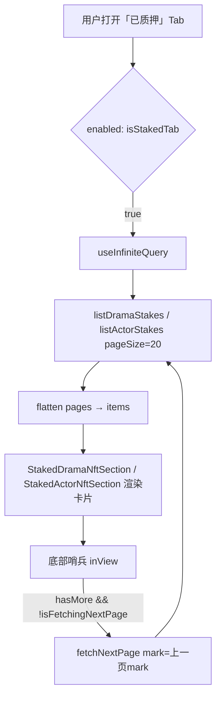

# 已质押短剧 / 演员 NFT 列表（中心化 API）

叙述者中心「短剧 NFT」「持有演员 NFT」面板中，**已质押** Tab 的数据来源、游标分页约定与前端实现说明。  
**未质押** Tab 仍为链上查询，见 [`docs/查询未质押短剧NFT列表.md`](./查询未质押短剧NFT列表.md) 及演员侧链上 hook。

> **最近更新（2026-05）**  
> 1. 短剧已质押列表接入 **`listDramaStakes`**（`GET /api/mini-drama/creator/stakes/dramas`），移除 `DramaNftPanel` 内 mock。  
> 2. 演员已质押列表接入 **`listActorStakes`**（`GET /api/mini-drama/creator/stakes/actors`），移除 `ActorNftHoldingsPanel` 内 mock。  
> 3. 分页采用 **`mark` 游标 + `hasMore`**，`pageSize = 20`；列表底部 **`useInView` 哨兵** 滚动自动加载下一页（与 History / ActorPlaza 等模块一致）。  
> 4. 链上质押成功后 **`invalidateQueries`** 未质押基线 + 已质押列表缓存。

---

## 一、Tab 语义与数据来源

| 面板 | Tab | 数据来源 | 说明 |
|------|-----|----------|------|
| 短剧 NFT | **未质押** | 链上钱包 + `NftInfo` + `StakeInfo` | `useUnstakedDramaNfts({ listEnabled })` |
| 短剧 NFT | **已质押** | 中心化 **`listDramaStakes`** | 质押后 NFT 在合约 vault，**不在用户钱包** |
| 持有演员 NFT | **未质押** | 链上 Actor `NftInfo` + `StakeInfo` | `useUnstakedActorNfts({ listEnabled })` |
| 持有演员 NFT | **已质押** | 中心化 **`listActorStakes`** | 同上，以中心化登记为准 |



**结论：**

- **已质押** 与 **未质押** 列表天然互斥：未质押扫钱包；已质押只请求创作者质押登记接口。
- 仅在对应 **已质押** 子 Tab 激活时发起 HTTP 请求（`enabled: isStakedTab`），避免无效调用。

---

## 二、中心化接口

### 2.1 短剧已质押列表

| 项目 | 值 |
|------|-----|
| OpenAPI 操作 | `listDramaStakes` |
| 路径 | `GET /api/mini-drama/creator/stakes/dramas` |
| 查询参数 | `mark?`（number，上一页响应游标）、`pageSize?`（1～100，前端固定 **20**） |
| 响应分页体 | `PageDtoStakedDramaResponse`：`list`、`mark`（string）、`hasMore`、`pageSize` |
| 列表项类型 | `StakedDramaResponse` |

### 2.2 演员已质押列表

| 项目 | 值 |
|------|-----|
| OpenAPI 操作 | `listActorStakes` |
| 路径 | `GET /api/mini-drama/creator/stakes/actors` |
| 查询参数 | 同短剧（`mark`、`pageSize`） |
| 响应分页体 | `PageDtoStakedActorResponse` |
| 列表项类型 | `StakedActorResponse` |

### 2.3 Orval 生成代码（勿手写重复 client）

| 用途 | 路径 |
|------|------|
| API 函数 + Query Key | `src/api/__generated__/story/creator-stake-controller/creator-stake-controller.ts` |
| 请求参数 | `src/api/__generated__/story/model/listDramaStakesParams.ts`、`listActorStakesParams.ts` |
| 分页 / 行模型 | `pageDtoStakedDramaResponse.ts`、`pageDtoStakedActorResponse.ts`、`stakedDramaResponse.ts`、`stakedActorResponse.ts` |

重新生成：`pnpm generate:api`（以 `orval.config.ts` 为准）。

---

## 三、游标分页（mark 协议）

与项目 **`agent-to-api-model`**「mark 协议」一致：

1. **首屏**：只传 `pageSize: 20`，**不传** `mark`（`initialPageParam: undefined`）。
2. **下一页**：使用**上一页响应**中的 `mark` 原值（经 `Number(mark)` 写入请求参数；响应里 `mark` 类型为 string）。
3. **停止翻页**：`hasMore === false`，或 `mark` 缺失，或 `mark === '-1'`（`STAKED_MARK_END`）。
4. **禁止**用页码、自增 offset 替代 `mark`。

实现集中在 `src/features/narrator/narratorStakeFormat.ts`：

| 常量 / 函数 | 说明 |
|-------------|------|
| `NARRATOR_STAKED_PAGE_SIZE` | **20** |
| `getStakedDramaCursorNextPageParam` | 短剧列表 `getNextPageParam` |
| `getStakedActorCursorNextPageParam` | 演员列表 `getNextPageParam` |
| `unwrapOrvalPayload` | 从 Orval 响应中解出 `data.data` 分页体（复用 mining 工具） |

---

## 四、数据流（React Query）



### 4.1 Query Key

| 列表 | Query Key 工厂 | 典型 key |
|------|----------------|----------|
| 短剧已质押 | `getListDramaStakesQueryKey(params)` | `['/api/mini-drama/creator/stakes/dramas', { pageSize: 20 }]` |
| 演员已质押 | `getListActorStakesQueryKey(params)` | `['/api/mini-drama/creator/stakes/actors', { pageSize: 20 }]` |

失效缓存时使用 **无参** `getListDramaStakesQueryKey()` / `getListActorStakesQueryKey()`，可匹配该路径下全部分页实例。

### 4.2 分页触发（滚动加载）

- **`useInView`**（`react-intersection-observer`）绑定列表底部哨兵 `loadMoreRef`。
- **`useEffect`** 条件：`enabled && inView && hasNextPage && !isFetchingNextPage` → `fetchNextPage()`。
- **不**使用「加载更多」按钮作为主交互（与未质押 Tab 的链上渐进列表不同）。

### 4.3 质押成功后的缓存更新

| 操作 | 失效范围 |
|------|----------|
| 短剧 `stake_nft` 成功（`StakeDramaNftDialog`） | `UNSTAKED_DRAMA_NFTS_BASE_QUERY_KEY` + `getListDramaStakesQueryKey()` |
| 演员质押成功（`StakeActorNftDialog`） | `UNSTAKED_ACTOR_NFTS_BASE_QUERY_KEY` + `getListActorStakesQueryKey()` |

链上写入与中心化索引可能存在短暂延迟；失效后用户切到「已质押」Tab 会重新拉列表。

---

## 五、代码结构

| 路径 | 职责 |
|------|------|
| `src/features/narrator/narratorStakeFormat.ts` | 分页常量、`mark` 下一页解析 |
| `src/features/narrator/hooks/useStakedDramaNfts.ts` | 短剧已质押 `useInfiniteQuery` + 滚动翻页 |
| `src/features/narrator/hooks/useStakedActorNfts.ts` | 演员已质押 `useInfiniteQuery` + 滚动翻页 |
| `src/features/narrator/components/DramaNftPanel.tsx` | 短剧 Tab；`StakedDramaNftSection` / `StakedDramaNftCard` |
| `src/features/narrator/components/ActorNftHoldingsPanel.tsx` | 演员 Tab；`StakedActorNftSection` / `StakedActorNftCard` |
| `src/features/narrator/components/BindActorDialog.tsx` | 绑定演员弹窗；支持 `dramaTitle` / `dramaNftLabel` / `episodesLine` 接口直出 |
| `src/features/narrator/components/StakeDramaNftDialog.tsx` | 质押写链 + 缓存失效 |
| `src/components/StakeActorNftDialog.tsx` | 演员质押写链 + 缓存失效 |

### 5.1 Hook 启用条件

```ts
// DramaNftPanel
const isStakedTab = stakeFilter === NarratorStakeFilter.Staked;
useStakedDramaNfts({ enabled: isStakedTab });

// ActorNftHoldingsPanel
useStakedActorNfts({ enabled: isStakedTab });
```

### 5.2 Hook 返回值

| 字段 | 说明 |
|------|------|
| `items` | 已展平的全部页 `StakedDramaResponse[]` / `StakedActorResponse[]` |
| `loadMoreRef` | 传给底部哨兵 DOM |
| `isLoading` | 首屏加载（且 `enabled`） |
| `isError` | 请求失败 |
| `isFetchingNextPage` | 正在拉下一页 |
| `hasNextPage` | 是否还有下一页（供哨兵逻辑使用） |

---

## 六、卡片字段映射（API → UI）

联调阶段**禁止**再维护与 Orval 同构的本地 mock 类型；组件直接使用生成 model。

### 6.1 短剧已质押卡（`StakedDramaNftCard`）

| UI | API 字段 | 备注 |
|----|----------|------|
| 封面 | `coverUrl` | 缺省用本地占位图 |
| 标题 | `title` | 缺省 `Drama #${id}` |
| 角标 `DramaNFT#` | `id` 或 `nftContractAddress` 前缀 | |
| 集数 pill | `totalEpisodes` | `t('共 {{n}} 集')` |
| 角色 / 演员 NFT pill | `totalRoles`、`totalActorCount` | `t('角色 {{n}}')`、`t('演员NFT {{n}}')` |
| 单价 / 批量折扣 / 演员分润 | `episodePrice`、`batchUnlockDiscountRate`、`totalActorCommissionRatio` | `formatNumber` / `toPercentFloor`；缺失显示 `-` |
| 创作者分润区块 | 仍为稿面固定文案 key | 待产品接 `dramaCommissionRatio` 等字段时可再改 |
| 已质押 / 绑定演员 | 按钮态 | 绑定打开 `BindActorDialog`，传入接口标题与封面 |

### 6.2 演员已质押卡（`StakedActorNftCard`）

| UI | API 字段 | 备注 |
|----|----------|------|
| 头像 / 模糊底图 | `avatarUrl` | 缺省 `identity-01.png` |
| 标题 | `name` | |
| 角标 `ActorNFT#` | `id` 或 `nftMintAddress` | |
| 「质押中」角标 | 固定 i18n | |
| 发行量 / 可 Mint | `nftMaxSupply`、`mintQuantity` | 可 Mint = `max(0, supply - minted)` |
| 进度条 / 已铸造文案 | `mintQuantity`、`nftMaxSupply` | |
| 已质押数量 | `stakedAmount` | `formatNumber` |

---

## 七、UI 状态

| 场景 | 展示 |
|------|------|
| 首屏请求中 | 区域居中 `Spinner` |
| 请求失败 | `t('加载失败')` |
| 无数据且非翻页中 | `t('暂无记录')` |
| 滚动到底且仍有下一页 | 哨兵处 `Spinner`，自动 `fetchNextPage` |

错误 toast 由全局 `appAxiosInstance` 等业务层处理（与内嵌列表惯例一致）。

---

## 八、i18n

新增 key（需在其它语言执行 `pnpm i18n:translate`）：

| Key | en 示例 | zh-CN（key === value） |
|-----|---------|------------------------|
| `角色 {{n}}` | Roles {{n}} | 角色 {{n}} |
| `演员NFT {{n}}` | Actor NFT {{n}} | 演员NFT {{n}} |

---

## 九、与未质押列表的差异

| 维度 | 未质押 Tab | 已质押 Tab（本文） |
|------|------------|-------------------|
| 数据源 | Solana RPC + Story 程序账户 | 中心化 REST |
| 触发 | 需钱包 + chainlinks；短剧另需 `listEnabled` | 仅需打开已质押 Tab |
| 翻页 | 链上 slice +「加载更多」按钮（短剧） | HTTP `mark` + **滚动哨兵** |
| 质押后 NFT 位置 | 仍在钱包（未质押）或已进 vault（不再出现在未质押列表） | 由后端索引展示 |

---

## 十、手动验收

1. 登录叙述者账号，进入叙述者中心。
2. **短剧 NFT → 已质押**：Network 应出现 `GET .../stakes/dramas?pageSize=20`；有数据时渲染卡片；滚到底自动带 `mark` 请求下一页。
3. **持有演员 NFT → 已质押**：`GET .../stakes/actors?pageSize=20`，行为同上。
4. 切换到 **未质押** Tab：不应继续请求上述 stakes 接口（`enabled: false`）。
5. 完成一笔短剧 / 演员质押后：未质押列表刷新；切回 **已质押** 应能看到新记录（若后端已同步）。
6. 短剧已质押卡点击 **绑定演员**：弹窗展示接口返回的剧名、封面、集数。

---

## 十一、实施阶段

| 阶段 | 内容 | 状态 |
|------|------|------|
| P0 | `listDramaStakes` + `useStakedDramaNfts` + `DramaNftPanel` 已质押 Tab | ✅ |
| P0 | `listActorStakes` + `useStakedActorNfts` + `ActorNftHoldingsPanel` 已质押 Tab | ✅ |
| P0 | 质押成功 invalidate 已质押 + 未质押基线缓存 | ✅ |
| P1 | 创作者分润等区块改为 API 字段驱动 | 待产品 / 接口字段确认 |
| P1 | 绑定演员弹窗接真实角色 / 演员 NFT 选择接口 | 仍为演示交互 |

---

## 十二、相关文档

- 未质押短剧列表（链上）：[`docs/查询未质押短剧NFT列表.md`](./查询未质押短剧NFT列表.md)
- 短剧质押写链：[`docs/质押短剧NFT.md`](./质押短剧NFT.md)
- 合约账户说明：`src/solana/STORY_CONTRACT_API.md`

---

## 附录：相关文件速查

```
src/features/narrator/
  narratorStakeFormat.ts
  hooks/useStakedDramaNfts.ts
  hooks/useStakedActorNfts.ts
  components/DramaNftPanel.tsx          # StakedDramaNftSection
  components/ActorNftHoldingsPanel.tsx  # StakedActorNftSection
  components/StakeDramaNftDialog.tsx
  components/BindActorDialog.tsx

src/components/StakeActorNftDialog.tsx

src/api/__generated__/story/creator-stake-controller/creator-stake-controller.ts
```
