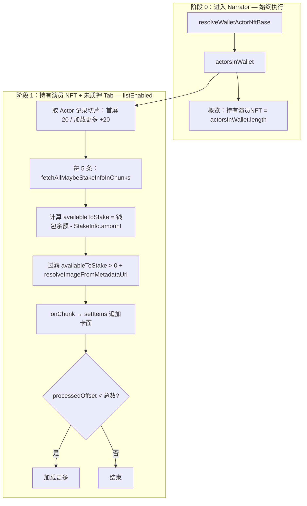
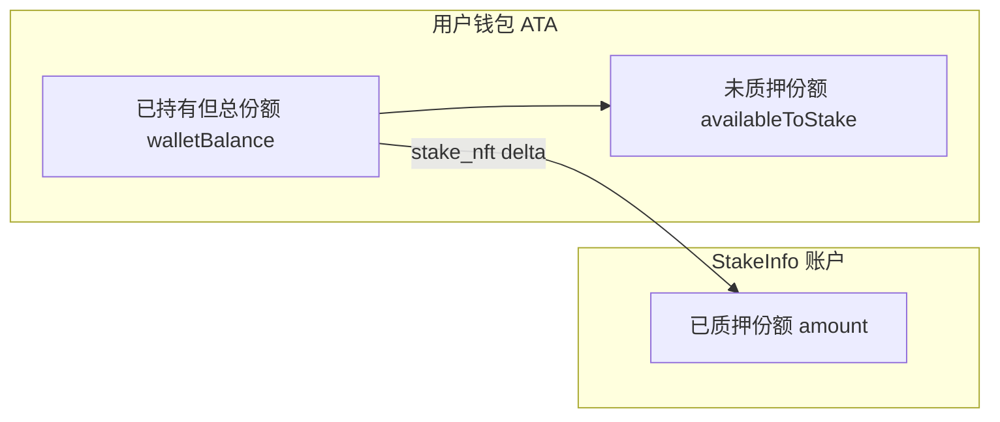
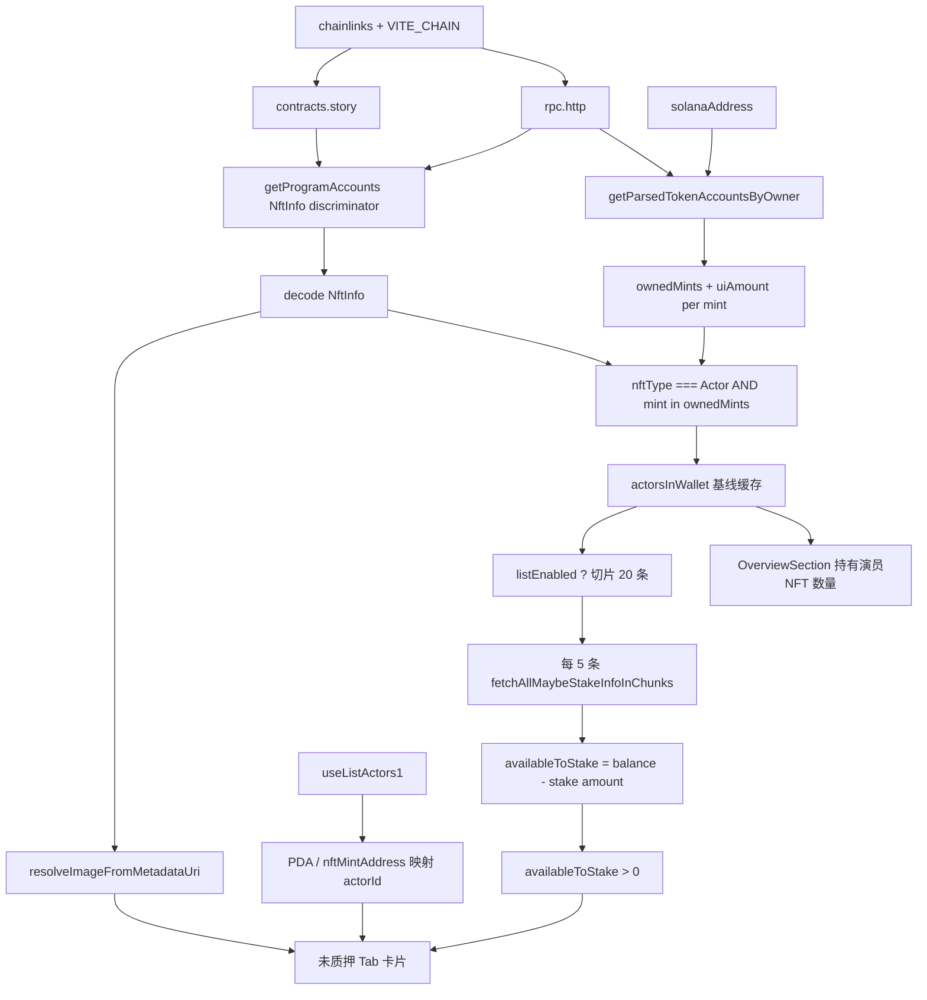

# 查询未质押演员 NFT 列表

叙述者中心「持有演员 NFT」面板与概览区中，**持有演员 NFT 数量**、**未质押** Tab 列表的数据来源、分批 RPC 约定与前端实现说明。  
**已质押** Tab 本期使用 mock，待中心化 API 替换。

> **最近更新（2026-05）**  
> 1. 以链上 **`NftInfo`** 为真源识别演员 SNFT，结合 **`StakeInfo.amount`** 计算可质押数量（支持**部分质押**）。  
> 2. **方案 A**（与短剧一致）：`getMultipleAccounts` 单次最多 **5** 个地址（QuickNode 上限），StakeInfo 分批查询；复用 `unstakedDramaNfts/chunkedAccounts.ts`。  
> 3. 进入 narrator **即拉基线**（钱包 Actor `NftInfo` 总数 → 概览「持有演员NFT」）；**仅**在「持有演员 NFT + 未质押」Tab 才查 StakeInfo 并渲染卡面。  
> 4. **渐进分页**：首屏处理前 **20** 条 Actor 记录，每 **5** 条一批 RPC、查完即展示；超过 20 条可「加载更多」。

---

## 重点功能（1～4）与实现方案

| # | 功能 | 用户可见 | 实现要点 |
|---|------|----------|----------|
| **1** | 修复 RPC 单次地址数超限 | 未质押 Tab 不因批量 `getMultipleAccounts` 返回 413 / 加载失败 | 复用 `fetchAllMaybeStakeInfoInChunks`，`RPC_GET_MULTIPLE_ACCOUNTS_CHUNK_SIZE = 5` |
| **2** | 进入 narrator 即查持有演员 NFT 总数 | 概览区「持有演员NFT」显示链上 Actor 种类数 | `useWalletActorNftCount`；`count = actorsInWallet.length`（含已部分质押） |
| **3** | 按需拉未质押卡面 | 仅「持有演员 NFT」Tab 且子 Tab 为「未质押」时才查 StakeInfo + 元数据 | `useUnstakedActorNfts({ listEnabled: isUnstakedTab })` |
| **4** | 渐进分页与加载更多 | 首屏不必等 20 条全部查完；卡片随批次出现；>20 条可继续加载 | 首屏 slice **20**；每批 RPC **5**；`onChunk` 追加 `items`；`loadMore` 每次再处理 **20** 条 |

### 实现方案 A（分批 RPC + 双阶段查询）



**常量**（`src/hooks/solana/unstakedActorNfts/constants.ts`）：

| 常量 | 值 | 含义 |
|------|-----|------|
| `RPC_GET_MULTIPLE_ACCOUNTS_CHUNK_SIZE` | **5** | 单次 `getMultipleAccounts` 地址上限 |
| `UNSTAKED_ACTOR_NFT_INITIAL_SLICE` | **20** | 未质押列表首屏处理的 Actor NftInfo 记录条数 |
| `UNSTAKED_ACTOR_NFT_LOAD_MORE_SLICE` | **20** | 点击「加载更多」时每页处理的 Actor 记录条数 |

**React Query 缓存拆分**：

| Query Key | Hook | 何时启用 | 用途 |
|-----------|------|----------|------|
| `wallet-actor-nft-base` | `useWalletActorNftCount` / `useUnstakedActorNfts` 基线 | 已登录 + 有钱包 + chainlinks 就绪 | 扫钱包 + `getProgramAccounts` NftInfo → `actorsInWallet` |
| （无独立 key，基线 effect） | `useUnstakedActorNfts` 列表 | 额外要求 `listEnabled === true` | 对切片做 StakeInfo + 元数据 + 渐进 `items` |

概览 **数量** 与未质押 **列表** 共用同一基线 Query，避免重复扫链。

---

## 一、Tab 语义

| Tab | 数据来源 | 判定 |
|-----|----------|------|
| **未质押** | 链上：钱包 SPL 持有 ∩ Story **`NftInfo`（`NftType.Actor`）** ∩ **`availableToStake > 0`** | 钱包内仍持有 SNFT，且链上登记为演员类型，且扣除已质押数量后仍有可质押份额 |
| **已质押** | **暂 mock** | 本期不拉链上；保留静态 mock，后续由中心化接口提供 |

### 与短剧 NFT 的关键差异

演员 NFT 为 **SNFT（半同质化）**：同一 `mint` 可在钱包中持有**多份**（`uiAmount > 1`），且可对同一 mint **部分质押**（`StakeInfo.amount` 记录已质押份数，钱包 ATA 仍可能有余量）。



**结论：**

- **未质押列表** = 钱包里有的 Actor mint，且在 Story 程序 **`NftInfo`** 中类型为 **`Actor`**，且 **`availableToStake = walletBalance - stakedAmount > 0`**。
  - `walletBalance`：SPL 扫描该 mint 的 `uiAmount`
  - `stakedAmount`：`StakeInfo` 存在且 `isStaked === true` 时取 `amount`，否则为 `0`
- **已质押列表** = 本期不拉链上；保留静态 mock（`STAKED_HOLDING_CARDS_MOCK`），后续由中心化接口提供。
- **不把**短剧 Series NFT（`NftType.Series`）计入本列表。

---

## 二、配置：RPC 与 Story 程序地址

与短剧未质押列表相同，详见 `docs/查询未质押短剧NFT列表.md` 第二节。

### 2.1 RPC（强制）

**真源**：`chainlinks[getCurrentChain()].rpc.http`（Admin 配置中心）。

```ts
// src/hooks/solana/chainRpcConfig.ts
getChainRpcHttp(chainlinks, chain)
resolveStoryChainContext(chainlinks, chain) // → { chain, rpcHttp, programId }
```

### 2.2 Story Program Id

- **优先**：`chainlinks[chain].contracts.story`
- **回落**：Codama 常量 `STORY_PROGRAM_ADDRESS`
- 演员 `NftInfo` PDA：`findNftInfoPda({ actorId })`，种子 `["actor_nft", actor_id]`

### 2.3 环境变量对照

| 变量 | 作用 |
|------|------|
| `VITE_CHAIN` | 当前链 key（如 `solana-devnet`），决定 `chainlinks` 取哪一条 |

> RPC 端点**唯一**来自 `chainlinks[currentChain].rpc.http`，不再有 env 兜底。

---

## 三、未质押 Tab：查询方案（当前实现）

### 3.1 核心思路

**三个问题：**

1. 用户钱包里有哪些 mint、各多少份？（SPL 扫描，保留 `uiAmount`）
2. 其中哪些是 Story **演员 Actor SNFT**？（`NftInfo` + `NftType.Actor`）
3. 每种演员 NFT 还有多少**可质押**？（`walletBalance - StakeInfo.amount`）

展示字段以链上 **`NftInfo`**（`name`、`uri`、`mintableSupply`、`userMinted` 等）为主，中心化 **`listActors1`** 仅用于补全 `actorId`、头像、单价等业务字段。

### 3.2 Step A：扫钱包 SPL 持有（含数量）

1. `owner` = Privy `solanaAddress`
2. `Connection(chainlinks[chain].rpc.http)`
3. `getParsedTokenAccountsByOwner(owner, { programId: TOKEN_PROGRAM_ID })`
4. 过滤：`uiAmount >= 1`；排除 `chainlinks[chain].tokens` 中的 fungible mint
5. 构建 **`walletBalanceByMint: Map<mint, uiAmount>`**（演员 SNFT 需保留数量）

实现：`src/hooks/solana/walletNftHoldings.ts` → `fetchOwnerTokenMintHoldings`。

### 3.3 Step B：扫描 Story 程序下全部 `NftInfo`

| 项目 | 值 |
|------|-----|
| 账户类型 | `NftInfo` |
| 演员 PDA | `findNftInfoPda`，种子 `["actor_nft", actor_id]` |
| 演员类型 | `NftType.Actor` |

实现方式：

1. `connection.getProgramAccounts(programId, { filters: [{ memcmp: { offset: 0, bytes: bs58(NFT_INFO_DISCRIMINATOR) } }] })`
2. `decodeNftInfo` 解码每条账户
3. 保留 **`nftType === Actor`** 且 **`mint ∈ 钱包持有集合`** 的记录 → `actorsInWallet`

> 与短剧相同：全程序扫描 `NftInfo` 以链上登记为准，不依赖 API「是否已 mint」标志作为前置条件。

### 3.4 Step C：计算可质押份额（`StakeInfo`，分批 RPC）

| 项目 | 值 |
|------|-----|
| PDA | `findStakeInfoPda({ mint, owner })`，种子 `["stake_info", mint, owner]` |
| 已质押份数 | 账户存在且 **`isStaked === true`** 时取 **`amount`**，否则 `0` |
| 可质押份数 | **`availableToStake = max(0, walletBalance - stakedAmount)`** |
| 列入未质押 Tab | **`availableToStake > 0`** |
| 批量方式 | **`fetchAllMaybeStakeInfoInChunks`**（`unstakedDramaNfts/chunkedAccounts.ts`），每批最多 **5** 个地址 |

> **与短剧判定差异**：短剧 Series 为 1/1 NFT，未质押条件为 `!isStaked`（全额在钱包或全额在 vault）。演员 SNFT 允许**部分质押**，故必须结合 SPL **`uiAmount`** 与 **`StakeInfo.amount`** 计算剩余可质押份数。

**触发时机**：Step C **不在**进入 narrator 时执行，仅当 `useUnstakedActorNfts({ listEnabled: true })`（持有演员 NFT Tab + 未质押子 Tab）时，对当前 **Actor 记录切片** 分批执行。

### 3.5 Step D：关联演员 ID 与展示字段

| 来源 | 用途 |
|------|------|
| `useListActors1` | 构建 `actor_id → NftInfo PDA` 索引；`nftMintAddress → actor` 索引 |
| 链上 `NftInfo` | **真源**：`name`、`uri`、`mintableSupply`、`userMinted` 等 |
| `resolveImageFromMetadataUri(uri)` | Metaplex JSON → `image` 作为头像 |
| `ActorResponse` | 补全演员名、头像、单价等（API 有则展示） |

卡片渲染优先级（`ActorNftHoldingsPanel` → `UnstakedActorNftCard`）：

- 标题：`onChainMetadata.name` → `actor.name`
- 头像：`onChainMetadata.imageUrl` → `actor.avatarUrl` → 本地占位图
- 发行量 / 已铸造：`mintableSupply`、`userMinted`（链上）
- 可质押：`availableToStake`（链上计算）
- 链上标记：有 `onChainMetadata` 时展示 `t('链上')`

### 3.6 渐进列表（Step E，仅 `listEnabled`）

在基线 `actorsInWallet` 已就绪的前提下：

1. **首屏**：`actorsInWallet.slice(0, 20)`（`UNSTAKED_ACTOR_NFT_INITIAL_SLICE`）
2. **批内 RPC**：`buildUnstakedActorItemsProgressive` 对当前切片再按 **5** 条调用 `buildUnstakedItemsFromActorRecords`
3. **查完即展示**：每批得到未质押项后 `onChunk` → `setItems(prev => [...prev, ...chunkItems])`
4. **加载更多**：`processedOffset < actorsInWallet.length` 时展示按钮；`loadMore` 再处理后续 **20** 条

**UI 状态**（`ActorNftHoldingsPanel` → `UnstakedActorNftSection`）：

| 状态 | 展示 |
|------|------|
| 首屏无数据且处理中 | 全屏 `Spinner`（`isLoading`） |
| 已有卡片且仍在分批 | 列表底部 `Spinner`（`isFetchingMore`） |
| 仍有未处理的 Actor 记录 | 「加载更多」按钮（`hasMore`） |
| 处理完成且无未质押项 | `t('暂无记录')` |

### 3.7 数据流



### 3.8 明确不做的事

- **不使用**无 `onChainMetadata` 的钱包 token 后备列表（与短剧一致，避免 mock 封面）
- **不把**短剧 Series NFT（`NftType.Series`）计入演员未质押列表
- **不**依赖只读指令 `getNftStakeInfo` / `getUserNftStakes`（直接读 `StakeInfo` 账户）
- **不**在基线阶段批量查 StakeInfo（仅 `listEnabled` 时对切片查询）

### 3.9 调试日志

`resolveWalletActorNftBase` / 相关模块控制台前缀 **`[UnstakedActorNfts]`**：

| 日志 | 含义 |
|------|------|
| `钱包持有的 NFT mint` | Step A 结果（含 `uiAmount`） |
| `钱包内 Actor NftInfo 数量` | 类型 Actor + 持有交集（**概览「持有演员NFT」同此 length**） |
| `NftInfo 链上数据` | 每条入选项的 `actorId`、`walletBalance`、`stakedAmount`、`availableToStake` 等 |

> **数量语义区分**：`actorsInWallet.length` = 钱包内 Actor 种类数（**含已部分质押**，只要 mint 仍在 SPL 扫描结果中）；未质押 Tab `items.length` = 其中 `availableToStake > 0` 的子集。

---

## 四、已质押 Tab：Mock + TODO

本期**不拉链上**，代码中保留 TODO：

```ts
// TODO(centralized-api): 已质押演员 NFT 改由中心化接口查询，替换 STAKED_HOLDING_CARDS_MOCK。
```

---

## 五、代码结构

| 路径 | 职责 |
|------|------|
| `src/hooks/solana/chainRpcConfig.ts` | RPC / Program Id 解析 |
| `src/hooks/solana/walletNftHoldings.ts` | 钱包 SPL mint 扫描（含 `uiAmount`） |
| `src/hooks/solana/unstakedDramaNfts/chunkedAccounts.ts` | **`fetchAllMaybeStakeInfoInChunks`（演员复用）** |
| `src/hooks/solana/unstakedActorNfts/constants.ts` | RPC chunk=5、首屏/加载更多 slice=20 |
| `src/hooks/solana/unstakedActorNfts/resolveWalletActorNft.ts` | 基线 `resolveWalletActorNftBase`、渐进 `buildUnstakedActorItemsProgressive` |
| `src/hooks/solana/useWalletActorNftCount.ts` | 概览「持有演员NFT」数量 |
| `src/hooks/solana/useUnstakedActorNfts.ts` | 基线 React Query + `listEnabled` 渐进列表 + `loadMore` |
| `src/features/narrator/components/OverviewSection.tsx` | 概览指标卡，接 `useWalletActorNftCount` |
| `src/features/narrator/components/ActorNftHoldingsPanel.tsx` | `listEnabled`、渐进加载 UI、质押弹窗；已质押 mock |
| `src/components/StakeActorNftDialog.tsx` | 质押 `stake_nft` + 成功后 invalidate 基线 query |
| `src/solana/STORY_CONTRACT_API.md` | 合约账户 / PDA / 指令说明 |

### 5.1 基线 Query 启用条件（概览 + 列表共用）

```ts
// queryKey: UNSTAKED_ACTOR_NFTS_BASE_QUERY_KEY = 'wallet-actor-nft-base'
enabled:
  authenticated &&
  solanaAddress &&
  isInitialized &&
  chainContext（含 rpc.http + programId）
```

### 5.2 未质押列表 `listEnabled`

```ts
// ActorNftHoldingsPanel
const isUnstakedTab = stakeFilter === NarratorStakeFilter.Unstaked;
useUnstakedActorNfts({ listEnabled: isUnstakedTab });
```

- `listEnabled === false`：仅保留/复用基线缓存，清空 `items`，不查 StakeInfo。
- `listEnabled === true`：对 `actorsInWallet` 切片渐进处理并填充 `items`。

`listActors1` 失败或为空时，链上项仍可能展示（`actorId` 可能为 `0`，标题/头像来自 `NftInfo`）。

### 5.3 概览数量 Hook

```ts
// useWalletActorNftCount
count: baseQuery.data?.actorsInWallet.length ?? 0
```

与未质押列表共用 `UNSTAKED_ACTOR_NFTS_BASE_QUERY_KEY`，进入 narrator 即请求，不依赖是否打开「未质押」Tab。

### 5.4 返回类型

```ts
type UnstakedActorNftItem = {
  id: string;
  actorId: number;
  mintAddress: string;
  nftInfoAddress: string;
  actor: ActorResponse;
  walletBalance: number;       // 钱包 SPL uiAmount
  stakedAmount: number;       // StakeInfo.amount（已质押份数）
  availableToStake: number;   // walletBalance - stakedAmount
  mintableSupply: number;
  userMinted: number;
  onChainMetadata?: {
    name: string;
    uri: string;
    imageUrl?: string;
    creator: Address;
    nftType: NftInfo['nftType'];
    createdAt: bigint;
    mintableSupply: bigint;
    userMinted: bigint;
  };
};
```

### 5.5 `useUnstakedActorNfts` 返回值（列表）

| 字段 | 说明 |
|------|------|
| `items` | 当前已展示的未质押卡面项（渐进追加） |
| `actorsInWalletCount` | 基线 `actorsInWallet.length` |
| `isLoading` | `listEnabled` 且首屏无数据时处理中 |
| `isFetchingMore` | 已有卡片且仍在分批 / loadMore |
| `hasMore` | `processedOffset < actorsInWalletCount` |
| `loadMore` | 加载下一页 Actor 记录（每页 20） |
| `refetch` | `invalidateQueries` 基线并重置列表 |

### 5.6 UI 状态（未质押 Tab）

| 场景 | 展示 |
|------|------|
| chainlinks / RPC 未就绪 | `Spinner` |
| 未连接 Solana 钱包 | `t('未连接钱包')` |
| 列表或链上查询失败 | `t('加载失败')` |
| 首屏处理中且无卡片 | 全屏 `Spinner` |
| 有卡片且批处理中 | 列表底部 `Spinner` |
| 仍有未处理 Actor 记录 | `t('加载更多')` |
| 处理完成且无未质押项 | `t('暂无记录')` |
| 有 `onChainMetadata` | 卡片右上角 `t('链上')` 标记 |

概览「持有演员NFT」：加载中 `Spinner`；未连钱包 / 错误显示 `0`。

### 5.7 质押成功后的缓存

`StakeActorNftDialog` 在链上 `stake_nft` 成功后：

```ts
queryClient.invalidateQueries({ queryKey: [UNSTAKED_ACTOR_NFTS_BASE_QUERY_KEY] });
```

弹窗入参来自列表项：`actorId`、`mintAddress`、`availableToStake`、`stakedAmount`。

---

## 六、与短剧未质押列表的对照

| 项 | 短剧 Series | 演员 Actor SNFT |
|----|-------------|-----------------|
| NFT 类型 | `NftType.Series` | `NftType.Actor` |
| NftInfo PDA | `findMintSeriesNftNftInfoPda` | `findNftInfoPda({ actorId })` |
| 中心化 API | `useListDramas` | `useListActors1` |
| 基线字段 | `seriesInWallet` | `actorsInWallet` |
| Query Key | `wallet-series-drama-nft-base` | `wallet-actor-nft-base` |
| 未质押判定 | `!isStaked`（1/1） | `availableToStake > 0`（可部分质押） |
| 面板组件 | `DramaNftPanel` | `ActorNftHoldingsPanel` |
| 质押弹窗 | `StakeDramaNftDialog` | `StakeActorNftDialog` |
| 分批 RPC | `unstakedDramaNfts/chunkedAccounts.ts` | **复用同一模块** |

详细短剧方案见：`docs/查询未质押短剧NFT列表.md`。

---

## 七、链上合约参考

| 项目 | 说明 |
|------|------|
| IDL / 生成代码 | `src/solana/generated/story/` |
| 文档 | `src/solana/STORY_CONTRACT_API.md` |
| 演员 mint PDA | `findMintPda`，`["actor_mint", actor_id]` |
| 演员 NftInfo PDA | `findNftInfoPda`，`["actor_nft", actor_id]` |
| 质押状态 PDA | `findStakeInfoPda`，`["stake_info", mint, owner]` |
| NFT 类型 | `NftType.Actor` = 演员 SNFT；`NftType.Series` = 短剧（**不进入本列表**） |

`StakeInfo` 与演员质押相关字段：`owner`、`mint`、`nftType`、`nftId`、`amount`、`isStaked`。

---

## 八、实施阶段

| 阶段 | 内容 | 状态 |
|------|------|------|
| P0 | 钱包扫描 + `NftInfo` 程序扫描 + `StakeInfo` 可质押计算 | ✅ |
| P0 | `onChainMetadata` + 头像 JSON 解析 + `ActorNftHoldingsPanel` | ✅ |
| P0 | RPC 分批（chunk=5，复用短剧 chunkedAccounts） | ✅ |
| P0 | 概览「持有演员NFT」链上总数 + `listEnabled` 按需列表 | ✅ |
| P0 | 渐进分页（首屏 20、每批 5 RPC、加载更多） | ✅ |
| P1 | 已质押 mock + `TODO(centralized-api)` | ✅ |
| P1 | `StakeActorNftDialog` 接 `stake_nft` + invalidate 基线 query | ✅ |
| P2 | 中心化「已质押演员 NFT 列表」API 替换 mock | 待做 |

---

## 九、手动验收

1. `chainlinks[solana-devnet].rpc.http` 可访问；`contracts.story` 与部署程序一致。
2. Privy 连接 Solana 钱包；钱包内持有已铸造的**演员 Actor SNFT**（`uiAmount >= 1`）。
3. 进入**叙述者中心**（无需打开未质押 Tab）：
   - 概览「持有演员NFT」= 控制台 `钱包内 Actor NftInfo 数量`
   - 数量为钱包内 Actor **种类数**（含已部分质押、mint 仍在 ATA 的项）
4. **持有演员 NFT** → **未质押**：
   - 卡片应**分批出现**（每 5 条 StakeInfo RPC 一批）
   - 名称/头像来自链上 `NftInfo`（或 `uri` → `image`）
   - 「可质押」= `availableToStake`；控制台可见 `NftInfo 链上数据` 中的余额与质押份数
   - 有链上元数据时显示「链上」标记
   - 无 413 /「加载失败」
5. 若 `actorsInWallet.length > 20`：首屏先处理 20 条；底部「加载更多」。
6. 点击「质押NFT」：弹窗带入 `actorId`、`mintAddress`、`availableToStake`；质押成功后列表刷新。
7. 切换到**已质押**或其它 Tab：不应触发 StakeInfo 列表请求（`items` 清空）。
8. 若钱包仅有短剧 Series NFT → 演员概览为 0、未质押 Tab **暂无记录**（符合预期）。

---

## 十、小结

| 项 | 结论 |
|----|------|
| RPC | `chainlinks[VITE_CHAIN].rpc.http` |
| 识别演员 NFT | Story 程序 `NftInfo` + `NftType.Actor` + mint ∈ 钱包 |
| 概览持有数量 | `actorsInWallet.length`（进入 narrator 即查，**含已部分质押**） |
| 未质押列表触发 | 仅「持有演员 NFT + 未质押」Tab，`listEnabled: true` |
| 未质押判定 | `availableToStake = walletBalance - stakedAmount > 0` |
| StakeInfo 批量 | 每批 ≤ **5** 地址（复用 `fetchAllMaybeStakeInfoInChunks`） |
| 列表分页 | 首屏 / 加载更多各 **20** 条；批内每 **5** 条 RPC，查完即展示 |
| 展示真源 | `NftInfo.name` / `uri`（→ `image`）；API 补演员业务字段 |
| 已质押 Tab | 本期 mock + TODO 中心化 API |
| 与短剧文档 | `docs/查询未质押短剧NFT列表.md` |

---

## 附录：相关文件

- 短剧对照文档：`docs/查询未质押短剧NFT列表.md`
- SPL 余额说明：`docs/查询链上SPLToken余额查询.md`
- 实现入口：
  - 基线 + 列表：`src/hooks/solana/useUnstakedActorNfts.ts`
  - 概览数量：`src/hooks/solana/useWalletActorNftCount.ts`
  - 链上解析：`src/hooks/solana/unstakedActorNfts/resolveWalletActorNft.ts`
  - 分批 RPC（共用）：`src/hooks/solana/unstakedDramaNfts/chunkedAccounts.ts`
  - 常量：`src/hooks/solana/unstakedActorNfts/constants.ts`
  - UI：`src/features/narrator/components/ActorNftHoldingsPanel.tsx`
