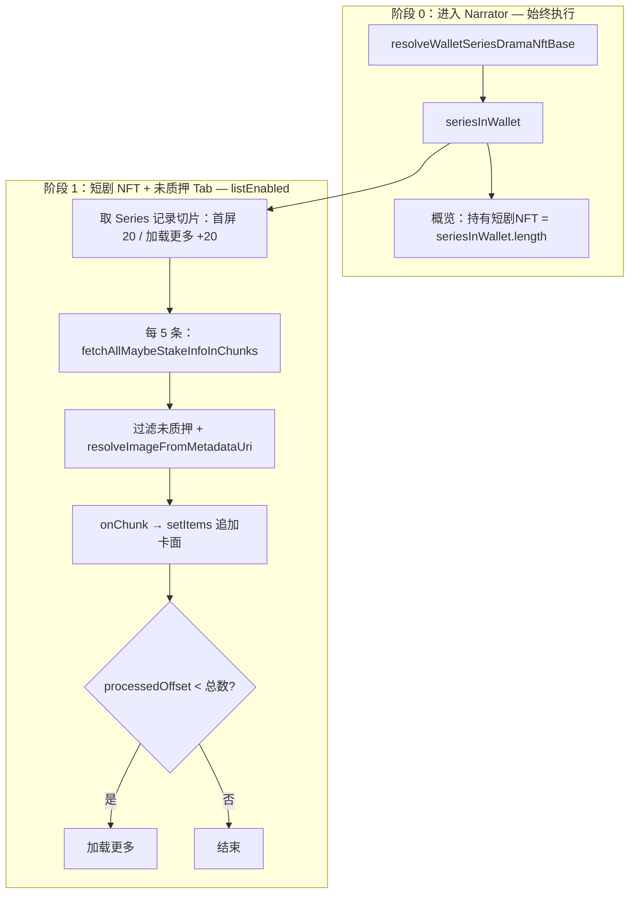
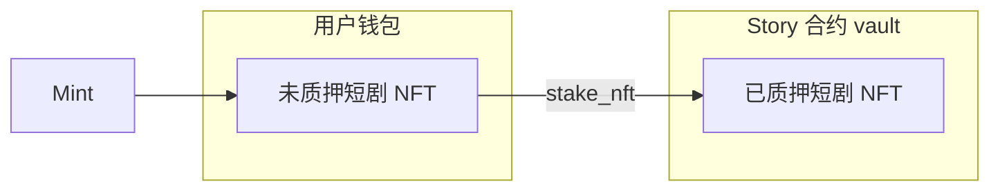
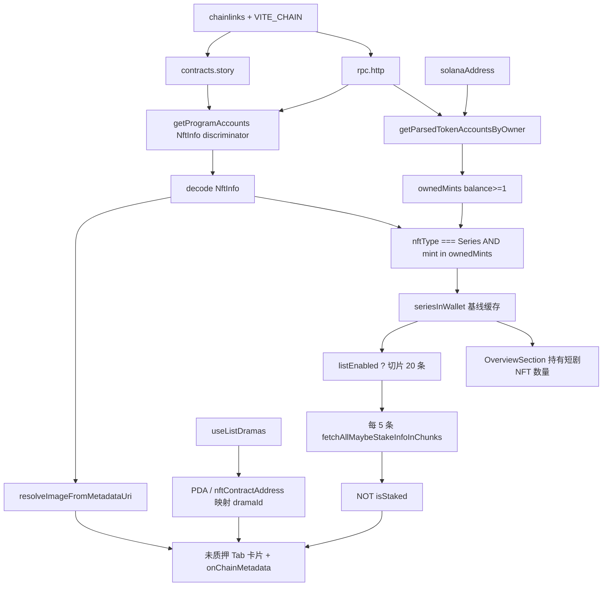

# 查询未质押短剧 NFT 列表

叙述者中心「短剧 NFT」面板与概览区中，**持有短剧 NFT 数量**、**未质押** Tab 列表的数据来源、分批 RPC 约定与前端实现说明。  
**已质押** Tab 已改由中心化 API，见 [`docs/已质押的短剧和演员列表中心化.md`](./已质押的短剧和演员列表中心化.md)。

> **最近更新（2026-05）**  
> 1. 以链上 **`NftInfo`** 为真源识别短剧 NFT，**`StakeInfo.isStaked`** 排除已质押项（移除无元数据后备列表）。  
> 2. **方案 A**：`getMultipleAccounts` 单次最多 **5** 个地址（QuickNode 上限），StakeInfo 分批查询。  
> 3. 进入 narrator **即拉基线**（钱包 Series `NftInfo` 总数 → 概览「持有短剧NFT」）；**仅**在「短剧 NFT + 未质押」Tab 才查 StakeInfo 并渲染卡面。  
> 4. **渐进分页**：首屏处理前 **20** 条 Series 记录，每 **5** 条一批 RPC、查完即展示；超过 20 条可「加载更多」。

---

## 重点功能（1～4）与实现方案

| # | 功能 | 用户可见 | 实现要点 |
|---|------|----------|----------|
| **1** | 修复 RPC 单次地址数超限 | 未质押 Tab 不再因 7 个 mint 一次性 `getMultipleAccounts` 而 413 / 加载失败 | `fetchAllMaybeStakeInfoInChunks`，`RPC_GET_MULTIPLE_ACCOUNTS_CHUNK_SIZE = 5` |
| **2** | 进入 narrator 即查持有短剧 NFT 总数 | 概览区「持有短剧NFT」显示链上数量（如 **7**） | `useWalletSeriesDramaNftCount`；`count = seriesInWallet.length`（含已质押） |
| **3** | 按需拉未质押卡面 | 仅「短剧 NFT」Tab 且子 Tab 为「未质押」时才查 StakeInfo + 元数据 | `useUnstakedDramaNfts({ listEnabled: isUnstakedTab })` |
| **4** | 渐进分页与加载更多 | 首屏不必等 20 条全部查完；卡片随批次出现；>20 条可继续加载 | 首屏 slice **20**；每批 RPC **5**；`onChunk` 追加 `items`；`loadMore` 每次再处理 **20** 条 |

### 实现方案 A（分批 RPC + 双阶段查询）



**常量**（`src/hooks/solana/unstakedDramaNfts/constants.ts`）：

| 常量 | 值 | 含义 |
|------|-----|------|
| `RPC_GET_MULTIPLE_ACCOUNTS_CHUNK_SIZE` | **5** | 单次 `getMultipleAccounts` 地址上限 |
| `UNSTAKED_DRAMA_NFT_INITIAL_SLICE` | **20** | 未质押列表首屏处理的 Series 记录条数 |
| `UNSTAKED_DRAMA_NFT_LOAD_MORE_SLICE` | **20** | 点击「加载更多」时每页处理的 Series 记录条数 |

**React Query 缓存拆分**：

| Query Key | Hook | 何时启用 | 用途 |
|-----------|------|----------|------|
| `wallet-series-drama-nft-base` | `useWalletSeriesDramaNftCount` / `useUnstakedDramaNfts` 基线 | 已登录 + 有钱包 + chainlinks 就绪 | 扫钱包 + `getProgramAccounts` NftInfo → `seriesInWallet` |
| （无独立 key，基线 effect） | `useUnstakedDramaNfts` 列表 | 额外要求 `listEnabled === true` | 对切片做 StakeInfo + 元数据 + 渐进 `items` |

概览 **数量** 与未质押 **列表** 共用同一基线 Query，避免重复扫链。

---

## 一、Tab 语义

| Tab | 数据来源 | 判定 |
|-----|----------|------|
| **未质押** | 链上：钱包 SPL 持有 ∩ Story **`NftInfo`（`NftType.Series`）** ∩ **`StakeInfo.isStaked !== true`** | 钱包内仍持有、且链上登记为短剧 Series、且未标记已质押 |
| **已质押** | 中心化 **`listDramaStakes`** | 质押后 NFT 进入合约 vault，**不会出现在用户钱包**；见 [`已质押的短剧和演员列表中心化.md`](./已质押的短剧和演员列表中心化.md) |



**结论：**

- **未质押列表** = 钱包里有的 mint，且在 Story 程序 **`NftInfo`** 中类型为 **`Series`**，且对应 **`StakeInfo`** 不存在或 **`isStaked === false`**。
- **已质押列表** = 中心化 `listDramaStakes`，不在此文档范围。

---

## 二、配置：RPC 与 Story 程序地址

### 2.1 RPC（强制）

**真源**：`chainlinks[getCurrentChain()].rpc.http`（Admin 配置中心）。

- `VITE_CHAIN` 决定使用 `chainlinks` 的哪一条。
- 列表查询使用 **`rpc.http`**（已是项目唯一 RPC 事实来源）。

```ts
// src/hooks/solana/chainRpcConfig.ts
getChainRpcHttp(chainlinks, chain)
resolveStoryChainContext(chainlinks, chain) // → { chain, rpcHttp, programId }
```

### 2.2 Story Program Id

- **优先**：`chainlinks[chain].contracts.story`
- **回落**：Codama 常量 `STORY_PROGRAM_ADDRESS`（与 `src/solana/STORY_CONTRACT_API.md` 一致，当前为 `D3zJ8SZFLSU5iJnYzcc4hKovnUyPjSeZeoUYhMQbu8oN`）
- 所有 PDA 计算须传入 `{ programAddress: programId }`

### 2.3 环境变量对照

| 变量 | 作用 |
|------|------|
| `VITE_CHAIN` | 当前链 key（如 `solana-devnet`），决定 `chainlinks` 取哪一条 |

> RPC 端点**唯一**来自 `chainlinks[currentChain].rpc.http`，不再有 env 兜底。

---

## 三、未质押 Tab：查询方案（当前实现）

### 3.1 核心思路

**两个问题：**

1. 用户钱包里有哪些 mint？（SPL 扫描）
2. 其中哪些是 Story **短剧 Series NFT**，且**未质押**？（`NftInfo` + `StakeInfo`）

展示字段以链上 **`NftInfo`**（`name`、`uri` 等）为主，中心化 **`listDramas`** 仅用于补全 `dramaId`、集数、单价等业务字段。

### 3.2 Step A：扫钱包 SPL 持有

1. `owner` = Privy `solanaAddress`
2. `Connection(chainlinks[chain].rpc.http)`
3. `getParsedTokenAccountsByOwner(owner, { programId: TOKEN_PROGRAM_ID })`
4. 过滤：`uiAmount >= 1`；排除 `chainlinks[chain].tokens` 中的 fungible mint

实现：`src/hooks/solana/walletNftHoldings.ts` → `fetchOwnerTokenMintHoldings`。

### 3.3 Step B：扫描 Story 程序下全部 `NftInfo`

按 `STORY_CONTRACT_API.md`：

| 项目 | 值 |
|------|-----|
| 账户类型 | `NftInfo` |
| 短剧 PDA | `findMintSeriesNftNftInfoPda`，种子 `["drama_nft", drama_id]` |
| 短剧类型 | `NftType.Series`（枚举值 `0`） |

实现方式：

1. `connection.getProgramAccounts(programId, { filters: [{ memcmp: { offset: 0, bytes: bs58(NFT_INFO_DISCRIMINATOR) } }] })`
2. `decodeNftInfo` 解码每条账户
3. 保留 **`nftType === Series`** 且 **`mint ∈ 钱包持有集合`** 的记录

> **为何不用「仅按 API `nftMinted` + `findMintSeriesNftMintPda`」**：API 标记、PDA 批量读取失败或 mint 不一致时，旧逻辑会落入后备方案，把钱包内任意 token 当 NFT 展示并回退 mock 图。全程序扫描 `NftInfo` 以链上登记为准，不依赖 `nftMinted` 标志。

### 3.4 Step C：排除已质押（`StakeInfo`，分批 RPC）

| 项目 | 值 |
|------|-----|
| PDA | `findStakeInfoPda({ mint, owner })`，种子 `["stake_info", mint, owner]` |
| 未质押条件 | 账户不存在，或 **`isStaked === false`** |
| 批量方式 | **`fetchAllMaybeStakeInfoInChunks`**，每批最多 **5** 个地址 |

实现：`src/hooks/solana/unstakedDramaNfts/chunkedAccounts.ts` 循环调用 `fetchAllMaybeStakeInfo`（`@solana/kit` RPC）。

> **QuickNode 限制**：Discover 等对 `getMultipleAccounts` 单次地址数有上限（本项目按 **5** 处理）。钱包持有 7 个 Series NFT 时，若一次性传 7 个 StakeInfo PDA 会返回 **413 / -32615**，页面显示「加载失败」。  
> 质押后 NFT 通常在 vault、钱包扫不到；读 `StakeInfo` 用于边界态（质押未完成、索引延迟等）的二次校验。

**触发时机**：Step C **不在**进入 narrator 时执行，仅当 `useUnstakedDramaNfts({ listEnabled: true })`（短剧 NFT Tab + 未质押子 Tab）时，对当前 **Series 记录切片** 分批执行。

### 3.5 Step D：关联短剧 ID 与展示字段

| 来源 | 用途 |
|------|------|
| `useListDramas` | 构建 `drama_id → NftInfo PDA` 索引；`nftContractAddress → drama` 索引 |
| 链上 `NftInfo` | **真源**：`name`、`uri`、`creator`、`nftType`、`createdAt`、`mintableSupply`、`userMinted` |
| `resolveImageFromMetadataUri(uri)` | `uri` 多为 Metaplex JSON URL → 请求 JSON → 取 `image` 作为封面 |
| `DramaDetailResponse` | 补全集数、单价、批量折扣等（API 有则展示） |

卡片渲染优先级（`DramaNftPanel`）：

- 标题：`onChainMetadata.name` → `drama.title`
- 封面：`onChainMetadata.imageUrl` → `drama.coverUrl` → 本地占位图

### 3.6 渐进列表（Step E，仅 `listEnabled`）

在基线 `seriesInWallet` 已就绪的前提下：

1. **首屏**：`seriesInWallet.slice(0, 20)`（`UNSTAKED_DRAMA_NFT_INITIAL_SLICE`）
2. **批内 RPC**：`buildUnstakedItemsProgressive` 对当前切片再按 **5** 条调用 `buildUnstakedItemsFromSeriesRecords` → 内部 `fetchAllMaybeStakeInfoInChunks`
3. **查完即展示**：每批得到未质押项后 `onChunk` → `setItems(prev => [...prev, ...chunkItems])`，无需等 20 条全部完成
4. **加载更多**：`processedOffset < seriesInWallet.length` 时展示按钮；`loadMore` 再处理后续 **20** 条（`UNSTAKED_DRAMA_NFT_LOAD_MORE_SLICE`）

**UI 状态**（`DramaNftPanel` → `UnstakedDramaNftSection`）：

| 状态 | 展示 |
|------|------|
| 首屏无数据且处理中 | 全屏 `Spinner`（`isLoading`） |
| 已有卡片且仍在分批 | 列表底部 `Spinner`（`isFetchingMore`） |
| 仍有未处理的 Series 记录 | 「加载更多」按钮（`hasMore`） |
| 处理完成且无未质押项 | `t('暂无记录')` |

### 3.7 数据流



### 3.8 明确不做的事

- **不再**使用「钱包内全部 token + 无 `onChainMetadata`」的后备列表（已移除，避免 mock 封面与假标题）
- **不**把演员 NFT（`NftType.Actor`）计入未质押短剧列表
- **不**依赖 `getNftStakeInfo` / `getUserNftStakes` 只读指令（直接读 `StakeInfo` 账户即可）

### 3.9 调试日志

`resolveWalletSeriesDramaNftBase` / 相关模块在控制台输出（前缀 `[UnstakedDramaNfts]` 或实现内 `console`）：

| 日志 | 含义 |
|------|------|
| `钱包持有的 NFT mint` | Step A 结果 |
| `Story 程序 NftInfo 账户总数` | Step B 扫描量 |
| `钱包内 Series NftInfo 数量` | 类型 + 持有交集（**概览「持有短剧NFT」同此 length**） |
| `NftInfo 链上数据` | 每条入选项的完整 `NftInfo` 字段 |
| `未质押短剧 NFT 数量` | 当前 Tab 列表 `items.length`（≤ 已处理切片中的未质押数） |

> **数量语义区分**：`seriesInWallet.length` = 钱包内所有 Series 短剧 NFT（**含已质押**）；未质押 Tab `items.length` = 其中 `StakeInfo` 未质押的子集。

---

## 四、已质押 Tab

已质押短剧列表改由中心化接口 **`listDramaStakes`** 实现，详见 [`docs/已质押的短剧和演员列表中心化.md`](./已质押的短剧和演员列表中心化.md)。

---

## 五、代码结构

| 路径 | 职责 |
|------|------|
| `src/hooks/solana/chainRpcConfig.ts` | RPC / Program Id 解析 |
| `src/hooks/solana/walletNftHoldings.ts` | 钱包 SPL mint 扫描 |
| `src/hooks/solana/unstakedDramaNfts/constants.ts` | RPC chunk=5、首屏/加载更多 slice=20 |
| `src/hooks/solana/unstakedDramaNfts/chunkedAccounts.ts` | `fetchAllMaybeStakeInfoInChunks` |
| `src/hooks/solana/unstakedDramaNfts/resolveWalletSeriesNft.ts` | 基线 `resolveWalletSeriesDramaNftBase`、渐进 `buildUnstakedItemsProgressive` |
| `src/hooks/solana/useWalletSeriesDramaNftCount.ts` | 概览「持有短剧NFT」数量 |
| `src/hooks/solana/useUnstakedDramaNfts.ts` | 基线 React Query + `listEnabled` 渐进列表 + `loadMore` |
| `src/features/narrator/components/OverviewSection.tsx` | 概览指标卡，接 `useWalletSeriesDramaNftCount` |
| `src/features/narrator/components/DramaNftPanel.tsx` | `listEnabled`、渐进加载 UI、加载更多；已质押 mock |
| `src/solana/STORY_CONTRACT_API.md` | 合约账户 / PDA / 指令说明 |

### 5.1 基线 Query 启用条件（概览 + 列表共用）

```ts
// queryKey: UNSTAKED_DRAMA_NFTS_BASE_QUERY_KEY = 'wallet-series-drama-nft-base'
enabled:
  authenticated &&
  solanaAddress &&
  isInitialized &&
  chainContext（含 rpc.http + programId）
```

### 5.2 未质押列表 `listEnabled`

```ts
// DramaNftPanel
const isUnstakedTab = stakeFilter === NarratorStakeFilter.Unstaked;
useUnstakedDramaNfts({ listEnabled: isUnstakedTab });
```

- `listEnabled === false`：仅保留/复用基线缓存，清空 `items`，不查 StakeInfo。
- `listEnabled === true`：对 `seriesInWallet` 切片渐进处理并填充 `items`。

`listDramas` 失败或为空时，链上项仍可能展示（`dramaId` 可能为 `0`，标题/封面来自 `NftInfo`）。

### 5.3 概览数量 Hook

```ts
// useWalletSeriesDramaNftCount
count: baseQuery.data?.seriesInWallet.length ?? 0
```

与未质押列表共用 `UNSTAKED_DRAMA_NFTS_BASE_QUERY_KEY`，进入 narrator 即请求，不依赖是否打开「未质押」Tab。

### 5.4 返回类型

```ts
type UnstakedDramaNftItem = {
  id: string;
  dramaId: number;
  mintAddress: string;
  drama: DramaDetailResponse;
  onChainMetadata?: {
    name: string;
    uri: string;
    imageUrl?: string;       // Metaplex JSON.image
    creator: Address;
    nftType: NftInfo['nftType'];
    createdAt: bigint;
    mintableSupply: bigint;
    userMinted: bigint;
  };
};
```

### 5.5 `useUnstakedDramaNfts` 返回值（列表）

| 字段 | 说明 |
|------|------|
| `items` | 当前已展示的未质押卡面项（渐进追加） |
| `seriesInWalletCount` | 基线 `seriesInWallet.length` |
| `isLoading` | `listEnabled` 且首屏无数据时处理中 |
| `isFetchingMore` | 已有卡片且仍在分批 / loadMore |
| `hasMore` | `processedOffset < seriesInWalletCount` |
| `loadMore` | 加载下一页 Series 记录（每页 20） |
| `refetch` | `invalidateQueries` 基线并重置列表 |

### 5.6 UI 状态（未质押 Tab）

| 场景 | 展示 |
|------|------|
| chainlinks / RPC 未就绪 | `Spinner` |
| 未连接 Solana 钱包 | `t('未连接钱包')` |
| 列表或链上查询失败 | `t('加载失败')` |
| 首屏处理中且无卡片 | 全屏 `Spinner` |
| 有卡片且批处理中 | 列表底部 `Spinner` |
| 仍有未处理 Series 记录 | `t('加载更多')` |
| 处理完成且无未质押项 | `t('暂无记录')` |
| 有 `onChainMetadata` | 卡片右上角「⛓️ 链上」标记 |

概览「持有短剧NFT」：加载中 `Spinner`；未连钱包 / 错误显示 `-`。

### 5.7 质押成功后的缓存

已实现：见 `StakeDramaNftDialog` 与 `docs/质押短剧NFT.md`。

```ts
queryClient.invalidateQueries({ queryKey: [UNSTAKED_DRAMA_NFTS_BASE_QUERY_KEY] });
```

---

## 六、与 `useStoryProgram` 的关系

| 场景 | 是否必需 |
|------|----------|
| 未质押**读**列表 | 否；`Connection` + `getProgramAccounts` + Kit `fetchAllMaybeStakeInfo` |
| 质押**写**（后续） | 是；`stakeNft` 等写指令 |

---

## 七、链上合约参考

| 项目 | 说明 |
|------|------|
| IDL / 生成代码 | `src/solana/generated/story/` |
| 文档 | `src/solana/STORY_CONTRACT_API.md` |
| 短剧 mint PDA | `findMintSeriesNftMintPda`，`["drama_mint", drama_id]` |
| 短剧 NftInfo PDA | `findMintSeriesNftNftInfoPda`，`["drama_nft", drama_id]` |
| 质押状态 PDA | `findStakeInfoPda`，`["stake_info", mint, owner]` |
| NFT 类型 | `NftType.Series` = 短剧；`NftType.Actor` = 演员（**不进入本列表**） |

`NftInfo` 主要字段：`mint`、`nftType`、`name`、`uri`、`creator`、`createdAt`、`mintableSupply`、`userMinted`。

---

## 八、历史问题与修复（2026-05）

### 8.1 现象

- 未质押 Tab 显示多张相同 mock 封面（`showcase-still-02.png`）
- 标题为 `NFT xxxxx...`，单价/折扣为 `-` / `0`
- 控制台 `onChainMetadata: undefined`

### 8.2 根因

旧流程：`listDramas(nftMinted)` → 按 `drama_id` 批量读 `NftInfo` PDA → 与钱包 mint 求交。

当 **PDA 账户不存在**、**API `nftMinted` 未同步** 或 **mint 不一致** 时，交集为空，触发**后备方案**：把钱包内所有 SPL token 列入列表，且无链上元数据 → UI 回退 mock。

### 8.3 修复要点

1. **`getProgramAccounts` + `NftInfo` discriminator** 扫描程序下全部 `NftInfo`，不以 API `nftMinted` 为前置条件
2. 仅保留 **`NftType.Series`** 且 mint 在钱包中的项
3. 读 **`StakeInfo`**，过滤 `isStaked === true`；**分批** `fetchAllMaybeStakeInfoInChunks`（每批 ≤5）
4. 解析 **`uri` → Metaplex JSON → `image`**
5. **删除**无元数据的后备列表
6. 控制台打印完整 **`NftInfo`** 便于联调

### 8.4 QuickNode 413 / 加载失败（2026-05）

| 现象 | 根因 | 处理 |
|------|------|------|
| 控制台 `413` / `-32615` | 单次 `getMultipleAccounts` 超过节点地址上限（如 7 个 StakeInfo PDA） | **方案 A**：`chunkedAccounts.ts`，chunk size **5** |
| 未质押 Tab「加载失败」 | 同上，Promise 被拒绝后 `isError` | 与 8.3 第 3 点一并修复 |

### 8.5 概览数量为 0（2026-05）

| 现象 | 根因 | 处理 |
|------|------|------|
| 「持有短剧NFT」恒为 0 | 指标卡写死 mock，未接链上基线 | `useWalletSeriesDramaNftCount` + `OverviewSection` |

---

## 九、实施阶段

| 阶段 | 内容 | 状态 |
|------|------|------|
| P0 | 钱包扫描 + `NftInfo` 程序扫描 + `StakeInfo` 过滤 | ✅ |
| P0 | `onChainMetadata` + 封面 JSON 解析 + `DramaNftPanel` | ✅ |
| P0 | RPC 分批（chunk=5）+ QuickNode 413 修复 | ✅ |
| P0 | 概览「持有短剧NFT」链上总数 + `listEnabled` 按需列表 | ✅ |
| P0 | 渐进分页（首屏 20、每批 5 RPC、加载更多） | ✅ |
| P1 | 已质押中心化 API（`listDramaStakes`） | ✅，见 [`已质押的短剧和演员列表中心化.md`](./已质押的短剧和演员列表中心化.md) |
| P2 | `StakeDramaNftDialog` 接 `stakeNft` + invalidate 基线 query | ✅（见 `docs/质押短剧NFT.md`） |
| P3 | 中心化「已质押列表」API | ✅ |

---

## 十、手动验收

1. `chainlinks[solana-devnet].rpc.http` 可访问；`contracts.story` 与部署程序一致。
2. Privy 连接 Solana 钱包；钱包内持有已铸造的**短剧 Series NFT**（非演员 Actor NFT）。
3. 进入**叙述者中心**（无需打开未质押 Tab）：
   - 概览「持有短剧NFT」= 控制台 `钱包内 Series NftInfo 数量`（如 **7**）
   - 数量含已质押 Series（只要链上 `NftInfo` 且 mint 仍在钱包扫描结果中）
4. **短剧 NFT** → **未质押**：
   - 卡片应**分批出现**（每 5 条 StakeInfo RPC 一批），不必等首屏 20 条全部完成
   - 封面/标题来自链上 `NftInfo`（或 `uri` → `image`）
   - 控制台可见 `NftInfo 链上数据`；卡片带「⛓️ 链上」标记
   - 无 413 /「加载失败」
5. 若 `seriesInWallet.length > 20`：首屏先处理 20 条；底部出现「加载更多」，继续拉取。
6. 切换到**已质押**或其它 Tab：不应触发 StakeInfo 列表请求（`items` 清空）。
7. 若钱包仅有演员 NFT 或非 Story Series token → 概览可能为 0；未质押 Tab **暂无记录**（符合预期）。

---

## 十一、小结

| 项 | 结论 |
|----|------|
| RPC | `chainlinks[VITE_CHAIN].rpc.http` |
| 识别短剧 NFT | Story 程序 `NftInfo` + `NftType.Series` + mint ∈ 钱包 |
| 概览持有数量 | `seriesInWallet.length`（进入 narrator 即查，**含已质押**） |
| 未质押列表触发 | 仅「短剧 NFT + 未质押」Tab，`listEnabled: true` |
| 未质押判定 | 钱包持有 + `StakeInfo` 不存在或 `isStaked === false` |
| StakeInfo 批量 | 每批 ≤ **5** 地址（`fetchAllMaybeStakeInfoInChunks`） |
| 列表分页 | 首屏 / 加载更多各 **20** 条 Series 记录；批内每 **5** 条 RPC，查完即展示 |
| 展示真源 | `NftInfo.name` / `uri`（→ `image`）；API 补业务字段 |
| 已质押 Tab | 中心化 `listDramaStakes`，见 [`已质押的短剧和演员列表中心化.md`](./已质押的短剧和演员列表中心化.md) |
| 已移除 | 无 `onChainMetadata` 的钱包 token 后备列表 |

---

## 附录：相关文件

- 方案讨论稿（早期）：`demo/mint/查询未质押NFT短剧列表.md`
- 配置 mock 样例：`demo/mock/config.json`
- 铸造响应 mock：`demo/mock/mintDramaNft.json`
- 实现入口：
  - 基线 + 列表：`src/hooks/solana/useUnstakedDramaNfts.ts`
  - 概览数量：`src/hooks/solana/useWalletSeriesDramaNftCount.ts`
  - 链上解析：`src/hooks/solana/unstakedDramaNfts/resolveWalletSeriesNft.ts`
  - 分批 RPC：`src/hooks/solana/unstakedDramaNfts/chunkedAccounts.ts`
  - 常量：`src/hooks/solana/unstakedDramaNfts/constants.ts`
