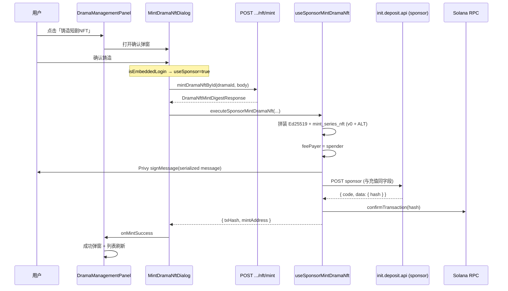

# 短剧 NFT 铸造代付（邮箱登录 / Solana Sponsor）

本文档描述**当前仓库已落地**的「邮箱登录用户铸造短剧 NFT」代付流程：在 Privy 托管 Solana 钱包无原生 SOL 的情况下，由平台 **spender** 代付 Gas，完成 `mint_series_nft` 链上铸造。

> **关联文档**
> - 直连钱包铸造（含合约指令、签名口径）：[`docs/铸造NFT合约实现.md`](./铸造NFT合约实现.md)
> - Solana 充值代付（同一 sponsor API、请求体字段）：[`docs/邮箱充值.md`](./邮箱充值.md)（EVM 7702 章节仅适用于 EVM 充值，**短剧铸造代付走 Solana sponsor，不是 7702**）
> - ALT 与账户布局：[`docs/ALT.md`](./ALT.md)

---

## 一、两种铸造路径对比

| 维度 | 邮箱登录（代付） | 钱包直连 |
|------|------------------|----------|
| 判定 | `useAppPrivyAccount().isEmbeddedLogin === true` | 非邮箱 / 外链钱包 |
| 链上发送 | 用户签 message → POST sponsor API → 后端代付广播 | Privy `signAndSendTransaction` 直连 RPC |
| fee payer | `depositConfig.spenderAddress` | 用户 `solanaAddress` |
| 本地 simulate | **不做**（用户无 SOL，易误报 `insufficient lamports`） | **做**（`useMintDramaNftOnChain`） |
| 代码入口 | `useSponsorMintDramaNft` | `useMintDramaNftOnChain` |
| 编排位置 | `MintDramaNftDialog.handleConfirmMint` 内分支 | 同上 |

后端 **mint 摘要接口**（`POST .../nft/mint`）两条路径共用；分叉发生在拿到 `DramaNftMintDigestResponse` 之后。

---

## 二、端到端数据流（代付）



---

## 三、涉及文件一览

### 3.1 UI 与编排

| 路径 | 职责 |
|------|------|
| `src/features/narrator/components/DramaManagementPanel.tsx` | 短剧列表、打开/关闭铸造弹窗、`onMintSuccess` 切成功态 |
| `src/features/narrator/components/MintDramaNftDialog.tsx` | **铸造全流程**：组装 `MintDramaNftRequest`、调 mint API、按登录方式选代付/直连 |

### 3.2 代付模块（`hooks/sponsor/dramaMint`，与 `hooks/solana` 解耦）

| 路径 | 职责 |
|------|------|
| `extractMintDigestBody.ts` | 解析 mint API 响应中的 `DramaNftMintDigestResponse`（不依赖 solana 目录） |
| `submitMintDramaSponsorRequest.ts` | POST sponsor API，请求体与 `useSolanaDeposit` 一致 |
| `useSponsorMintDramaNft.ts` | 内联拼装 `mint_series_nft` 交易、用户签名、提交代付、确认上链 |

### 3.3 仍复用的 Solana 能力（只读引用，非代付目录）

| 路径 | 职责 |
|------|------|
| `src/hooks/solana/dramaMint/mintDramaNftApi.ts` | `mintDramaNftById` HTTP 调用 |
| `src/hooks/solana/useMintDramaNftOnChain.ts` | 钱包直连；`buildMintDramaCanonicalPayloadFromContext`、`resolveMintDramaOnChainContext` |
| `src/hooks/solana/delegatorSignature.ts` | Ed25519 预编译指令 |
| `src/hooks/solana/buildStoryMintVersionedTransaction.ts` | v0 + ALT 交易编译 |
| `src/hooks/solana/dramaMint/storyDramaMintLookupTable.ts` | 短剧铸造 ALT |

---

## 四、配置依赖

代付与充值共用 **Admin `init.deposit`** 与 **`depositConfig`**（`useGlobalConfig` / `useDepositConfig` 写入 store）。

| 配置项 | 来源 | 代付用途 |
|--------|------|----------|
| `init.deposit[].api` | `InitConfig.deposit` 按当前链匹配 | sponsor POST 地址，如 `/api/nfp/v1/sponsor/solana-devnet` |
| `depositConfig.spenderAddress` | `chainlinks.contracts.spender` | 交易 **fee payer**（代付方） |
| `depositConfig.token.address` | 当前链 USDC/USDT 等 | sponsor 请求体 `token_address` |
| `depositConfig.rpc` | `chainlinks.rpc.http` | 拉 blockhash、确认交易 |
| `chainlinks` 短剧字段 | 见 `resolveMintDramaOnChainContext` | programId、collectionMint、delegator、**storyDramaMintLookupTable** |

### `useSponsorMintDramaNft.isReady` 条件（全部满足才可代付）

```text
isEmbeddedLogin
&& solanaAddress
&& solanaWallet (Privy)
&& depositConfig.chainType === 'svm'
&& spenderAddress
&& sponsorUrl (init.deposit.api)
&& depositConfig.rpc
&& depositConfig.token.address
```

不满足时弹窗提示：`网络不稳定，请稍后重试`（i18n key）。

---

## 五、阶段说明

### 5.1 用户确认（`MintDramaNftDialog`）

1. `useMemo` 构建 `MintDramaNftRequest`：`nftChain`、`nftTokenStandard: 'NFT'`、`nftContractAddress` = Story ProgramId。
2. `const useSponsor = isEmbeddedLogin`。
3. 校验 `solanaAddress`、链上上下文 `resolveMintDramaOnChainContext(chainlinks)`。

### 5.2 后端 Mint 摘要（共用）

```http
POST /api/mini-drama/creator/dramas/{dramaId}/nft/mint
```

- `dramaId`：**字符串**雪花 ID（`readSnowflakeId`），避免 number 精度丢失。
- 响应解析：`extractMintDigestBody(res)` → `DramaNftMintDigestResponse`。

关键字段（与直连一致，见 [`铸造NFT合约实现.md`](./铸造NFT合约实现.md)）：

| 字段 | 说明 |
|------|------|
| `sig` | Base64，64 字节 Ed25519 签名 |
| `canonicalPayload` | 优先用后端返回值 |
| `mintWalletAddress` | 须与当前 Privy `solanaAddress` 一致 |
| `metadataUrl` / `expiresAt` / `dramaId` | fallback 拼装 payload 时使用 |

### 5.3 代付链上交易拼装（`useSponsorMintDramaNft`）

与 `useMintDramaNftOnChain` **指令与账户一致**，差异仅：

| 项 | 代付 | 直连 |
|----|------|------|
| fee payer | `new PublicKey(spenderAddress)` | `userPublicKey` |
| simulate | 跳过 | `connection.simulateTransaction` |
| 广播 | sponsor API | `signAndSendTransaction` |

指令顺序（不可颠倒）：

1. `Ed25519Program`（delegator 对 `SHA256(canonicalPayload)` 验签）
2. `mint_series_nft`（Story Program）

使用 **VersionedTransaction + 短剧 ALT**（`storyDramaMintLookupTable`），序列化体积须 ≤ 1232 字节。

### 5.4 用户签名

```typescript
const messageBytes = versionedTx.message.serialize();
const signResult = await signMessage({ message, wallet: solanaWallet });
const transaction = Buffer.from(signResult.signature).toString('base64');
```

与充值代付相同：签的是 **message 序列化字节**，不是完整已签名交易；后端结合 spender 签名后广播。

### 5.5 提交 Sponsor API

**URL**：`initConfig.deposit.find(chain === currentChain).api` 或 `depositConfig.api`。

**请求体**（与 `useSolanaDeposit.signAndSubmitTransaction` **字段完全一致**）：

```json
{
  "amount": "0",
  "from_address": "<Privy Solana 地址>",
  "latest_blockhash": "<getLatestBlockhash>",
  "token_address": "<depositConfig.token.address>",
  "transaction": "<用户签名 Base64>"
}
```

说明：

- `amount`：铸造无充值金额，固定 `"0"`，仅占位满足接口 schema。
- `token_address`：与充值相同，取当前链配置代币 mint（如 USDC），**不是** NFT mint 地址。

**请求示例（curl）**：

```bash
curl 'https://dev-api-gateway.actqa.com/api/nfp/v1/sponsor/solana-devnet' \
  -H 'authorization: Bearer <token>' \
  -H 'content-type: application/json' \
  --data-raw '{
    "amount": "0",
    "from_address": "AF3xKqeay9C6FE7RTifDMW9ABPqfF4w8RE3yEVXjjfgf",
    "latest_blockhash": "52s8BEH5xP1W8HFDQ6LYBb3T7WBvvSsGcp5vt9iuV8mB",
    "token_address": "<链上 SPL Token Mint>",
    "transaction": "<base64>"
  }'
```

### 5.6 响应与成功判定

`appAxiosInstance` 业务成功码：`100000` 或 `200`（见 `src/api/appRequest.ts`）。

当前前端代付铸造额外要求：

```typescript
const isSuccess = code === 0 || code === 200 || code === 100000;
const txHash = submitResult.data?.hash?.trim();
if (!isSuccess || !txHash) throw ...
```

| 响应示例 | 前端行为 |
|----------|----------|
| `{ "code": 100000, "msg": "Success" }` 且无 `data.hash` | **抛错** → `toast.error('Success')`（已知坑，见第七节） |
| `{ "code": 100000, "data": { "hash": "..." } }` | `confirmTransaction` → 成功弹窗 |

### 5.7 上链确认与返回

1. `connection.confirmTransaction({ blockhash, lastValidBlockHeight, signature: txHash })`
2. 校验 `dramaMint` PDA 账户存在
3. 返回 `{ txHash, mintAddress: dramaMint.toBase58() }`

---

## 六、Console 日志关键字

过滤 `[useSponsorMintDramaNft]`：

| 日志 | 含义 |
|------|------|
| `========== 开始代付铸造 ==========` | 进入代付，含 sponsorUrl、feePayer、fromAddress |
| `签名与 payload` | canonicalPayload、msgHash、feePayer |
| `versionedTransaction.size` | 序列化字节与 1232 上限 |
| `请求用户签名 message...` | 等待 Privy 签名 |
| `用户签名完成，提交代付 API...` | 即将 POST sponsor |
| `代付交易已提交` | 拿到 `txHash` |
| `complete` | 全流程结束 |

---

## 七、已知问题与排查

### Q1：代付 API 返回 400

- 核对请求体是否 **仅** 含五个字段：`amount`、`from_address`、`latest_blockhash`、`token_address`、`transaction`。
- 勿传历史字段：`fee_payer`、`operation`、`drama_id`（已与充值对齐移除）。

### Q2：mint API 成功但未调 sponsor，只有 RPC `getAccountInfo`

- 代付路径在 **simulate 失败** 时会提前抛错（旧版共用 build 时曾出现）。
- 当前实现已 **跳过 simulate**；若仍失败，查 console 是否在 `提交代付 API` 之前报错。

### Q3：接口 `{ "code": 100000, "msg": "Success" }` 却弹出红色 `toast.error("Success")`

- 原因：无 `data.hash` 时 `throw new Error(submitResult.msg)`，catch 里 `toast.error(message)`。
- 处理：需后端在成功时返回 `data.hash`，或前端对 `100000` 无 hash 时改为轮询 mint PDA / 成功 toast（待产品确认）。

### Q4：`Transfer: insufficient lamports 0, need 1461600`（simulate）

- 邮箱用户托管钱包 **无 SOL**；本地 simulate 时 rent 由错误账户承担会失败。
- **代付路径禁止 simulate**；仅直连钱包路径需要 simulate。

### Q5：`extractMintDigestBody` 模块导出报错

- 该函数在 **`hooks/sponsor/dramaMint/extractMintDigestBody.ts`**，勿从 `mintDramaNftApi.ts` 导入。

---

## 八、验收清单

- [ ] 邮箱登录账号在短剧管理可打开铸造弹窗并确认
- [ ] Network：`POST .../nft/mint` 200，且摘要含 `sig`、`canonicalPayload`
- [ ] Network：`POST .../sponsor/solana-*` 请求体五字段与充值一致
- [ ] 代付成功后出现铸造成功弹窗，列表状态刷新
- [ ] Solscan：Ed25519 → `mint_series_nft`，fee payer 为配置的 spender
- [ ] 钱包直连账号仍走 `signAndSendTransaction`，行为与改代付前一致
- [ ] `storyDramaMintLookupTable` 未配置时有明确 toast

---

## 九、后续扩展

- **演员 NFT 代付**：可复用 `hooks/sponsor/dramaMint` 模式，新建 `hooks/sponsor/actorMint`，指令改为 `mint_actor_nft`，ALT 用演员表（见 `docs/ALT.md`）。
- **响应兼容**：若 sponsor 对 mint 与 deposit 共用 `code: 100000` 且无 `hash`，需与后端约定 mint 场景返回 `data.hash` 或单独字段。

---

## 十、相关代码索引

```text
src/features/narrator/components/
  MintDramaNftDialog.tsx      # handleConfirmMint：useSponsor 分支
  DramaManagementPanel.tsx    # onMintSuccess、成功弹窗

src/hooks/sponsor/dramaMint/
  extractMintDigestBody.ts
  submitMintDramaSponsorRequest.ts
  useSponsorMintDramaNft.ts

src/hooks/solana/
  dramaMint/mintDramaNftApi.ts
  useMintDramaNftOnChain.ts   # 直连 + resolveMintDramaOnChainContext
```

手动翻译其它语言键时，代付相关 UI 复用既有 i18n：`网络不稳定，请稍后重试`、`铸造失败，请稍后重试` 等；**无需**单独执行 `pnpm i18n:translate` 除非新增 key。
