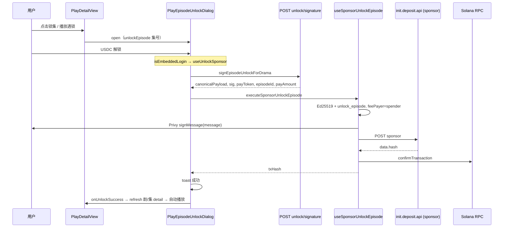

# 短剧剧集解锁代付（邮箱登录 / Solana Sponsor）

本文档描述**当前仓库已落地**的「邮箱登录用户 USDC 解锁剧集」代付流程：Privy 托管 Solana 钱包通常**无原生 SOL** 付 Gas 时，由平台 **spender** 担任交易 **fee payer**；**USDC 剧费仍从用户 ATA 划转到 treasury**（代付不代替用户付解锁金额）。

> **关联文档**
> - 铸造代付（同一 sponsor API、请求体字段）：[`docs/短剧NFT铸造代付.md`](./短剧NFT铸造代付.md)
> - Solana 充值代付：[`docs/邮箱充值.md`](./邮箱充值.md) / [`docs/SVM充值.md`](./SVM充值.md)
> - Story 合约解锁指令：[`src/solana/STORY_CONTRACT_API.md`](../src/solana/STORY_CONTRACT_API.md) §4.18 / §4.19
> - 直连钱包解锁（`signAndSendTransaction`）：`src/hooks/solana/useSubmitUnlockEpisode.ts`、`useSubmitBatchUnlockEpisodes.ts`

---

## 一、两种解锁路径对比

| 维度 | 邮箱登录（代付） | 钱包直连 |
|------|------------------|----------|
| 判定 | `useAppPrivyAccount().isEmbeddedLogin === true` | 非邮箱 / 外链钱包 |
| 预下单 | `POST .../unlock/signature` 或 `.../unlock/batch-signature` | 同上 |
| 链上发送 | 用户 `signMessage` → POST sponsor API → 后端广播 | Privy `signAndSendTransaction` 直连 RPC |
| fee payer | `depositConfig.spenderAddress` | 用户 `solanaAddress` |
| 本地 simulate | **不做**（托管钱包无 SOL，易误报 `insufficient lamports`） | **做** |
| 单集代码 | `useSponsorUnlockEpisode` | `useSubmitUnlockEpisode` |
| 批量代码 | `useSponsorBatchUnlockEpisodes` | `useSubmitBatchUnlockEpisodes` |
| 编排位置 | `PlayEpisodeUnlockDialog` 内 `useUnlockSponsor` 分支 | 同上 |

签名接口两条路径**共用**；分叉发生在拿到 `UnlockEpisodeSignatureResponse` / `UnlockBatchSignatureResponse` 之后。

---

## 二、端到端数据流（代付 · 单集）



批量解锁在签名接口改为 `batch-signature`、链上指令改为 `batch_unlock_episodes`，代付提交逻辑与单集相同。

---

## 三、涉及文件一览

### 3.1 UI 与编排

| 路径 | 职责 |
|------|------|
| `src/features/play/PlayDetailView.tsx` | 解锁弹窗开关、`handleUnlockSuccess` 刷新剧/集 detail、`suppressUnlockDialogRef` 防刷新期间重复弹窗 |
| `src/features/play/components/PlayEpisodeUnlockDialog.tsx` | 单集/批量解锁 UI、`useUnlockSponsor` 分支、签名校验、余额校验 |
| `src/features/play/components/PlayHeroSection.tsx` | 遇锁打开解锁弹窗 |
| `src/features/play/playUnlockSignatureApi.ts` | 签名 API（雪花 `dramaId` 路径） |
| `src/features/play/playDramaApi.ts` | `refreshPlayDataAfterUnlock`：剧 detail + 当前集 detail |

### 3.2 代付模块（`hooks/sponsor/unlock`）

| 路径 | 职责 |
|------|------|
| `useSponsorUnlockConfig.ts` | 与铸造代付共用 `init.deposit.api`、`spenderAddress`、`depositConfig` |
| `sponsorUnlockSubmit.ts` | 解析 sponsor 响应、`submitSponsorUnlockTransaction` |
| `useSponsorUnlockEpisode.ts` | 拼装 `unlock_episode`、代付广播、确认 |
| `useSponsorBatchUnlockEpisodes.ts` | 拼装 `batch_unlock_episodes`、同上 |

### 3.3 Sponsor HTTP（与铸造/充值共用）

| 路径 | 职责 |
|------|------|
| `src/hooks/sponsor/dramaMint/submitMintDramaSponsorRequest.ts` | `submitSolanaSponsorRequest`、请求体类型 `SolanaSponsorRequestBody` |

### 3.4 直连钱包（`hooks/solana`）

| 路径 | 职责 |
|------|------|
| `useSubmitUnlockEpisode.ts` | 单集：`payerKey = user`，simulate + `signAndSendTransaction` |
| `useSubmitBatchUnlockEpisodes.ts` | 批量：同上 |
| `delegatorSignature.ts` | Ed25519 预编译指令 |

---

## 四、配置依赖

与铸造/充值共用 **Admin `init.deposit`** 与 **`depositConfig`**。

| 配置项 | 来源 | 代付用途 |
|--------|------|----------|
| `init.deposit[].api` | `InitConfig.deposit` 按当前链 | sponsor POST，如 `/api/nfp/v1/sponsor/solana-devnet` |
| `depositConfig.spenderAddress` | `chainlinks.contracts.spender` | 交易 **fee payer** |
| `depositConfig.token.address` | 当前链 USDC 等 | sponsor 请求体 `token_address`（与充值一致，**不是** unlock 的 `payToken`） |
| `depositConfig.rpc` | `chainlinks.rpc.http` | blockhash、确认交易 |
| `chainlinks` Story 字段 | `resolveUnlockEpisodeContext` | `storyProgramId`、`delegator`、`treasury` |

### `useSponsorUnlockConfig.isReady`（全部满足才可代付）

```text
isEmbeddedLogin
&& solanaAddress
&& solanaWallet (Privy)
&& depositConfig.chainType === 'svm'
&& spenderAddress
&& sponsorUrl (init.deposit.api)
&& depositConfig.rpc
&& depositConfig.token.address
```

不满足时弹窗：`网络不稳定，请稍后重试`（i18n 已有）。

---

## 五、阶段说明

### 5.1 打开解锁弹窗

- 路由：`/play/{dramaId}`，`dramaId` 为**字符串雪花 ID**（禁止 `Number()`）。
- `PlayDetailView`：`unlockEpisode !== undefined` 时渲染 `PlayEpisodeUnlockDialog`。
- 顺序解锁：`resolveSequentialUnlockEpisode`（`max(freeEps, unlockedEpsCount) + 1`）。

### 5.2 预下单签名（共用）

**单集**

```http
POST /api/mini-drama/user/dramas/{dramaId}/unlock/signature
Body: { "payMethod": "usdc" }
```

**批量**

```http
POST /api/mini-drama/user/dramas/{dramaId}/unlock/batch-signature
Body: { "payMethod": "usdc" }
```

关键响应字段：

| 字段 | 单集 | 批量 |
|------|------|------|
| `canonicalPayload` | 链上验签原文 | 同上 |
| `sig` | Base64，64 字节 | 同上 |
| `payToken` | SPL mint | 同上 |
| `payAmount` / `totalPayAmount` | 单集 USDC 最小单位 | 批量总价最小单位 |
| `episodeId` / `episodeNo` | 链上 episode id、展示集号（原 `episodeNum` 已更名） | `unlockEpisodeCount` |

签前校验（两种登录均做）：

- 单集：钱包 USDC ≥ `playbackRule.priceUsdtPerEp`（展示价）
- 批量：钱包 USDC ≥ `totalPayAmount` 换算人类可读金额（**以签名为准**）

### 5.3 代付链上交易拼装

与直连**指令与账户一致**，差异：

| 项 | 代付 | 直连 |
|----|------|------|
| `payerKey` / fee payer | `spenderAddress` | `solanaAddress` |
| simulate | 跳过 | 执行 |
| 广播 | sponsor API | `signAndSendTransaction` |
| ALT | **未使用**（解锁交易体积小于铸造） | 同上 |

指令顺序（不可颠倒）：

1. `Ed25519Program`（delegator 对 `SHA256(canonical_payload)` 验签）
2. `unlock_episode` 或 `batch_unlock_episodes`

单集额外账户：`unlock_record` PDA（`user + dramaId + episodeId`）。

### 5.4 用户签名

```typescript
const messageBytes = versionedTx.message.serialize();
const signResult = await signMessage({ message, wallet: solanaWallet });
const transaction = Buffer.from(signResult.signature).toString('base64');
```

签的是 **message 序列化字节**，不是完整已签名交易；后端结合 spender 补全后广播（与铸造/充值一致）。

### 5.5 提交 Sponsor API

**URL**：`initConfig.deposit.find(chain === currentChain).api` 或 `depositConfig.api`。

**请求体**（五字段，与 [`短剧NFT铸造代付.md`](./短剧NFT铸造代付.md) / 充值一致）：

```json
{
  "amount": "<payAmount 或 totalPayAmount，无则 \"0\">",
  "from_address": "<Privy Solana 地址>",
  "latest_blockhash": "<getLatestBlockhash>",
  "token_address": "<depositConfig.token.address>",
  "transaction": "<用户签名 Base64>"
}
```

说明：

- `amount`：解锁优先传签名返回的 **`payAmount` / `totalPayAmount`**（USDC 最小单位字符串）；铸造场景固定 `"0"` 仅垫 Gas。
- `token_address`：配置里的 USDC mint，满足 sponsor 网关 schema；链上实际扣款 mint 以指令内 `pay_token_mint` 为准。

### 5.6 响应与成功判定

业务成功码：`100000` 或 `200`（见 `src/api/appRequest.ts`）。

代付解锁要求：

```typescript
const txHash = submitResult.data?.hash?.trim();
if (!isSuccess || !txHash) throw ...
```

| 响应 | 前端行为 |
|------|----------|
| `100000` 且无 `data.hash` | 抛 `SponsorSubmitMissingTxHashError` → 专用 i18n 提示（**不再** toast「Success」）；需后端补 `data.hash` 并实际广播交易 |
| 含 `data.hash` | `confirmTransaction` → 进入成功 UI 流程 |

### 5.7 解锁成功后的前端刷新

`PlayEpisodeUnlockDialog.handleUnlockSuccess`：

1. `toast`「剧集解锁成功」
2. `onUnlockSuccess(playEpisodeNum)` → `PlayDetailView`：
   - `setUnlockEpisode(undefined)` 关弹窗
   - `setCurrentEpisode(episode)`
   - `refreshPlayDataAfterUnlock`：
     - **剧 detail**：更新 `unlockedEpsCount`、批量剩余集、锁态 UI
     - **当前集 detail**：`mediaAccessUrl`、点赞/评论
   - `setEpisodePlayTrigger` 尝试自动打开播放器

---

## 六、计价与 `batchUnlockDiscountRate`（产品口径）

| 层级 | 含义 |
|------|------|
| 接口 / 播放页 `batchUnlockDiscountRate` | **华语「折」实付比例**：`0.4` = 4 折 = 付原价 40% |
| 创作端 UI `% OFF` | 减免百分比；**提交入库前**在 `batchUnlockDiscountRate.ts` 转为实付比例：`1 - OFF/100`（20% OFF → 存 `0.8`） |

待解锁集数（与 `unlockEpisodeCount` 对齐）：

```text
待解锁集数 = totalEpisodes − unlockedEpsCount
```

批量展示价（弹窗估算，链上以 `totalPayAmount` 为准）：

```text
应付 ≈ 待解锁集数 × priceUsdtPerEp × batchUnlockDiscountRate
```

---

## 七、Console 日志关键字

| 前缀 | 场景 |
|------|------|
| `[useSponsorUnlockEpisode]` | 单集代付 |
| `[useSponsorBatchUnlockEpisodes]` | 批量代付 |
| `[handleSingleUsdtUnlock]` / `[handleBulkUsdtUnlock]` | 弹窗内错误 |

---

## 八、已知问题与排查

### Q1：邮箱用户弹出 `signAndSend` 而非 `signMessage`

- 检查 `isEmbeddedLogin` 是否为 true；`PlayEpisodeUnlockDialog` 中 `useUnlockSponsor` 应为 true。

### Q2：`网络不稳定，请稍后重试`

- 对照第四节 `isReady` 条件；重点查 `init.deposit.api`、`spenderAddress`、USDC `token.address`。

### Q3：sponsor 返回 Success 但 toast 报错、无 hash

- 与铸造代付相同：需后端返回 `data.hash`，或产品约定轮询链上状态。

### Q4：弹窗价与链上实扣不一致

- 弹窗为 `playbackRule` 估算；**实付以 `batch-signature.totalPayAmount` 与链上为准**。
- 若后端批量金额错误，需后端修计价后再验批量代付。

### Q5：解锁成功弹窗不关 / 又弹出解锁

- 成功路径须 `setUnlockBusyMode(null)` 后再关窗（busy 会拦截 `onOpenChange(false)`）。
- `PlayDetailView.suppressUnlockDialogRef` 在刷新剧 detail 期间避免旧 `playbackRule` 再次触发 `onUnlockEpisodeChange`。

### Q6：直连路径 `insufficient lamports`（simulate）

- 仅钱包直连会 simulate；邮箱代付路径**禁止** simulate。

---

## 九、验收清单

- [ ] 邮箱账号在剧场页可对锁集打开解锁弹窗
- [ ] Network：`unlock/signature` 或 `batch-signature` 200
- [ ] Privy：**signMessage**（非 signAndSend）
- [ ] Network：sponsor POST 五字段与充值/铸造一致
- [ ] 响应含 `data.hash`，Solscan fee payer 为 spender
- [ ] 用户 USDC ATA 扣款金额与签名 `payAmount` / `totalPayAmount` 一致
- [ ] toast → 弹窗关闭 → 剧 detail + 当前集 detail 刷新 → 可播放
- [ ] 钱包直连仍走 `signAndSendTransaction`，行为与改代付前一致

---

## 十、相关代码索引

```text
src/features/play/
  PlayDetailView.tsx
  components/PlayEpisodeUnlockDialog.tsx
  playUnlockSignatureApi.ts
  playDramaApi.ts              # refreshPlayDataAfterUnlock
  playFormat.ts                # 锁集、批量价、折数展示

src/hooks/sponsor/unlock/
  useSponsorUnlockConfig.ts
  sponsorUnlockSubmit.ts
  useSponsorUnlockEpisode.ts
  useSponsorBatchUnlockEpisodes.ts

src/hooks/sponsor/dramaMint/
  submitMintDramaSponsorRequest.ts   # submitSolanaSponsorRequest

src/hooks/solana/
  useSubmitUnlockEpisode.ts
  useSubmitBatchUnlockEpisodes.ts

src/features/create/
  batchUnlockDiscountRate.ts   # 创作 % OFF → 接口实付比例
```

新增 i18n key 时复用既有：`网络不稳定，请稍后重试`、`剧集解锁成功`、`USDC 余额不足` 等；**无需**仅为本文档单独跑 `pnpm i18n:translate`。
