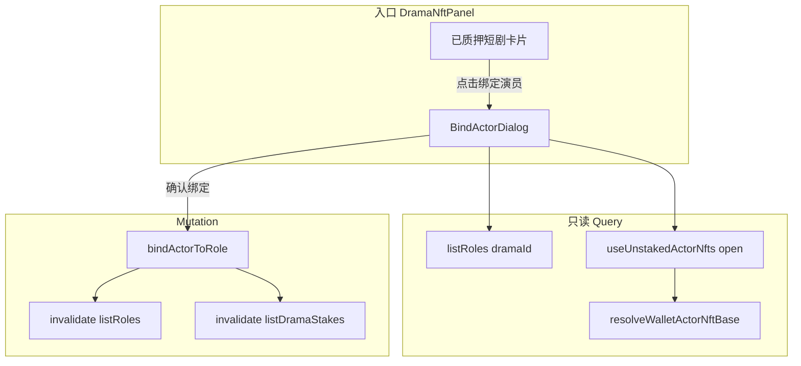

# 绑定演员（BindActorDialog）

叙述者中心「短剧 NFT → 已质押」卡片上的 **绑定演员** 弹窗：为短剧角色选择演员 NFT、设置分润比例并提交中心化接口。  
相关背景见 [`docs/已质押的短剧和演员列表中心化.md`](./已质押的短剧和演员列表中心化.md)。

> **最近更新（2026-05）**  
> 1. 角色下拉接入 **`listRoles`**（`GET /api/mini-drama/creator/dramas/{dramaId}/roles`）。  
> 2. 演员 NFT 下拉接入链上 **`resolveWalletActorNft`**（经 `useUnstakedActorNfts`）。  
> 3. 确认绑定接入 **`bindActorToRole`**（`POST /api/mini-drama/creator/actors/dramas/{dramaId}/bind-role`）。  
> 4. 移除弹窗内 Mock 选项、演示用重复绑定校验与假数据列表。

---

## 一、入口与触发

| 项目 | 说明 |
|------|------|
| 页面 | 叙述者中心 → **短剧 NFT** Tab → **已质押** 筛选 |
| 触发 | 已质押短剧卡片底部 **绑定演员** 按钮 |
| 容器 | `DramaNftPanel` 维护 `bindActorRecord: StakedDramaResponse \| null` |
| 弹窗 | `BindActorDialog`（`open` 由 `bindActorRecord` 是否存在控制） |

**前置条件：** `bindActorRecord.id` 必须有效，否则不挂载弹窗。

---

## 二、涉及接口与链上能力

### 2.1 角色列表（中心化）

| 项目 | 值 |
|------|-----|
| OpenAPI 操作 | `listRoles` |
| 路径 | `GET /api/mini-drama/creator/dramas/{dramaId}/roles` |
| Hook | `useListRoles(dramaId, { query: { enabled: open && dramaId > 0 } })` |
| 列表项类型 | `RoleResponse`（`id`、`name` 等） |
| 下拉展示 | `role.name`；选项 `value` 为 `String(role.id)` |

### 2.2 演员 NFT 列表（链上）

| 项目 | 值 |
|------|-----|
| 底层解析 | `src/hooks/solana/unstakedActorNfts/resolveWalletActorNft.ts` → `resolveWalletActorNftBase` |
| 业务 Hook | `useUnstakedActorNfts({ listEnabled: open })` |
| 依赖 | 已连接 Solana 钱包 + `listActors1` 演员登记 + 链上 `NftInfo`（`NftType.Actor`） |
| 列表项类型 | `UnstakedActorNftItem` |
| 下拉展示 | `链上名/演员名（ActorNFT#actorId）`；选项 `value` 为 `String(actor.id)` |

> 与「持有演员 NFT → 未质押」列表共用同一套链上基线；弹窗打开时才 `listEnabled: true`，避免无效 RPC。

### 2.3 确认绑定（中心化）

| 项目 | 值 |
|------|-----|
| OpenAPI 操作 | `bindActorToRole` |
| 路径 | `POST /api/mini-drama/creator/actors/dramas/{dramaId}/bind-role` |
| Hook | `useBindActorToRole` |
| 请求体 | `BindActorRoleRequest` |

```ts
{
  roleId: number;           // 所选角色 ID
  actorId: number;          // 所选演员 ID
  revenueShareRatio: number; // 分润比例，接口约束 0～70
}
```

| 响应 | 处理 |
|------|------|
| `status === 200` | `toast.success('绑定成功')`，关闭弹窗，失效相关 Query |
| 非 200 / 异常 | 由 `appAxiosInstance` 统一 toast（组件 `catch` 不再重复提示） |

### 2.4 Orval 生成代码（勿手写重复 client）

| 用途 | 路径 |
|------|------|
| `listRoles` / Query Key | `src/api/__generated__/story/creator-drama-controller/creator-drama-controller.ts` |
| `bindActorToRole` | `src/api/__generated__/story/creator-actor-controller/creator-actor-controller.ts` |
| 请求/响应模型 | `roleResponse.ts`、`bindActorRoleRequest.ts` |

重新生成：`pnpm generate:api`。

---

## 三、数据流



---

## 四、组件职责与 Props

**主文件：** `src/features/narrator/components/BindActorDialog.tsx`

| Prop | 来源（DramaNftPanel） | 用途 |
|------|------------------------|------|
| `dramaId` | `bindActorRecord.id` | 路径参数；`listRoles` / `bindActorToRole` |
| `dramaTitle` | `bindActorRecord.title` | 弹窗头部剧名 |
| `dramaNftLabel` | `` `DramaNFT#${id}` `` | NFT 标签 |
| `episodesLine` | `共 {{n}} 集` | 集数文案 |
| `totalActorCommissionRatio` | `bindActorRecord.totalActorCommissionRatio` | 计算剩余可分配比例 |
| `coverSrc` | `coverUrl` 或占位图 | 封面 |

**剩余可分配比例（展示口径）：**

```
剩余 = 70% − totalActorCommissionRatio   // 二者均为 0~1 小数
展示：toPercentFloor(0.7 - totalActorCommissionRatio, 0, true)
```

与已质押卡片上 `totalActorCommissionRatio` 字段口径一致；缺失时展示 `-`。

---

## 五、UI 状态（loading / error / submitting）

| 区块 | loading | error | empty |
|------|---------|-------|-------|
| 选择角色 | 触发器内 `Spinner` | `BindActorErrorBanner`「加载失败」 | 下拉内「暂无记录」 |
| 选择演员 NFT | 同上 | 未连接钱包 / 加载失败 | 同上 |
| 分润比例 | — | 超出 0–70 时输入框红框 + 文案 | — |
| 确认绑定 | 按钮文案「提交中」+ 全局禁用 | 接口 toast | — |

**确认按钮禁用条件：** 提交中、角色/演员加载中、未连钱包、未选角色/演员、分润无效。

弹窗关闭时重置：角色/演员选择、分润默认 `10`。

---

## 六、缓存失效策略

绑定成功后并行失效：

```ts
queryClient.invalidateQueries({ queryKey: getListRolesQueryKey(dramaId) });
queryClient.invalidateQueries({ queryKey: getListDramaStakesQueryKey() });
```

| 失效目标 | 原因 |
|----------|------|
| `listRoles` | 角色绑定关系可能变化 |
| `listDramaStakes` | 卡片上 `totalActorCommissionRatio` 等汇总字段需刷新 |

---

## 七、与旧实现的差异

| 项目 | 联调前（静态/Mock） | 联调后 |
|------|---------------------|--------|
| 角色选项 | `CHARACTER_OPTIONS` 写死 | `listRoles` 接口 |
| 演员 NFT | `ACTOR_NFT_OPTIONS` 写死 | 链上 `useUnstakedActorNfts` |
| 确认绑定 | 仅关闭弹窗 | `bindActorToRole` + 缓存失效 |
| 重复绑定提示 | 前端写死角色/演员枚举判断 | 由后端业务错误 toast |
| 已绑定列表 | `MOCK_BIND_ROWS` | **暂未接入**（无列表 API，区块已移除） |

---

## 八、i18n 新增键（需手动翻译）

源语言 `src/locales/en.json`，中文 `zh-CN.json` 已 `key === value`：

| Key | 说明 |
|-----|------|
| `绑定成功` | 提交成功 toast |
| `请完整填写绑定信息` | 字段缺失 toast |
| `分润比例须在 0–70 之间` | 前端校验提示 |

其它语言：`pnpm i18n:translate`（AI 不自动执行）。

---

## 九、自测清单

- [ ] 已质押短剧卡片可打开弹窗，剧名/封面/NFT 标签与列表一致  
- [ ] 角色下拉展示该短剧 `listRoles` 返回的角色名  
- [ ] 已连钱包时演员下拉展示链上持有的 Actor NFT  
- [ ] 未连钱包时演员区提示「未连接钱包」，确认按钮禁用  
- [ ] 分润输入 0–70 外禁用确认；合法值可提交  
- [ ] 绑定成功后 toast、弹窗关闭、已质押列表分润合计刷新  
- [ ] 重复绑定等业务错误由接口 toast 提示  

---

## 十、相关文件索引

| 文件 | 说明 |
|------|------|
| `src/features/narrator/components/BindActorDialog.tsx` | 弹窗主体 |
| `src/features/narrator/components/DramaNftPanel.tsx` | 入口与 Props 传入 |
| `src/hooks/solana/useUnstakedActorNfts.ts` | 演员 NFT 列表 Hook |
| `src/hooks/solana/unstakedActorNfts/resolveWalletActorNft.ts` | 链上解析实现 |
| `docs/已质押的短剧和演员列表中心化.md` | 已质押列表与 mark 分页 |
