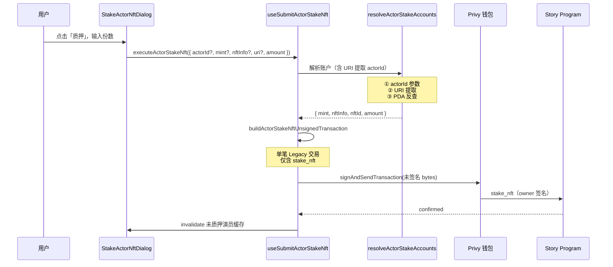

# 质押演员 NFT（合约与前端实现说明）

本文档说明叙述者中心「演员 NFT → 未质押 → 质押」已落地链路的**合约方法**、**前端模块划分**、**URI 提取 actorId 方案**，并给出与短剧 NFT 的差异对照。

> **关联文档**  
> - 未质押列表数据来源：`docs/查询未质押短剧NFT列表.md`（演员类似逻辑）
> - Story 程序全量指令：`src/solana/STORY_CONTRACT_API.md`  
> - 短剧 NFT 质押对照：`docs/质押短剧NFT.md`

---

## 一、结论速览

| 问题 | 答案 |
|------|------|
| 是否有单独的「授权」链上指令？ | **无**。Story 程序不提供 SPL `approve` 类前置指令；UI「质押」实为**一次钱包签名完成质押**。 |
| 质押实际调用的合约方法？ | **`stake_nft`**（IDL / 客户端：`client.story.instructions.stakeNft`） |
| 演员与短剧是否同一指令？ | **是**，共用 `stake_nft`；差异在 **mint / NftInfo PDA 种子** 与 **`amount`**。 |
| 演员质押数量 | 用户输入整数份数 → `amount = BigInt(份数)`（Actor SNFT 可质押多份） |
| 短剧质押数量 | **固定 `amount = 1`**（Series 1/1 NFT） |
| actorId 获取优先级 | ① 直接传入 `actorId` → ② **从 URI 提取**（新增） → ③ PDA 反查 |
| 赎回 | **`unstake_nft`**（收入页等，见 `useSubmitUnstakeNft`） |



**核心差异**：演员 NFT 为 **SNFT（半同质化代币）**，可质押 **1~N 份**；短剧为 **Series 1/1 NFT**，固定质押 1 份。

---

## 二、合约：`stake_nft`

### 2.1 程序与客户端

| 项目 | 值 |
|------|-----|
| 程序 | Story（`chainlinks[VITE_CHAIN].contracts.story`，回落见 `getStoryProgramId`） |
| IDL 指令名 | `stake_nft` |
| Codama 客户端 | `getStakeNftInstructionAsync` / `client.story.instructions.stakeNft` |
| 签名者 | **`owner`**（当前连接钱包） |

### 2.2 Instruction data

| 字段 | 类型 | 演员 NFT | 短剧 NFT |
|------|------|----------|----------|
| `nft_id` | `u64` | **`actor_id`** | **`drama_id`** |
| `amount` | `u64` | 用户输入可质押份数（1~N） | **`1`** |

### 2.3 主要账户（按 IDL 顺序）

| 账户 | 演员 PDA / 来源 | 说明 |
|------|-----------------|------|
| `owner` | 钱包公钥（signer, writable） | 唯一签名者 |
| `config` | `findConfigPda` | Story 全局配置 |
| `mint` | 钱包 mint 或 **`findMintPda(actor_id)`** | 演员 NFT mint，PDA 种子 `["actor_mint", actor_id]` |
| `nft_info` | **`findNftInfoPda(actor_id)`** | 演员 NFT 信息，PDA 种子 `["actor_nft", actor_id]` |
| `user_token_account` | owner × mint 的 ATA | 用户持有的演员 NFT ATA |
| `vault` | `findVaultPda(mint, owner)` | Story 程序托管 vault |
| `stake_info` | `findStakeInfoPda(mint, owner)` | 质押状态记录 |
| `user_stake_account` | `findUserStakeAccountPda(owner)` | 用户质押账户 |
| `system_program` / `token_program` / `associated_token_program` | 固定程序 ID | Solana 系统程序 |

链上行为摘要：将用户 ATA 中已注册的演员 NFT **指定份数** 转入按 **`[vault, mint, owner]`** 派生的 vault，并更新 `StakeInfo` / `UserStakeAccount`。

### 2.4 演员 vs 短剧：PDA 种子对照

| 语义 | 演员（Actor SNFT） | 短剧（Series） |
|------|-------------------|----------------|
| Mint PDA 种子 | `["actor_mint", actor_id]` | `["drama_mint", drama_id]` |
| NftInfo PDA 种子 | `["actor_nft", actor_id]` | `["drama_nft", drama_id]` |
| `nft_id` 入参 | `actor_id` | `drama_id` |
| 典型 `amount` | `1..availableToStake` | `1` |

---

## 三、前端：演员 NFT 质押实现

### 3.1 核心文件

| 路径 | 职责 |
|------|------|
| `src/features/narrator/components/ActorNftHoldingsPanel.tsx` | 未质押卡 → 打开 `StakeActorNftDialog`，传入 `actorId` / `mintAddress` / `nftInfoAddress` / **`uri`** |
| `src/components/StakeActorNftDialog.tsx` | 数量表单 + 确认 UI；按钮文案 **「质押」**；调用 `executeActorStakeNft` |
| `src/hooks/solana/actorStake/resolveActorStakeAccounts.ts` | 解析 mint、nftInfo、nftId、amount；**核心：URI 提取 actorId** |
| `src/hooks/solana/dramaStake/buildStakeNftWeb3Instruction.ts` | **与短剧共用**：按 IDL 手写 web3 `TransactionInstruction` |
| `src/hooks/solana/actorStake/buildActorStakeNftUnsignedTransaction.ts` | Legacy 未签名交易 `serialize({ requireAllSignatures: false })` |
| `src/hooks/solana/actorStake/useSubmitActorStakeNft.ts` | Privy `signAndSendTransaction` + `confirmTransaction` + 缓存失效 |
| `src/hooks/solana/useUnstakedActorNfts.ts` | 未质押演员列表；项含 `mintAddress` / `nftInfoAddress` / **`onChainMetadata.uri`** |

### 3.2 入参来源（未质押卡）

| 字段 | 来源 | 用途 | 必传 |
|------|------|------|------|
| `actorId` | API `listActors` + 链上 `NftInfo` 映射 | `stake_nft.nft_id` | ❌（可由 URI 提取或 PDA 反查） |
| `mintAddress` | `NftInfo.mint`（钱包持有） | 指令 `mint` 账户 | ❌（可由 `findMintPda(actor_id)` 推导） |
| `nftInfoAddress` | `NftInfo` 账户 PDA | 指令 `nft_info` 账户 | ❌（可由 `findNftInfoPda(actor_id)` 推导） |
| **`uri`** | **`onChainMetadata.uri`**（链上扫描） | **提取 actorId**（新增能力） | ❌（但推荐传递以提高鲁棒性） |
| `amount` | 用户表单输入 | `stake_nft.amount` | ✅ |

**推荐传递优先级**：链上扫描的 `mintAddress` + `nftInfoAddress` + **`uri`** > 仅 `actorId` > 无任何参数（依赖 PDA 反查）。

### 3.3 actorId 解析优先级（核心机制）

#### 3.3.1 三级 fallback 策略

```typescript
// src/hooks/solana/actorStake/resolveActorStakeAccounts.ts

export async function resolveActorStakeAccounts(
  params: ResolveActorStakeAccountsParams,
  storyProgramId?: string,
): Promise<{
  mint: Address;
  nftInfo: Address;
  nftId: bigint;
  amount: bigint;
}> {
  const owner = readAddress(getPrivySolanaWalletAddress());
  const programAddress = readAddress(getStoryProgramId(storyProgramId));

  // ① 优先：直接传入的 actorId
  let actorId = params.actorId?.trim();

  // ② 其次：从 URI 提取（新增能力）
  if (!actorId && params.uri) {
    actorId = extractActorIdFromUri(params.uri);
    if (actorId) {
      console.log(`[resolveActorStakeAccounts] 从 URI 提取到 actorId: ${actorId}`);
    }
  }

  // ③ 最后：通过 nftInfo PDA 反查
  if (!actorId && params.nftInfo) {
    const nftInfoAddress = readAddress(params.nftInfo);
    const nftInfoAccount = await fetchNftInfo(rpc, nftInfoAddress);
    if (nftInfoAccount.exists) {
      const snowflakeIdU64 = nftInfoAccount.data.id;
      actorId = readSnowflakeId(snowflakeIdU64);
      console.log(`[resolveActorStakeAccounts] 从 PDA 反查到 actorId: ${actorId}`);
    }
  }

  if (!actorId) {
    throw new Error('未获取到演员 ID，请刷新演员列表后重试或确认 NFT metadata URI 格式正确');
  }

  // ... 后续 mint / nftInfo 解析
}
```

#### 3.3.2 URI 提取函数（核心实现）

```typescript
/**
 * 从 metadata URI 中提取 actorId
 * 支持格式：
 * - https://one-story-dev.s3.us-east-2.amazonaws.com/metadata/actor/413965250524725248.json
 * - https://...metadata/actor/413965250524725248
 * - /actor/123456789.json
 * - /actor/123456789
 */
function extractActorIdFromUri(uri: string | undefined): string | undefined {
  if (!uri) return undefined;

  // 匹配 /actor/ 后面跟着的数字（可能后面有 .json）
  const match = uri.match(/\/actor\/(\d+)(?:\.json)?/i);
  if (match && match[1]) {
    return match[1];
  }

  return undefined;
}
```

**正则说明**：
- `\/actor\/`：匹配路径中的 `/actor/`
- `(\d+)`：捕获一个或多个数字（即 actorId）
- `(?:\.json)?`：可选匹配 `.json` 后缀（非捕获组）
- `i`：大小写不敏感

#### 3.3.3 场景示例

| 场景 | 入参 | 解析路径 | actorId 来源 |
|------|------|----------|--------------|
| 完整传参 | `actorId="123"` + `uri="...actor/999.json"` | ① | 直接使用 `actorId="123"` |
| 缺 actorId | `actorId=undefined` + `uri="...actor/413965250524725248.json"` | ② | URI 提取 `413965250524725248` |
| 仅 nftInfo | `actorId=undefined` + `uri=undefined` + `nftInfo="..."` | ③ | 链上 NftInfo 反查 |
| 无任何参数 | 全为 `undefined` | 抛错 | ❌ "未获取到演员 ID，请刷新演员列表后重试或确认 NFT metadata URI 格式正确" |

**实际落地**：`ActorNftHoldingsPanel` 从链上扫描的 `onChainMetadata.uri` 传给 `StakeActorNftDialog`，即使 API 未返回 `actorId`（如为 `0`），仍可从 URI 提取真实 ID。

### 3.4 交易构建约定

演员质押**禁止**使用 `@solana/react-hooks` 的 `TransactionPool.toWire()`：

- Privy 场景需在**钱包内**完成签名；`toWire()` 会在本地尝试 `signTransactionMessageWithSigners`，易报 `Transaction is missing signatures for addresses: <mint>`。
- 现用路径与短剧一致：
  1. `buildStakeNftWeb3Instruction` 组装指令（**与短剧共用**）
  2. `Transaction.serialize({ requireAllSignatures: false, verifySignatures: false })`
  3. `signAndSendTransaction({ transaction: bytes, wallet })`
- **`ownerAddress` 必须与 `selectedWallet.address` 一致**（feePayer / 唯一 signer）。

### 3.5 质押成功后的缓存失效

```typescript
import { UNSTAKED_ACTOR_NFTS_BASE_QUERY_KEY } from '@/hooks/solana/useUnstakedActorNfts';

// 质押成功后
await queryClient.invalidateQueries({
  queryKey: [UNSTAKED_ACTOR_NFTS_BASE_QUERY_KEY],
});
```

基线失效后，未质押列表 effect 会重建；概览「持有演员NFT」数量仍来自 `actorsInWallet`（含已质押项）。

### 3.6 调试日志关键字

新链路控制台关键字（**不应**再出现 `toWire`）：

- `[useSubmitActorStakeNft] start`
- `[resolveActorStakeAccounts] 从 URI 提取到 actorId: 413965250524725248`
- `[resolveActorStakeAccounts] 从 PDA 反查到 actorId: ...`
- `[buildActorStakeNftUnsignedTransaction] prepared`
- `[useSubmitActorStakeNft] privy.signAndSend.start` / `success` / `complete`

### 3.7 数据流追踪（完整链路）

```
链上扫描（useUnstakedActorNfts）
  └─> NftInfo 批量读取
       └─> onChainMetadata: { uri, name, creator, nftType, ... }
            └─> ActorNftHoldingsPanel
                 └─> 点击「质押」按钮
                      └─> StakeActorNftDialog
                           ├─> actorId（可能为 undefined）
                           ├─> mintAddress（PDA 或链上）
                           ├─> nftInfoAddress（PDA 或链上）
                           └─> uri（onChainMetadata.uri）
                                └─> useSubmitActorStakeNft
                                     └─> resolveActorStakeAccounts
                                          ├─> extractActorIdFromUri(uri)
                                          │    └─> 正则匹配 /\/actor\/(\d+)/
                                          ├─> 回落 findNftInfoPda 反查
                                          └─> 返回 { mint, nftInfo, nftId, amount }
                                               └─> buildActorStakeNftUnsignedTransaction
                                                    └─> buildStakeNftWeb3Instruction
                                                         └─> Privy 签名 stake_nft
                                                              └─> 链上确认
                                                                   └─> invalidate 缓存
```

---

## 四、演员 / 短剧 Hook 对照表

| 能力 | 演员 | 短剧 |
|------|------|------|
| 账户解析 | `actorStake/resolveActorStakeAccounts.ts` | `dramaStake/resolveDramaStakeAccounts.ts` |
| **URI 提取 ID** | ✅ `extractActorIdFromUri` | ❌ 无（dramaId 由 API 提供） |
| 指令构建 | **共用** `dramaStake/buildStakeNftWeb3Instruction.ts` | 同左 |
| 未签名交易 | `actorStake/buildActorStakeNftUnsignedTransaction.ts` | `dramaStake/buildStakeNftUnsignedTransaction.ts` |
| 发送 Hook | `actorStake/useSubmitActorStakeNft.ts` | `dramaStake/useSubmitDramaStakeNft.ts` |
| 弹窗 | `StakeActorNftDialog.tsx` | `StakeDramaNftDialog.tsx` |
| 缓存基线 | `UNSTAKED_ACTOR_NFTS_BASE_QUERY_KEY` | `UNSTAKED_DRAMA_NFTS_BASE_QUERY_KEY` |
| 数量输入 | 用户表单（1~可质押份数） | 固定 `amount = 1` |

---

## 五、与短剧 NFT 的区别

| 维度 | 演员 NFT（Actor SNFT） | 短剧 NFT（Series） |
|------|------------------------|-------------------|
| **代币类型** | 半同质化代币（Semi-Fungible） | 1/1 NFT（Non-Fungible） |
| **质押数量** | 可质押 **1~N 份**（用户输入） | 固定质押 **1 份** |
| **PDA 种子** | `actor_mint` / `actor_nft` | `drama_mint` / `drama_nft` |
| **actorId 解析** | ① 直接传入 → ② **URI 提取** → ③ PDA 反查 | dramaId 由 API 直接提供 |
| **URI 格式** | `https://.../metadata/actor/413965250524725248.json` | `https://.../metadata/series/123.json` |
| **nftType** | `1`（链上 `NftInfo.nft_type`） | `0` |
| **合约方法** | `stake_nft`（与短剧相同） | 同左 |
| **典型用例** | 质押演员以获得该演员的短剧收益分成 | 质押短剧以参与创作者收益分配 |

---

## 六、常见错误与处理

| 现象 | 原因 | 处理 |
|------|------|------|
| `Transaction is missing signatures for addresses: <某地址>` 且栈含 `toWire` | 使用旧版 `TransactionPool` 或 Kit→web3 `isSigner` 误判 | 改用 `actorStake` 未签名 Legacy 路径；硬刷新 / 重启 dev server |
| "未获取到演员 ID，请刷新演员列表后重试" | actorId / URI / nftInfo 均未提供或格式错误 | ① 确认链上扫描返回 `onChainMetadata.uri`<br/>② 检查 URI 是否含 `/actor/数字` 模式<br/>③ 刷新未质押列表 |
| 链上 `InvalidNftType` / `StakeInfoMismatch` | `nft_info` 与 `mint` 不匹配，或混用短剧/演员 PDA | 传列表扫描的 `mintAddress` + `nftInfoAddress`；确认 nftType=1 |
| 质押成功但列表仍在 | 未 invalidate 演员缓存 | 质押成功后 invalidate `UNSTAKED_ACTOR_NFTS_BASE_QUERY_KEY` |
| URI 提取失败（控制台无 "从 URI 提取到" 日志） | URI 格式不符合 `/actor/\d+` 模式 | 检查 `onChainMetadata.uri` 内容；可能需回落 PDA 反查 |
| `amount` 超出可质押份数 | 用户输入大于 `availableToStake` | 表单前端校验；后端链上校验会抛 `InsufficientBalance` |

---

## 七、手动验收

1. **前置条件**：钱包 devnet 持有未质押演员 SNFT（见 `docs/查询未质押短剧NFT列表.md` 类似逻辑）。
2. 叙述者中心 → **演员 NFT** → **未质押** → 打开质押弹窗。
3. **输入份数**（1~可质押份数） → **质押**。
4. Privy 弹出**一笔**交易签名（非两笔 approve + stake）。
5. 成功后：
   - 该卡从未质押列表消失或份数减少
   - 控制台有 `[useSubmitActorStakeNft] complete` 与 txHash
   - **若 API 未返回 actorId**，控制台应有 `从 URI 提取到 actorId: 413965250524725248`
6. Solscan 上指令为 Story 程序 **`stake_nft`**，data 含 `nft_id` 与 `amount`。

### 7.1 URI 提取专项验收

| 测试用例 | 入参模拟 | 预期行为 |
|----------|----------|----------|
| 完整 actorId | `actorId="123"` + `uri="...actor/999.json"` | 使用 actorId=123，控制台无 URI 提取日志 |
| 缺 actorId | `actorId=undefined` + `uri="https://.../actor/413965250524725248.json"` | 控制台显示 "从 URI 提取到 actorId: 413965250524725248" |
| URI 无 actor 路径 | `actorId=undefined` + `uri="https://.../invalid.json"` | 回落 PDA 反查或抛错 |
| 无任何参数 | 全 undefined | 抛错 "未获取到演员 ID" |

---

## 八、对话实现总结

### 8.1 实现背景

用户报告质押演员 NFT 时遇到错误："未获取到演员 ID，请刷新演员列表后重试"。调查发现：
- API 返回的 `actorId` 可能为 `0` 或缺失
- 链上 `NftInfo` 的 `id` 字段也为 `0`
- 但 `onChainMetadata.uri` 包含真实 actorId：`https://one-story-dev.s3.us-east-2.amazonaws.com/metadata/actor/413965250524725248.json`

### 8.2 解决方案

实现了 **URI 提取 actorId** 机制：
1. 添加 `extractActorIdFromUri` 函数，用正则 `/\/actor\/(\d+)(?:\.json)?/i` 解析 URI
2. 在 `resolveActorStakeAccounts` 中按优先级获取 actorId：直接传入 → **URI 提取** → PDA 反查
3. 线程化 `uri` 参数：
   - `ActorNftHoldingsPanel` 传 `onChainMetadata?.uri` 给弹窗
   - `StakeActorNftDialog` 接收 `uri` 参数并传给 Hook
   - `useSubmitActorStakeNft` → `buildActorStakeNftUnsignedTransaction` → `resolveActorStakeAccounts`
4. 添加调试日志验证提取成功

### 8.3 关键代码片段

```typescript
// 1. 提取函数
function extractActorIdFromUri(uri: string | undefined): string | undefined {
  if (!uri) return undefined;
  const match = uri.match(/\/actor\/(\d+)(?:\.json)?/i);
  if (match && match[1]) return match[1];
  return undefined;
}

// 2. 三级 fallback
let actorId = params.actorId?.trim();
if (!actorId && params.uri) {
  actorId = extractActorIdFromUri(params.uri);
  if (actorId) {
    console.log(`[resolveActorStakeAccounts] 从 URI 提取到 actorId: ${actorId}`);
  }
}
if (!actorId && params.nftInfo) {
  // ... PDA 反查
}

// 3. 组件传参
<StakeActorNftDialog
  actorId={stakeDialogItem.actorId}
  mintAddress={stakeDialogItem.mintAddress}
  nftInfoAddress={stakeDialogItem.nftInfoAddress}
  uri={stakeDialogItem.onChainMetadata?.uri}  // 新增
  // ...
/>
```

### 8.4 TypeScript 类型更新

```typescript
// resolveActorStakeAccounts.ts
export interface ResolveActorStakeAccountsParams {
  actorId?: string;
  mint?: string;
  nftInfo?: string;
  uri?: string;  // 新增
  amount: string | bigint;
  candidateActorIds?: string[];
}

// StakeActorNftDialog.tsx
export interface StakeActorNftDialogProps {
  actorId?: string;
  mintAddress?: string;
  nftInfoAddress?: string;
  uri?: string;  // 新增
  // ...
}
```

---

## 九、实施状态

| 阶段 | 内容 | 状态 |
|------|------|------|
| P2 | `StakeActorNftDialog` 接 `stake_nft` + invalidate 缓存 | ✅ |
| P2+ | `actorStake` 对齐 `dramaStake` 未签名交易构建 | ✅ |
| P2+ | **URI 提取 actorId** 三级 fallback 机制 | ✅ |
| P2+ | 线程化 `uri` 参数（Panel → Dialog → Hook → Resolver） | ✅ |
| P3 | 已质押演员列表中心化 API | 待做 |
| P3 | 演员 NFT 元数据 API actorId 准确性修复 | 待后端验证 |

---

## 十、小结

- **授权**：无单独合约方法；**用户钱包对含 `stake_nft` 的交易签名**即完成授权与质押。
- **质押**：Story 程序 **`stake_nft`**；演员 `nft_id = actor_id`、`amount = 用户输入份数`。
- **核心差异**：演员为 **SNFT**，可质押多份；短剧为 **1/1 NFT**，固定 1 份。
- **URI 提取**（新增能力）：当 actorId 缺失时，从 `onChainMetadata.uri` 中正则提取（`/actor/\d+`），提升鲁棒性。
- **前端路径**：演员逻辑集中在 **`src/hooks/solana/actorStake/`**，与短剧共用指令构建，Privy 发未签名 Legacy 交易；避免 `TransactionPool.toWire()`。
