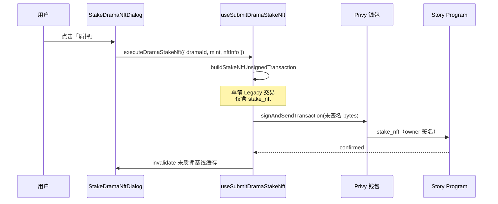

# 质押短剧 NFT（合约与前端实现说明）

本文档说明叙述者中心「短剧 NFT → 未质押 → 质押」已落地链路的**合约方法**、**是否存在单独授权**、**前端模块划分**，并给出**演员 NFT 质押复用清单**。

> **关联文档**  
> - 未质押列表数据来源：`docs/查询未质押短剧NFT列表.md`  
> - Story 程序全量指令：`src/solana/STORY_CONTRACT_API.md`  
> - 铸造短剧 NFT（对比用）：`docs/铸造NFT合约实现.md`

---

## 一、结论速览（产品 / 合约）

| 问题 | 答案 |
|------|------|
| 是否有单独的「授权」链上指令？ | **无**。Story 程序不提供 SPL `approve` 类前置指令；UI 历史上「授权并质押」实为**一次钱包签名完成质押**。 |
| 质押实际调用的合约方法？ | **`stake_nft`**（IDL / 客户端：`client.story.instructions.stakeNft`） |
| 短剧与演员是否同一指令？ | **是**，共用 `stake_nft`；差异在 **mint / NftInfo PDA 种子** 与 **`amount`**。 |
| 短剧质押数量 | **固定 `amount = 1`**（Series 1/1 NFT） |
| 演员质押数量 | 用户输入整数份数 → `amount = BigInt(份数)`（Actor SNFT） |
| 赎回 | **`unstake_nft`**（收入页等，见 `useSubmitUnstakeNft`） |



**与 EVM「先 approve 再 stake」的区别**：Solana 上由 **`stake_nft` 一笔交易**完成「用户 ATA → 程序 vault」的 SPL 划转；**不需要**也不应再发一笔仅 `approve` 的交易。

---

## 二、合约：`stake_nft`

### 2.1 程序与客户端

| 项目 | 值 |
|------|-----|
| 程序 | Story（`chainlinks[VITE_CHAIN].contracts.story`，回落见 `getStoryProgramId`） |
| IDL 指令名 | `stake_nft` |
| Codama 客户端 | `getStakeNftInstructionAsync` / `client.story.instructions.stakeNft` |
| 签名者 | **`owner`**（当前连接钱包） |

### 2.2 Instruction data

| 字段 | 类型 | 短剧 | 演员 |
|------|------|------|------|
| `nft_id` | `u64` | **`drama_id`** | **`actor_id`** |
| `amount` | `u64` | **`1`** | 用户输入可质押份数 |

### 2.3 主要账户（按 IDL 顺序）

| 账户 | 短剧 PDA / 来源 | 演员 PDA / 来源 |
|------|-----------------|-----------------|
| `owner` | 钱包公钥（signer, writable） | 同左 |
| `config` | `findConfigPda` | 同左 |
| `mint` | 钱包内 **真实 SPL mint**（`NftInfo.mint`）；可回落 `findMintSeriesNftMintPda(drama_id)` | 钱包 mint 或 `findMintPda(actor_id)` |
| `nft_info` | 链上扫描得到的 **NftInfo PDA**；可回落 `findMintSeriesNftNftInfoPda(drama_id)` | `findNftInfoPda(actor_id)` |
| `user_token_account` | owner × mint 的 ATA | 同左 |
| `vault` | `findVaultPda(mint, owner)` | 同左 |
| `stake_info` | `findStakeInfoPda(mint, owner)` | 同左 |
| `user_stake_account` | `findUserStakeAccountPda(owner)` | 同左 |
| `system_program` / `token_program` / `associated_token_program` | 固定程序 ID | 同左 |

链上行为摘要（见 `STORY_CONTRACT_API.md` §4.14）：将用户 ATA 中已注册的 NFT 转入按 **`[vault, mint, owner]`** 派生的 vault，并更新 `StakeInfo` / `UserStakeAccount`。

### 2.4 短剧 vs 演员：PDA 种子对照

| 语义 | 短剧（Series） | 演员（Actor SNFT） |
|------|----------------|-------------------|
| Mint PDA 种子 | `["drama_mint", drama_id]` | `["actor_mint", actor_id]` |
| NftInfo PDA 种子 | `["drama_nft", drama_id]` | `["actor_nft", actor_id]` |
| `nft_id` 入参 | `drama_id` | `actor_id` |
| 典型 `amount` | `1` | `1..availableToStake` |

---

## 三、前端：短剧质押实现

### 3.1 涉及文件

| 路径 | 职责 |
|------|------|
| `src/features/narrator/components/DramaNftPanel.tsx` | 未质押卡 → 打开 `StakeDramaNftDialog`，传入 `dramaId` / `mintAddress` / `nftInfoAddress` |
| `src/features/narrator/components/StakeDramaNftDialog.tsx` | 确认 UI；按钮文案 **「质押」**；调用 `executeDramaStakeNft` |
| `src/hooks/solana/dramaStake/resolveDramaStakeAccounts.ts` | 解析 mint、nftInfo、nftId、amount（默认 amount=1） |
| `src/hooks/solana/dramaStake/buildStakeNftWeb3Instruction.ts` | 按 IDL **手写** web3 `TransactionInstruction`（仅 owner 为 signer） |
| `src/hooks/solana/dramaStake/buildStakeNftUnsignedTransaction.ts` | Legacy 未签名交易 `serialize({ requireAllSignatures: false })` |
| `src/hooks/solana/dramaStake/useSubmitDramaStakeNft.ts` | Privy `signAndSendTransaction` + `confirmTransaction` |
| `src/hooks/solana/unstakedDramaNfts/resolveWalletSeriesNft.ts` | 列表项 `UnstakedDramaNftItem` 含 `nftInfoAddress` |

### 3.2 入参来源（未质押卡）

| 字段 | 来源 | 用途 |
|------|------|------|
| `stakeNftId` | API `listDramas`（`readSnowflakeId`）/ URI `/drama/{id}` / PDA 反查 | `stake_nft.nft_id`（**须字符串雪花 ID**） |
| `mintAddress` | `NftInfo.mint`（钱包持有） | 指令 `mint` 账户 |
| `nftInfoAddress` | `NftInfo` 账户 PDA（`record.pdaAddress`） | 指令 `nft_info` 账户 |
| `candidateDramaIds` | `useUnstakedDramaNfts` 从 `listDramas` 汇总 | `stakeNftId` 缺失时与 `nftInfo` PDA 比对反查 |

缺省 `mint` / `nftInfo` 时由 `resolveDramaStakeAccounts` 按 `dramaId` 推导 PDA；**推荐列表直传链上实值**，与钱包扫描一致。

### 3.3 交易构建约定（必读）

短剧质押**禁止**使用 `@solana/react-hooks` 的 `TransactionPool.toWire()`：

- Privy 场景需在**钱包内**完成签名；`toWire()` 会在本地尝试 `signTransactionMessageWithSigners`，易报 `Transaction is missing signatures for addresses: <mint>`（将 mint 误判为 signer 时尤甚）。
- 现用路径与 `useSolanaDirectWalletToken`、短剧铸造一致：
  1. `buildStakeNftWeb3Instruction` 组装指令  
  2. `Transaction.serialize({ requireAllSignatures: false, verifySignatures: false })`  
  3. `signAndSendTransaction({ transaction: bytes, wallet })`  
- **`ownerAddress` 必须与 `selectedWallet.address` 一致**（feePayer / 唯一 signer）。

### 3.4 质押成功后的缓存

```ts
import { UNSTAKED_DRAMA_NFTS_BASE_QUERY_KEY } from '@/hooks/solana/useUnstakedDramaNfts';

await queryClient.invalidateQueries({
  queryKey: [UNSTAKED_DRAMA_NFTS_BASE_QUERY_KEY],
});
```

基线失效后，未质押列表 effect 会重建；概览「持有短剧NFT」数量仍来自 `seriesInWallet`（含已质押项，见未质押列表文档）。

### 3.5 调试日志

新链路控制台关键字（**不应**再出现 `toWire`）：

- `[useSubmitDramaStakeNft] start`
- `[buildStakeNftUnsignedTransaction] prepared`
- `[useSubmitDramaStakeNft] privy.signAndSend.start` / `success` / `complete`

---

## 四、演员 NFT 质押

### 4.1 实现（与短剧同模式）

| 项目 | 演员 |
|------|------|
| UI | `src/components/StakeActorNftDialog.tsx` |
| Hook | `src/hooks/solana/actorStake/useSubmitActorStakeNft.ts` |
| 兼容导出 | `src/hooks/solana/useSubmitStakeNft.ts` → 转发至 `useSubmitActorStakeNft` |
| 合约方法 | **`stake_nft`**（与短剧相同） |
| 交易构建 | 复用 `dramaStake/buildStakeNftWeb3Instruction.ts` + `actorStake/buildActorStakeNftUnsignedTransaction.ts` |
| 入参 | `actorId`、`mintAddress?`、`nftInfoAddress?`、`amount`（表单份数） |

演员与短剧**合约层无差别**；差异仅在 PDA（`actor_mint` / `actor_nft`）与 **`amount` 为用户输入份数**。

### 4.2 涉及文件

| 路径 | 职责 |
|------|------|
| `src/hooks/solana/actorStake/resolveActorStakeAccounts.ts` | `findMintPda` / `findNftInfoPda`，`nft_id = actor_id` |
| `src/hooks/solana/actorStake/buildActorStakeNftUnsignedTransaction.ts` | 未签名 Legacy 交易 |
| `src/hooks/solana/actorStake/useSubmitActorStakeNft.ts` | Privy 签名发送 + `confirmTransaction` |
| `src/components/StakeActorNftDialog.tsx` | 数量表单、invalidate `UNSTAKED_ACTOR_NFTS_BASE_QUERY_KEY` |
| `src/features/narrator/components/ActorNftHoldingsPanel.tsx` | 传入 `actorId` / `mintAddress` / `nftInfoAddress` |

### 4.3 质押成功后的缓存

```ts
import { UNSTAKED_ACTOR_NFTS_BASE_QUERY_KEY } from '@/hooks/solana/useUnstakedActorNfts';

await queryClient.invalidateQueries({
  queryKey: [UNSTAKED_ACTOR_NFTS_BASE_QUERY_KEY],
});
```

### 4.4 调试日志

- `[useSubmitActorStakeNft] start`
- `[buildActorStakeNftUnsignedTransaction] prepared`
- `[useSubmitActorStakeNft] privy.signAndSend.start` / `success` / `complete`

### 4.5 演员 / 短剧 Hook 对照表

| 能力 | 短剧 | 演员 |
|------|------|------|
| 账户解析 | `dramaStake/resolveDramaStakeAccounts.ts` | `actorStake/resolveActorStakeAccounts.ts` |
| 指令构建 | `dramaStake/buildStakeNftWeb3Instruction.ts` | **复用同一文件** |
| 未签名交易 | `dramaStake/buildStakeNftUnsignedTransaction.ts` | `actorStake/buildActorStakeNftUnsignedTransaction.ts` |
| 发送 | `dramaStake/useSubmitDramaStakeNft.ts` | `actorStake/useSubmitActorStakeNft.ts` |
| 弹窗 | `StakeDramaNftDialog.tsx` | `StakeActorNftDialog.tsx` |

---

## 五、赎回（对照）

| 操作 | 合约方法 | 前端 Hook |
|------|----------|-----------|
| 赎回短剧 / 演员 NFT | `unstake_nft` | `useSubmitUnstakeNft`（短剧可传 `dramaId` 或 `mint`） |

`unstake_nft` **无** instruction data；仅需 `owner` + `mint` 等账户。短剧赎回时 `mint` 可由 `findMintSeriesNftMintPda(drama_id)` 推导。

---

## 六、常见错误

| 现象 | 原因 | 处理 |
|------|------|------|
| `Transaction is missing signatures for addresses: <某地址>` 且栈含 `toWire` | 使用旧版 `TransactionPool` 或 Kit→web3 `isSigner` 误判 | 改用 `dramaStake` 未签名 Legacy 路径；硬刷新 / 重启 dev server |
| 栈内仍为 `handleAuthorizeStake` | 浏览器缓存旧 bundle | 确认存在 `[useSubmitDramaStakeNft] start` 日志 |
| 链上 `InvalidNftType` / `StakeInfoMismatch` | `nft_info` 与 `mint` 不匹配 | 传列表扫描的 `mintAddress` + `nftInfoAddress` |
| Toast「未获取到 NFT 配置」且 `dramaId` 为 0 | 雪花 ID 用 `number` 丢精度 / API 未映射到链上 PDA | 列表项传 `stakeNftId`（字符串）；质押时支持 URI `/drama/{id}` 提取与 `candidateDramaIds` PDA 反查（对齐演员质押） |
| 质押成功但列表仍在 | 未 invalidate 基线 | 质押成功后 invalidate `UNSTAKED_DRAMA_NFTS_BASE_QUERY_KEY` |

---

## 七、手动验收

1. 钱包 devnet 持有未质押短剧 Series NFT（见 `docs/查询未质押短剧NFT列表.md`）。
2. 叙述者中心 → **短剧 NFT** → **未质押** → 打开质押弹窗 → **质押**。
3. Privy 弹出**一笔**交易签名（非两笔 approve + stake）。
4. 成功后：该卡从未质押列表消失；控制台有 `complete` 与 txHash。
5. Solscan 上指令为 Story 程序 **`stake_nft`**。

---

## 八、实施状态

| 阶段 | 内容 | 状态 |
|------|------|------|
| P2 | `StakeDramaNftDialog` 接 `stake_nft` + invalidate 基线 | ✅ |
| P2+ | `dramaStake` 未签名交易 + 手写 web3 指令 | ✅ |
| P2+ | `actorStake` 对齐 `dramaStake` 构建方式 | ✅ |
| P3 | 已质押短剧列表中心化 API | 待做 |

---

## 九、小结

- **授权**：无单独合约方法；**用户钱包对含 `stake_nft` 的交易签名**即完成授权与质押。
- **质押**：Story 程序 **`stake_nft`**；短剧 `nft_id = drama_id`、`amount = 1`。
- **前端**：短剧逻辑集中在 **`src/hooks/solana/dramaStake/`**，Privy 发未签名 Legacy 交易；演员宜按第四节复用同一模式，避免 `TransactionPool.toWire()`。
