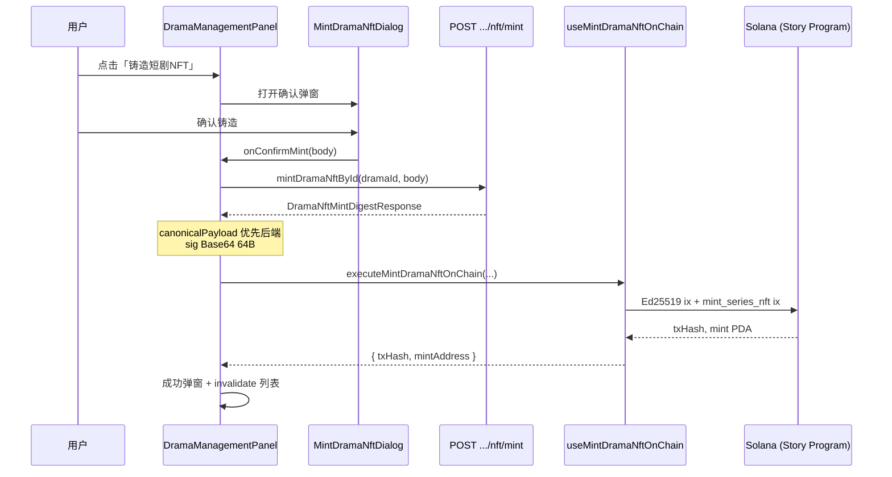

# 短剧 NFT 铸造（合约实现说明）

本文档描述**当前仓库已落地**的短剧 NFT 铸造全链路：从触发后端 `mint` 接口、消费返回值、到 Solana 合约 `mint_series_nft` 调用与成功回调。

> **范围**：短剧 `mint_series_nft` 已打通；演员 `mint_actor_nft` 尚未接链上 Hook，可复用本文「签名 + Ed25519 + 合约指令」骨架。

---

## 一、端到端数据流



**核心原则（与 Java 后端一致）**：

| 字段 | 来源 | 链上用途 |
|------|------|----------|
| `canonicalPayload` | **优先后端 API**，缺失时前端 fallback 拼装 | 写入 `mint_series_nft` 指令 data；Ed25519 验签前先 SHA256 |
| `sig` | 后端 Base64（64 字节 raw Ed25519 签名） | `Buffer.from(sig, 'base64')` → 同时用于 Ed25519 预编译指令与合约 `sig: [u8;64]` |
| `msgHash` | 前端 `SHA256(UTF-8(canonicalPayload))` | **仅** Ed25519 指令的 `message`（32 字节），不进 mint data |

```
后端: SHA256(canonicalPayload UTF-8) → msgHash → Ed25519Sign(msgHash, delegatorPrivKey) → Base64(sig)

前端:
  sig64 = Base64Decode(sig)
  msgHash = SHA256(UTF-8(canonicalPayload))
  ix0 = Ed25519Program(delegator, message=msgHash, signature=sig64)
  ix1 = mint_series_nft(dramaId, { canonicalPayload, sig: sig64 })
  tx = add(ix0, ix1)   // 顺序不可颠倒
```

---

## 二、涉及文件一览

| 路径 | 职责 |
|------|------|
| `src/features/narrator/components/DramaManagementPanel.tsx` | 列表、铸造入口、`handleMintConfirm` 编排 API → 链上 → 成功弹窗 |
| `src/features/narrator/components/MintDramaNftDialog.tsx` | 确认弹窗、组装 `MintDramaNftRequest` |
| `src/hooks/solana/dramaMint/mintDramaNftApi.ts` | `POST /api/mini-drama/creator/dramas/{dramaId}/nft/mint`（字符串 dramaId 防精度丢失） |
| `src/hooks/solana/useMintDramaNftOnChain.ts` | 链上交易：解码 sig、组指令、模拟、Privy 签名发送、确认 |
| `src/hooks/solana/delegatorSignature.ts` | Base64→64B、SHA256(payload)、Ed25519 预编译指令 |
| `src/hooks/solana/dramaMint/buildDramaCanonicalPayload.ts` | 7 段 `drama\|...\|` fallback 拼装 |
| `src/hooks/solana/dramaMint/resolveMintSeriesNftAccounts.ts` | Metaplex metadata / master edition PDA |
| `src/hooks/solana/chainRpcConfig.ts` | `resolveMintDramaOnChainContext`：RPC、programId、collectionMint、delegator |
| `src/api/__generated__/story/model/dramaNftMintDigestResponse.ts` | Orval 响应类型 |
| `src/solana/generated/.../mintSeriesNft.ts` | Codama 生成的 `mint_series_nft` 指令 encoder |

---

## 三、阶段 1：触发入口与后端 Mint 接口

### 3.1 用户操作

1. 叙述者中心 → **短剧管理** Tab（`DramaManagementPanel`）。
2. 短剧状态为 `REVIEW_APPROVED` 或 `PENDING_ONLINE` 时，卡片显示 **「铸造短剧NFT」**。
3. `handleOpenMintDialog` 设置 `activeDrama`，`dialogKind = Mint`，打开 `MintDramaNftDialog`。

### 3.2 请求体（`MintDramaNftDialog`）

弹窗内 `useMemo` 构建 `MintDramaNftRequest`：

```ts
{
  nftChain: getCurrentChain(),           // 如 solana-devnet
  nftTokenStandard: 'NFT',
  nftContractAddress: getStoryProgramId(chainlinks, currentChain),
}
```

参数不完整时 `confirmDisabled`，无法提交。

### 3.3 HTTP 调用（`handleMintConfirm`）

```ts
const res = await mintDramaNftById(dramaId, body);
const digest = extractMintDigestBody(res);
```

- **URL**：`/api/mini-drama/creator/dramas/{dramaId}/nft/mint`
- **方法**：`POST`
- **dramaId**：`readSnowflakeId` 转字符串，避免雪花 ID 在 `number` 路径丢精度（见 `mintDramaNftApi.ts`）。
- **响应解析**：`extractMintDigestBody` 兼容 `BaseResponse.data` 包裹，取出 `DramaNftMintDigestResponse`。

### 3.4 前置校验

`handleMintConfirm` 开头检查：

- `dramaId` 有效；
- `resolveMintDramaOnChainContext(chainlinks)` 返回 RPC、`storyProgramId`、`collectionMint`、`delegator`；
- `isMintOnChainReady && solanaAddress`（Privy 已连 Solana 钱包）。

失败则 `toast.error`，不发起 API。

---

## 四、阶段 2：消费后端返回值

### 4.1 响应示例（`DramaNftMintDigestResponse`）

```json
{
  "userId": "412796566122881024",
  "dramaId": "412799337522987008",
  "mintWalletAddress": "GdEiD1n9x1cGE8Y9Z5Q15mCyRPvpo4qagq59LSj5e7Lw",
  "nftChain": "solana-devnet",
  "nftTokenStandard": "NFT",
  "nftContractAddress": "D3zJ8SZFLSU5iJnYzcc4hKovnUyPjSeZeoUYhMQbu8oN",
  "metadataUrl": "https://one-story-dev.s3.us-east-2.amazonaws.com/metadata/drama/412799337522987008.json",
  "issuedAt": "1779092320",
  "expiresAt": "1779092620",
  "canonicalPayload": "drama|412799337522987008|GdEiD1n9x1cGE8Y9Z5Q15mCyRPvpo4qagq59LSj5e7Lw|D3zJ8SZFLSU5iJnYzcc4hKovnUyPjSeZeoUYhMQbu8oN|纸牌屋第一季|https://one-story-dev.s3.us-east-2.amazonaws.com/metadata/drama/412799337522987008.json|1779092620",
  "sig": "FoXPJz3YSCOX6fTErRTXkM7yzKJrPotkxfBLuY+TG48lD2A1V1sgTjsyqZKOqJdgJPntDc+PQt1l3ZYcLVkhDA=="
}
```

### 4.2 `canonicalPayload` 选取策略（`DramaManagementPanel`）

```ts
const walletAddress = digest.mintWalletAddress?.trim() || solanaAddress;

const canonicalPayload =
  digest.canonicalPayload?.trim() ||
  buildMintDramaCanonicalPayloadFromContext({
    digest,
    drama: activeDrama,
    dramaCollectionMint: onChainContext.collectionMint,
    walletAddress,
  });
```

- **必须优先后端下发的 `canonicalPayload`**，与签名逐字节一致。
- Fallback 仅在后端未返回时使用；7 段格式见 `buildDramaCanonicalPayload.ts`：

```
drama|{dramaId}|{walletAddress}|{nftContractAddress}|{name}|{metadataUrl}|{expiresAt}
```

> `nftContractAddress` 段须与后端签名时一致（常为 Collection Mint / 合约约定地址），否则 `sig` 正确也会链上验签失败（如 6015）。

### 4.3 传入链上 Hook

```ts
const onChainResult = await executeMintDramaNftOnChain({
  digest,
  drama: activeDrama,
  canonicalPayload,
  rpcEndpoint: onChainContext.rpcEndpoint,
  storyProgramId: onChainContext.storyProgramId,
  collectionMint: onChainContext.collectionMint,
  delegator: onChainContext.delegator,
});
```

---

## 五、阶段 3：链上合约调用（`useMintDramaNftOnChain`）

### 5.1 链上下文（`resolveMintDramaOnChainContext`）

从 `useConfigStore().chainlinks` + `getCurrentChain()` 读取：

| 字段 | 用途 |
|------|------|
| `rpcEndpoint` | `Connection` RPC |
| `storyProgramId` | Story 程序 ID |
| `collectionMint` | Drama Collection Mint PDA |
| `delegator` | Ed25519 验签公钥（平台 delegator） |

任一缺失则返回 `undefined`，Panel 层提示先连钱包 / 配置不全。

### 5.2 执行步骤（`executeMintDramaNftOnChain`）

1. **钱包**：`mintWalletAddress` 须与当前 Privy `solanaAddress` 一致。
2. **解码签名**：`decodeDelegatorSigBase64(digest.sig)` → `Uint8Array(64)`。
3. **msgHash**：`sha256CanonicalPayloadUtf8(canonicalPayload)`（32 字节）。
4. **派生账户**：`findConfigPda`、`findMintSeriesNftMintPda`、`findMintSeriesNftNftInfoPda`、用户 ATA、`resolveMintSeriesNftAccounts`（Metaplex）。
5. **指令 0**：`createDelegatorEd25519Instruction({ delegator, canonicalPayload, sig64 })`。
6. **指令 1**：`getMintSeriesNftInstructionDataEncoder().encode({ dramaId, canonicalPayload, sig: sig64 })` + 账户 metas。
7. **交易**：`Transaction().add(ed25519Ix).add(mintSeriesNftIx)`。
8. **模拟**：`connection.simulateTransaction(tx)`，失败则 `console.error` + `throw`（含程序 logs）。
9. **发送**：Privy `signAndSendTransaction` → `bs58` 编码 `signature`。
10. **确认**：`confirmTransaction` + `getTransaction` 拉取 `logMessages`。
11. **校验**：`dramaMint` PDA 账户存在。
12. **返回**：`{ txHash: signature, mintAddress: dramaMint.toBase58() }`。

### 5.3 控制台调试（内联 `console.log` / `console.error`）

过滤前缀 `[mintDramaNftOnChain]`：

| 日志 | 含义 |
|------|------|
| `签名与 payload` | canonicalPayload、msgHashHex、sigHex |
| `mint_series_nft 账户` | 全部账户 pubkey |
| `simulate.ok` / `simulate.failed` | 发交易前模拟 |
| `tx.sent` | txHash、Solscan URL |
| `confirm.ok` / `confirm.failed` | 链上确认 |
| `tx.onChain` | `logMessages`、`err` |
| `complete` | 最终 mintAddress |

---

## 六、阶段 4：成功回调与 UI

### 6.1 Panel 内成功处理（`handleMintConfirm` try 块末尾）

```ts
setLastMintTxHash(onChainResult.txHash);
setLastMintAddress(onChainResult.mintAddress);
skipMintCloseResetRef.current = true;   // 关闭铸造弹窗时保留 activeDrama
setDialogKind(DramaDialogKind.MintSuccess);
await invalidateDramaList();
```

- **`invalidateDramaList`**：`invalidateQueries` `listDramas` + `countApprovedDramas`，刷新列表状态（如 `PENDING_ONLINE` → `ONLINE`）。
- **`isMintFlowPending`**：`finally` 复位，铸造弹窗与按钮恢复。

### 6.2 失败处理

```ts
catch (error) {
  const message = error instanceof Error ? error.message : t('铸造失败，请稍后重试');
  toast.error(message);
}
```

API 失败、模拟失败、Privy 拒签、链上 `confirm` 失败均走此路径；**不**打开成功弹窗。

### 6.3 成功弹窗（`AppDialog` + `MintSuccess`）

展示内容：

- 标题：「铸造成功！」
- 剧名、**NFT 编号**（`lastMintAddress`，即 drama mint PDA）
- **交易哈希**链接（Solscan）：
  - devnet：`https://solscan.io/tx/{hash}?cluster=devnet`
  - 主网：`https://solscan.io/tx/{hash}`（无 query）

```ts
const mintTxExplorerHref = mintTxHashDisplay
  ? `https://solscan.io/tx/${mintTxHashDisplay}${
      getCurrentChain().includes('devnet') ? '?cluster=devnet' : ''
    }`
  : undefined;
```

用户点击「确认」→ `handleMintSuccessConfirm` 清空 `activeDrama` / txHash / mintAddress，关闭弹窗。

### 6.4 弹窗状态机

| `DramaDialogKind` | 说明 |
|-------------------|------|
| `Mint` | `MintDramaNftDialog` 确认中 |
| `MintSuccess` | 链上成功后展示结果 |
| `Closed` | 全部关闭 |

`skipMintCloseResetRef`：铸造弹窗因切换成功态关闭时，避免清空 `activeDrama`，以便成功弹窗仍能显示剧名。

---

## 七、如何验证合约调用成功

1. **控制台**：出现 `confirm.ok` + `tx.onChain` 且 `err: null` + `complete`。
2. **成功弹窗**：显示 NFT 编号与可点击 txHash。
3. **Solscan**：打开链接，Instruction 顺序为 Ed25519 → Story `mint_series_nft`，状态 Success。
4. **链上账户**：`mintAddress`（series mint PDA）在 Explorer 上可查。

失败时优先对照：

1. `sig64.length === 64`
2. `canonicalPayload` 与 API **完全一致**（勿本地改字）
3. `msgHashHex` 与后端 SHA256 日志一致
4. 交易指令顺序：**Ed25519 → mint**
5. `delegator` 与签名私钥匹配；`canonicalPayload` 第 4 段 `nftContractAddress` 与后端一致

---

## 八、与 `demo/mint/铸造NFT.md` 的差异说明

| 项 | demo 文档（历史） | 当前实现 |
|----|-------------------|----------|
| `sig` 来源 | 曾误用 `digest` hex | **仅** `digest.sig` Base64 |
| Ed25519 指令 | 曾遗漏 | **已** `add(ed25519Ix, mintSeriesNftIx)` |
| `canonicalPayload` | Panel 本地拼 | **优先后端** |
| 日志 | 建议独立 logger | **内联** `console.log` / `console.error` |
| Explorer | chainlinks.explorer | 成功弹窗固定 **Solscan** |
| 演员 NFT | 方案已写 | **未实现**链上 Hook |

---

## 九、演员 NFT 扩展（待做）

复用 `delegatorSignature.ts`，新增 `useMintActorNftOnChain.ts` + `ActorManagementPanel.handleMintConfirm` 链上步骤即可。差异见 `demo/mint/铸造NFT.md` 第七节：`mint_actor_nft`、11 段 `actor|...`、支付相关账户。

---

## 十、参考链接

- 方案 demo：`demo/mint/铸造NFT.md`
- 合约 API 说明：`src/solana/STORY_CONTRACT_API.md`（`mint_series_nft` 章节）
- 演员铸造 demo：`demo/mint/铸造演员NFT.md`
