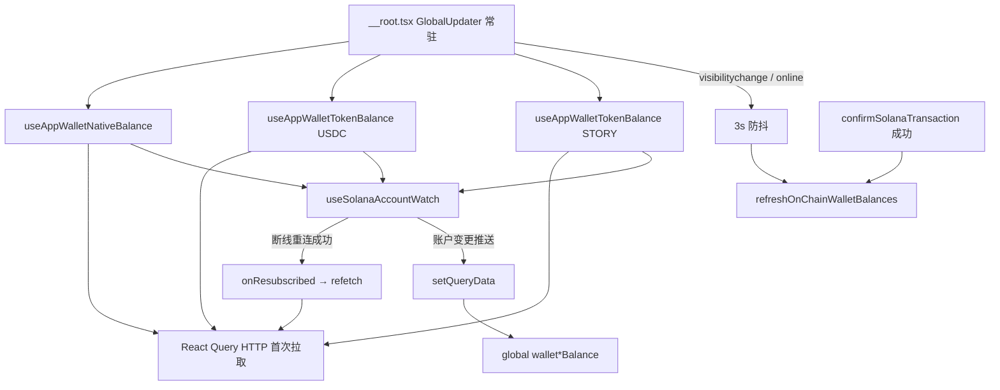

# 链上余额 WS 断连场景评估（补强后）

> 评估基准：已完成「层 1 WS 重连快照 + 层 2 可见/online 刷新 + 层 3 交易确认后刷新」三项补强后的代码现状。  
> 评估日期：2026-07-02

---

## 当前架构摘要

### 关键实现文件

| 能力 | 文件 | 说明 |
|------|------|------|
| WS 订阅 + 重连 | `src/hooks/solana/useSolanaAccountWatch.ts` | `accountNotifications`；指数退避重连（最大 5s）；非首次订阅成功时触发 `onResubscribed` |
| SOL / SPL 余额 | `src/hooks/solana/useAppWalletNativeBalance.ts`、`useAppWalletTokenBalance.ts` | `onResubscribed` 内调用 `refetch()` |
| 全局汇聚 | `src/stores/updater.ts` | `visibilitychange` + `online` → 3s 防抖 → `refreshOnChainWalletBalances()` |
| 站内交易后刷新 | `src/hooks/solana/confirmSolanaTx.ts` | 所有确认成功路径末尾统一 `refreshOnChainWalletBalances()` |

### 数据刷新触发矩阵

| 触发时机 | 机制 | HTTP 请求 |
|----------|------|-----------|
| 首屏 / 地址变更 | React Query `queryFn`（新 `queryKey`） | 是 |
| WS 推送账户变更 | `setQueryData` | 否 |
| WS 断线重连成功 | `onResubscribed` → `refetch` | 是 |
| 切回标签页 | `visibilitychange` → 防抖刷新 | 是 |
| 网络恢复 | `online` → 防抖刷新 | 是 |
| 站内交易确认成功 | `confirmSolanaTransaction` 末尾 | 是 |
| 业务手动调用 | `refreshOnChainWalletBalances()` | 是 |

React Query 仍保持 `staleTime: Infinity`、`refetchOnWindowFocus: false`、`refetchOnReconnect: false`；**窗口聚焦与浏览器 reconnect 的 HTTP 兜底改由 `GlobalUpdater` 显式监听实现**，避免 React Query 默认行为带来的无防抖多路 RPC。

---

## 各场景有效性评估（补强后）

| 场景 | 补强前 | 补强后 | 覆盖机制 | 残余风险 |
|------|--------|--------|----------|----------|
| **站内写合约** | 大部分可以（依赖 WS） | **可以有效应对** | WS 推送 + `confirmSolanaTransaction` 成功后强制 HTTP 刷新 | 若交易未经 `confirmSolanaTransaction` 且 WS 长期假连接，仍可能短暂滞后 |
| **站外链上行为** | 部分可以（断连窗口丢通知） | **可以有效应对** | WS 推送；断连重连后 `onResubscribed` 快照；切回页 / 网络恢复时防抖 HTTP 补拉 | 用户始终停留前台、网络不断、WS 假连接且不切换标签时，需等下一次链上变动或手动刷新 |
| **钱包切换账户** | 基本可以 | **可以有效应对** | Phantom 外链：`accountChanged` → 钱包登录态 `logout`；地址变更 → 新 `queryKey` 首查 + 新 WS 订阅 | Privy 嵌入式账户切换若未触发地址更新，行为取决于 Privy SDK |
| **页面停留过久** | 弱 | **较好** | WS 退避重连 + 重连后 HTTP 快照；若期间切回过标签则 `visibilitychange` 补拉 | 后台标签被浏览器节流时，重连可能延迟最多数秒；前台久留且 WS「假连接」无层 4 心跳兜底 |
| **切换页面再回来** | 路由可以 / 焦点弱 | **可以有效应对** | `GlobalUpdater` 常驻，路由切换不卸载 WS；切标签回来 → 3s 防抖 HTTP 补拉 | 仅站内路由跳转（不切浏览器标签）不触发 `visibilitychange`，仍依赖 WS 或重连快照 |
| **VPN 开/关/切换** | 弱 | **较好** | 断连 → 退避重连 → `onResubscribed` 快照；VPN 恢复常伴随 `online` 事件 → 防抖补拉 | 重连与 `online` 可能几乎同时触发，防抖会合并为一次刷新（符合预期）；`getRpcSubscriptions` 仍永久缓存客户端（层 5 未做） |
| **无 WSS 配置** | 仅首屏 | **仍仅首屏** | `wssUrl` 为空时不启用 WS；仅靠首查 + 交易后 / 可见性 / online 刷新 | 无 WSS 时无法靠推送实时更新，需依赖 HTTP 触发点 |

### 总体结论

补强后，原先「WS 能重连但状态过期」的核心缺口已通过 **重连 HTTP 快照** 与 **可见/online 防抖补拉** 闭合；站内交易通过 **`confirmSolanaTransaction` 统一刷新** 不再完全依赖 WS 健康度。

当前方案对常见断连场景（VPN、久留、切标签、站外转账后回站）**可以有效应对**。未实施的可选项（可见时 60–120s 心跳、`rpcSubscriptions` 缓存失效）仅影响极端边缘情况。

---

## 与补强前对比

| 维度 | 补强前 | 补强后 |
|------|--------|--------|
| WS 断连后状态对齐 | 仅等下一次链上变动 | 重连成功立即 HTTP 快照 |
| 切回标签 / 网络恢复 | 无自动 HTTP 补拉 | 3s 防抖后刷新 SOL + USDC + STORY |
| 站内交易后余额 | 多数依赖 WS | 确认成功统一 HTTP 刷新 |
| RPC 成本 | 低（几乎无轮询） | 仍低（事件驱动 + 防抖，无全量轮询） |

---

## 验证清单

### 前置条件

- 本地或测试环境已配置 `chainlinks.<chain>.rpc.http` 与 `wss`
- 已登录且头部可见链上余额（SOL / USDC / STORY）
- 打开 DevTools → **Network**，筛选 RPC 相关请求（`getBalance`、`getTokenAccountsByOwner` / `getParsedTokenAccountsByOwner`）

---

### 1. 站外转账

| 步骤 | 操作 | 期望结果 | 通过 |
|------|------|----------|------|
| 1.1 | 记录当前头部 USDC / STORY / SOL 显示值 | 基准值已记录 | ☐ |
| 1.2 | 断网（飞行模式或 DevTools Offline）约 30s | WS 断开，页面不崩溃 | ☐ |
| 1.3 | 用外部钱包向当前登录地址转入少量代币 | 链上已变动（可在浏览器查 tx） | ☐ |
| 1.4 | 恢复网络 | 约 3s 内触发 `online` 防抖刷新 | ☐ |
| 1.5 | 观察 Network 与 UI | 出现 HTTP 余额请求；头部数值与链上一致 | ☐ |

**备选路径**：若未断网仅站外转账，WS 正常时应数秒内通过推送更新；无需 HTTP 请求亦可判通过。

---

### 2. 长时间挂页（后台标签）

| 步骤 | 操作 | 期望结果 | 通过 |
|------|------|----------|------|
| 2.1 | 打开站点后切换到其他浏览器标签，停留 ≥ 10 分钟 | 标签在后台 | ☐ |
| 2.2 | （可选）后台期间外部钱包转账 | 链上余额已变 | ☐ |
| 2.3 | 切回本站点标签 | 触发 `visibilitychange` | ☐ |
| 2.4 | 等待约 3s | Network 出现余额 HTTP 请求 | ☐ |
| 2.5 | 核对 UI | 余额与链上一致 | ☐ |

**备选路径**：若后台期间 WS 已重连，可能先经 `onResubscribed` 刷新；与 2.4 任一满足即可。

---

### 3. VPN 开 / 关 / 切换

| 步骤 | 操作 | 期望结果 | 通过 |
|------|------|----------|------|
| 3.1 | 记录当前余额 | 基准值已记录 | ☐ |
| 3.2 | 开启或切换 VPN | 短暂断连可接受 | ☐ |
| 3.3 | 关闭 VPN 或切回原线路 | 网络恢复 | ☐ |
| 3.4 | 观察 Network（约 3–10s） | HTTP 余额请求和/或 WS 重连后请求 | ☐ |
| 3.5 | 核对 UI | 余额正确；无控制台持续报错 | ☐ |

---

### 4. 站内交易（如 Stake / Unlock）

| 步骤 | 操作 | 期望结果 | 通过 |
|------|------|----------|------|
| 4.1 | 记录交易前 STORY（或相关代币）余额 | 基准值已记录 | ☐ |
| 4.2 | 完成一笔经 `confirmSolanaTransaction` 的站内交易 | 交易确认成功 | ☐ |
| 4.3 | 观察 Network | 确认成功后立即出现余额 HTTP 请求 | ☐ |
| 4.4 | 核对 UI | 余额反映扣款/到账，无需手动刷新页面 | ☐ |

**可选加压**：交易前 DevTools 模拟 Offline，确认成功后恢复网络，仍应在恢复后看到刷新（交易确认路径 + online 补拉）。

---

### 5. 钱包切换账户

| 步骤 | 操作 | 期望结果 | 通过 |
|------|------|----------|------|
| 5.1 | **Phantom 外链登录**：在插件内切换账户 | 站点登出或地址变更 | ☐ |
| 5.2 | 重新登录后 | 新地址首查 + 新 WS 订阅；余额属新账户 | ☐ |
| 5.3 | **Privy 嵌入式**：若产品支持换址 | `queryKey` 变化后余额更新 | ☐ |

---

### 6. 站内路由跳转（不切浏览器标签）

| 步骤 | 操作 | 期望结果 | 通过 |
|------|------|----------|------|
| 6.1 | 从首页跳转到其他页面再返回 | `GlobalUpdater` 未卸载 | ☐ |
| 6.2 | 外部钱包转账（前台停留） | WS 推送或重连快照更新余额 | ☐ |
| 6.3 | 不应仅因路由跳转触发 HTTP 补拉 | 无多余 `visibilitychange` 请求（除非同时切标签） | ☐ |

---

### 7. 无 WSS 配置（仅测试环境可验证）

| 步骤 | 操作 | 期望结果 | 通过 |
|------|------|----------|------|
| 7.1 | 临时移除 / 不配 `wss` | 首屏 HTTP 有余额 | ☐ |
| 7.2 | 站外转账后切标签回来 | 靠 `visibilitychange` 防抖刷新更新 | ☐ |
| 7.3 | 站内交易成功 | `confirmSolanaTransaction` 后刷新 | ☐ |
| 7.4 | 无交易、不切标签、仅站外转账 | **不会**自动更新（已知限制） | ☐ |

---

## 回归记录模板

| 日期 | 测试人 | 环境 | 场景编号 | 结果 | 备注 |
|------|--------|------|----------|------|------|
| | | devnet / mainnet | 1–7 | 通过 / 失败 | |

---

## 已知限制与后续可选优化

1. **WS 假连接**：连接未断但不推送时，无周期性 HTTP 心跳（计划层 4，未实施）。
2. **`rpcSubscriptions` 永久缓存**：长期异常时未主动淘汰客户端（计划层 5，未实施）。
3. **无 WSS**：无法依赖推送，只能靠 HTTP 触发点。
4. **防抖 3s**：快速连续切标签 + 上线可能合并为一次刷新，属预期行为。
5. **部分业务重复刷新**：如 `StakeStoryDialog` 在交易成功后可能既走 `confirmSolanaTransaction` 又走业务层 `refreshOnChainWalletBalances()`，多一次无害 RPC。

如需进一步提升极端场景覆盖率，可评估：可见时 60–120s 低频心跳、连续 WS 失败后重建 `getRpcSubscriptions` 客户端。
